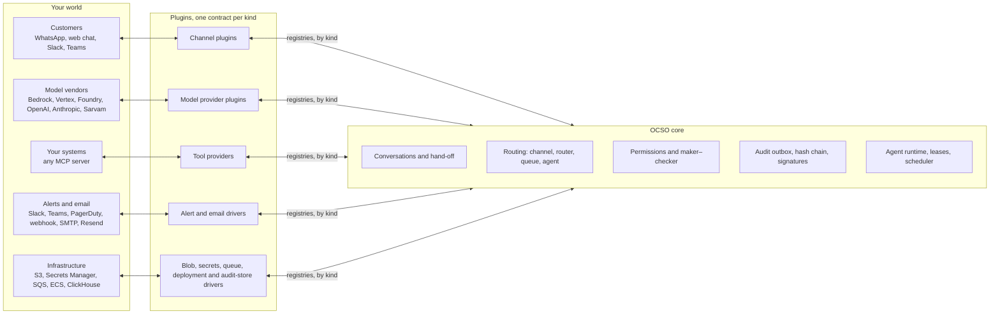
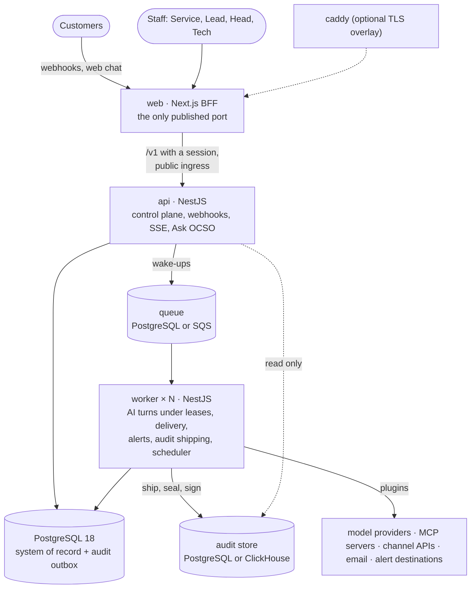

<p align="center">
  <picture>
    <source media="(prefers-color-scheme: dark)" srcset="brand/ocso-logo-inverse.svg">
    
  </picture>
</p>

<h1 align="center">OCSO: Open Customer Success Orchestration</h1>

<p align="center">
  <b>Self-hosted AI agents and human teams on every customer channel, on one governed path.</b><br/>
  Every part of customer success that touches the outside world is a plugin.
</p>

<p align="center">
  <a href="https://github.com/winsenlabs/ocso/actions/workflows/ci.yml"></a>
  <a href="LICENSE"></a>
  
  <a href="https://ocso.winsenlabs.dev"></a>
</p>

<p align="center">
  <a href="https://ocso.winsenlabs.dev">Website</a> ·
  <a href="#quickstart">Quickstart</a> ·
  <a href="docs/README.md">Docs</a> ·
  <a href="docs/concepts/architecture.md">Architecture</a> ·
  <a href="docs/concepts/plugins.md">Plugins</a> ·
  <a href="ROADMAP.md">Roadmap</a> ·
  <a href="CONTRIBUTING.md">Contributing</a>
</p>

<p align="center">
  
</p>

## The idea: customer success as plugins

A customer-success operation has two kinds of problems. Some are the same in every organization: a
conversation has one owner at a time, a hand-over to a person must not lose context, a change to live
configuration needs a second pair of eyes, and every privileged action must be on record. The others
are different everywhere: which messaging networks your customers use, which model vendor your
security team approved, which systems the AI may call, where alerts go, where files and secrets live.

OCSO keeps the first kind in a small core and makes the second kind pluggable. Channels, model
providers, tools, alert destinations, email, blob storage, secrets, queues, deployment targets and the
audit store are all plugins. Each one implements a contract and is looked up in a registry by an open
string kind. The core never names one, and a lint fails the build if it tries. Adding WhatsApp,
Bedrock or PagerDuty changes a plugin, not the core, the database or the web app.



Read [Architecture](docs/concepts/architecture.md) for the full picture and
[Plugins](docs/concepts/plugins.md) for every contract.

## Why OCSO

Customer success is scattered. The WhatsApp number sits with one vendor, the web chat with another,
the help desk with a third. The chatbot is a black box, the escalation happens in someone's DMs, and
the audit trail is a spreadsheet. Adding AI to that usually means one more silo.

OCSO puts it on one path you host:

- **One deployment, your data.** One organization, many users, your model providers, your database.
  Nothing leaves except through a plugin you configured.
- **AI and people on the same conversation.** Named AI agents answer. Your people take over any
  conversation and hand it back, with a summary, on the same timeline.
- **Change control a bank would accept.** Every configuration change is a proposal a named second
  person approves, against a content hash of exactly what they saw.
- **Evidence, not promises.** Audit events are hash-chained, checkpointed with Ed25519 signatures,
  exported, and verifiable offline. A weekly exception report lists every place the controls were
  bypassed or failed.
- **Open at every seam.** Apache-2.0, plugin contracts in a public SDK, and a headless chat SDK for
  your own UI.

## Screens

<table>
  <tr>
    <td width="50%"></td>
    <td width="50%"></td>
  </tr>
  <tr>
    <td align="center"><sub><b>Workspace.</b> The AI hands over to a person, with a summary</sub></td>
    <td align="center"><sub><b>Maker–checker.</b> The checker approves exactly the diff they saw</sub></td>
  </tr>
  <tr>
    <td width="50%"></td>
    <td width="50%"></td>
  </tr>
  <tr>
    <td align="center"><sub><b>Routing.</b> Menus, classifiers and known facts, with a simulator</sub></td>
    <td align="center"><sub><b>Exceptions.</b> Where the controls were bypassed, signed weekly</sub></td>
  </tr>
  <tr>
    <td width="50%"></td>
    <td width="50%"></td>
  </tr>
  <tr>
    <td align="center"><sub><b>Channels.</b> Each plugin ships its own setup guide</sub></td>
    <td align="center"><sub><b>Web chat.</b> One script tag, or the headless chat SDK</sub></td>
  </tr>
  <tr>
    <td width="50%"></td>
    <td width="50%"></td>
  </tr>
  <tr>
    <td align="center"><sub><b>Permissions.</b> Four presets plus per-user grants, in code</sub></td>
    <td align="center"><sub><b>System.</b> Tech sees the platform, never conversation content</sub></td>
  </tr>
</table>

More screens are in the [docs](docs/README.md). They come from the Meridian Bank demo with the
development-only scripted model, so the AI replies in them are canned.

## Features

<table>
  <tr>
    <th width="33%">Conversations</th>
    <th width="33%">Governance</th>
    <th width="33%">Operations</th>
  </tr>
  <tr valign="top">
    <td>

**[Named AI agents](docs/concepts/virtual-agents.md)** with prompts built from named components,
immutable versions, preview and replay.

**[Channels](docs/guides/channels/README.md):** WhatsApp (Meta Cloud API or Twilio), web chat, Slack,
Microsoft Teams. Text, media, locations, choice buttons, WhatsApp templates.

**[Routing](docs/concepts/routing.md):** channel → router → queue → agent, with menus, model
classification, known facts, returning customers and transfers.

**[Hand-off](docs/concepts/conversations.md):** explicit control states, SLAs, open pickup or
auto-assign, notes, copilot drafts, and a return to the AI.

**[Tools over MCP](docs/guides/tools/mcp.md):** risk classes, per-agent grants, argument rules,
human confirmation. Authorization in code, never in the prompt.

**[Six model providers](docs/guides/models/README.md)** with per-provider prompt caching, profiles
and ordered fallbacks.

  </td>
    <td>

**[Maker–checker](docs/concepts/governance.md)** on every configuration change: agents, prompts,
tools, routers, queues, channels, providers, MCP, SSO, users and grants. Stops apply at once.

**[Roles in code](docs/reference/permissions.md):** Tech, Head, Lead and Service presets, per-user
grants with expiry, team-scoped ownership. Tech never reads conversations.

**[Tamper-evident audit](docs/concepts/audit.md):** outbox in the same transaction, a separate
append-only store (PostgreSQL or ClickHouse), hash chain, signed checkpoints, `audit-verify`.

**[Exception report](docs/concepts/governance.md#the-exception-report):** live, and signed weekly,
with an offline-verifiable export.

**[Sign-in](docs/guides/sign-in.md):** password, TOTP, passkeys, OIDC and SAML, MFA per role.

  </td>
    <td>

**[Ask OCSO](docs/concepts/ask-ocso.md):** a copilot over about 250 generated capabilities. It acts
as the user, and every write is a card the user confirms. In the app, Slack and Teams.

**[Workers that survive failure](docs/operations/resilience-testing.md):** conversation leases in
PostgreSQL. Kill a worker mid-turn and another resumes.

**[Observability and alerts](docs/guides/alerts-and-webhooks.md):** Tech and business views,
alert rules to in-app, email, Slack, Teams, PagerDuty or a signed webhook, OpenTelemetry export.

**[Deploy](docs/guides/deploy/docker-compose.md)** on one VM with Docker Compose and Caddy, or
[on AWS](docs/guides/deploy/aws.md) with Terraform (not yet applied to a real account).

**[Extend](docs/guides/extending/build-a-channel-plugin.md)** with the plugin SDK and the
[chat SDK](docs/reference/chat-sdk.md).

  </td>
  </tr>
</table>

## Quickstart

You need Docker Engine 26+ with Compose v2.30+ and about 8 GB of RAM. The demo needs no model
provider keys. It seeds a fictional bank (Meridian Bank) with users, teams, queues, three live AI
agents, a web chat channel and an example MCP server, and it uses a development-only scripted model.

```bash
git clone https://github.com/winsenlabs/ocso.git && cd ocso
cp .env.example .env
OCSO_DEMO_SEED=true docker compose --profile demo up -d --build
docker compose logs seed       # what was created, including the web chat's public key
```

The first build takes several minutes. Open <http://localhost:3000> and sign in with the password
`meridian-demo-2026` as one of:

| Person | Role | Email |
|---|---|---|
| Tarun Shetty | Tech | `tarun.shetty@meridian.example` |
| Anjali Rao | Head | `anjali.rao@meridian.example` |
| Rohan Kapoor | Head | `rohan.kapoor@meridian.example` |
| Nikhil Menon | Service | `nikhil.menon@meridian.example` |
| Meera Pillai | Service | `meera.pillai@meridian.example` |

Things to try:

1. Open `http://localhost:3000/chat/<public key>` (the key is in the seed log), chat with Maya, and
   ask for a human. As Nikhil, take the conversation from **Home → Take next conversation**, reply,
   and hand it back with **Return to AI**.
2. As Anjali, edit Maya's prompt and activate the new version. It waits in **Approvals** until Rohan,
   the other Head, approves it.
3. As Tarun, open **System**, then **Audit log**, and verify the audit store's hash chain.
4. As Tarun, add a real provider under **Integrations → Models** and point a profile at it. The agents
   and Ask OCSO (⌘J / Ctrl+J) then give real answers instead of scripted ones.

The scripted model echoes messages and demonstrates hand-off and tool calls. Never enable it in a real
deployment. To start over, run `docker compose --profile demo down -v`, which deletes all data.

**A real deployment** starts without the demo flags. Follow
[Deploy with Docker Compose](docs/guides/deploy/docker-compose.md) (HTTPS with Caddy, email, backups)
and then [First-run setup](docs/guides/first-run-setup.md). To hack on the code, see
[Run OCSO from source](docs/guides/deploy/local-development.md).

## How it runs



- **PostgreSQL is the durable truth.** An inbound message is committed before anything else happens.
  Queue messages are only wake-ups, and worker memory is a cache.
- **The api and the workers scale independently.** Any worker can pick up any conversation.
- **The browser talks only to the web app.** The staff API is not reachable from outside.
- **The audit store is separate.** OCSO keeps serving while it is down, and it catches up.

Built with TypeScript, NestJS, Next.js, PostgreSQL 18 with Drizzle, the Vercel AI SDK, the official
MCP TypeScript SDK and Better Auth.

## Documentation

| | |
|---|---|
| **Start here** | [Docs home](docs/README.md) |
| **Concepts** | [Architecture](docs/concepts/architecture.md) · [Plugins](docs/concepts/plugins.md) · [Conversations](docs/concepts/conversations.md) · [Routing](docs/concepts/routing.md) · [Virtual agents](docs/concepts/virtual-agents.md) · [Governance](docs/concepts/governance.md) · [Audit](docs/concepts/audit.md) · [Ask OCSO](docs/concepts/ask-ocso.md) |
| **Deploy** | [Local development](docs/guides/deploy/local-development.md) · [Docker Compose](docs/guides/deploy/docker-compose.md) · [AWS](docs/guides/deploy/aws.md) · [First-run setup](docs/guides/first-run-setup.md) |
| **Channels** | [WhatsApp (Meta)](docs/guides/channels/whatsapp-meta.md) · [WhatsApp (Twilio)](docs/guides/channels/whatsapp-twilio.md) · [Web chat](docs/guides/channels/web-chat.md) · [Slack](docs/guides/channels/slack.md) · [Microsoft Teams](docs/guides/channels/microsoft-teams.md) |
| **Models and tools** | [Model providers](docs/guides/models/README.md) · [Profiles and pricing](docs/guides/models/profiles-and-pricing.md) · [MCP tools](docs/guides/tools/mcp.md) |
| **Reference** | [Configuration](docs/reference/configuration.md) · [Permissions](docs/reference/permissions.md) · [HTTP API](docs/reference/http-api.md) · [Plugin SDK](docs/reference/plugin-sdk.md) · [Chat SDK](docs/reference/chat-sdk.md) · [CLI](docs/reference/cli.md) |
| **Operations** | [Runbooks](docs/operations/README.md): backups, upgrades, scaling, resilience, troubleshooting |
| **Decisions** | [Architecture decision records](PM/ARCHITECTURE-DECISIONS.md) |

## Repository map

| Path | What it is |
|---|---|
| `apps/api` | NestJS control plane: the `/v1` staff API, public ingress (channel webhooks, web chat API, OAuth callback, JWKS), Better Auth, SSE, Ask OCSO, the demo seed |
| `apps/worker` | NestJS worker: AI turns, routing, delivery, media, summaries, copilot drafts, alerts, audit shipping, the scheduler |
| `apps/web` | Next.js staff UI and BFF; the customer web chat page and its embed loader |
| `apps/website` | The public website at ocso.winsenlabs.dev (static export) |
| `packages/bootstrap` | The one composition root: `OcsoPlugin`, `FIRST_PARTY_PLUGINS`, the `OCSO_PLUGINS` loader |
| `packages/channels`, `model-providers`, `alerts`, `email`, `mcp`, `blob`, `secrets`, `queue`, `deployment`, `audit-store` | Plugin contracts, registries and the shipped plugins |
| `packages/domain`, `application`, `agent-runtime`, `prompt-compiler`, `tools`, `auth`, `internal-agent` | The core: control states, routing, services, approvals, turns, tool authorization, permissions, Ask OCSO |
| `packages/db`, `config`, `events`, `observability` | Schema and hand-written migrations, configuration, events, telemetry |
| `packages/ocso-plugin-sdk`, `ocso-chat`, `ocso-chat-react` | The public SDKs |
| `examples/` | A fictional bank's MCP server, a web chat host page, an example third-party channel plugin |
| `infra/compose`, `infra/aws/terraform` | Compose helpers (keygen, Caddy TLS, website and OTel overlays); ECS Fargate Terraform |
| `docs/`, `PM/` | Documentation; architecture decision records and the research behind them |

## Status and roadmap

OCSO is pre-1.0. APIs, the database schema and the plugin contracts can still change between commits
on `main`. Only the latest `main` gets security fixes.

**Works today:** everything above, on a single Docker host with Compose, covered by unit, integration
(real PostgreSQL and ClickHouse), Playwright and chaos tests in CI.

**Not yet:**

- **Live verification is owed.** Model providers, both WhatsApp integrations, Slack, Teams, message
  templates and model discovery are tested offline against recorded provider responses, not live
  accounts. Sarvam's prompt caching is unverified. Ask OCSO's eval suite has not been run against a
  real model.
- **Escalation-rule conditions are not evaluated by the runtime.** Rules are stored and approved, but
  when the AI hands off is decided by the model from its prompt. See
  [Virtual agents](docs/concepts/virtual-agents.md#escalation-rules).
- **AWS.** The Terraform passes `terraform validate` but has never been applied, and as shipped it
  would not start: it lacks the `conversation.route` queue and does not wire `BETTER_AUTH_SECRET` or
  `EMAIL_DRIVER`. See [Deploy on AWS](docs/guides/deploy/aws.md). Docker Compose is the supported
  deployment.
- **The SDKs are not on npm yet.** They build from this repository.
- **Channels:** Slack and Teams carry text and choice buttons only. No SMS, RCS or voice.
- **MCP** uses Streamable HTTP only, no stdio.
- **Sign-in:** no email one-time codes as a second factor, and no "SSO only" per domain.

The [roadmap](ROADMAP.md) lists what is next and where help is welcome.

## Contributing

Contributions are welcome. Read [CONTRIBUTING.md](CONTRIBUTING.md) first: setup, the test layers, and
the rules (the plugin boundary, hand-written migrations, maker–checker for new configuration). For a
new channel, model provider or other plugin, open a "New plugin proposal" issue and start from
[Build a channel plugin](docs/guides/extending/build-a-channel-plugin.md). Everyone taking part
follows the [Code of Conduct](CODE_OF_CONDUCT.md).

## Security

Please report vulnerabilities privately to **security@winsenlabs.dev**, not in a public issue. See
[SECURITY.md](SECURITY.md) for the scope and what to include.

## License

Apache License 2.0. See [LICENSE](LICENSE) and [NOTICE](NOTICE). Copyright 2026 Winsen Labs.

---

<p align="center">
  Built by <a href="https://winsenlabs.com">Winsen Labs</a> · <a href="https://ocso.winsenlabs.dev">ocso.winsenlabs.dev</a><br/>
  <sub>We build OCSO with a small number of teams. To run it with us, or to see it live, request a demo at ocso.winsenlabs.dev.</sub>
</p>
