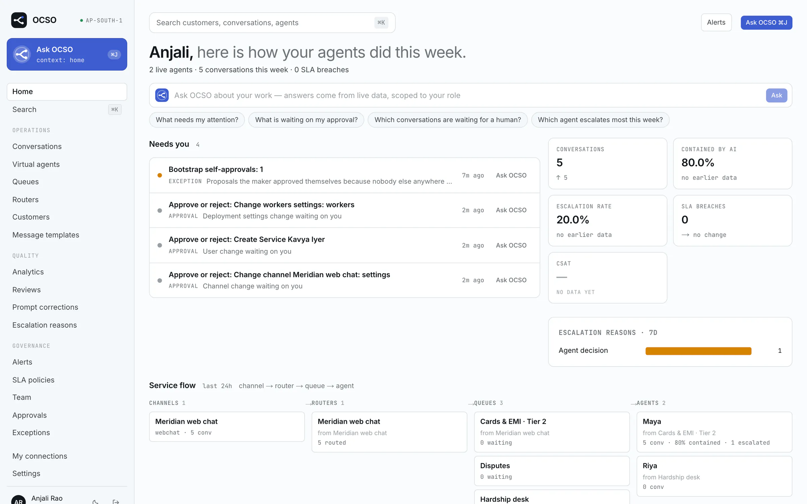
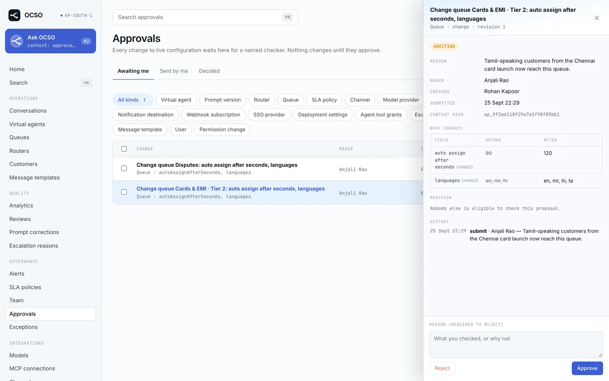

<p align="center">
  <picture>
    <source media="(prefers-color-scheme: dark)" srcset="brand/ocso-logo-inverse.svg">
    
  </picture>
</p>

<h1 align="center">OCSO: Open Customer Success Orchestration</h1>

<p align="center">
  Self-hosted AI agents and human teams on every customer channel, on one governed path.
</p>

<p align="center">
  <a href="https://github.com/winsenlabs/ocso/actions/workflows/ci.yml"></a>
  <a href="LICENSE"></a>
  
  <a href="https://ocso.winsenlabs.dev"></a>
</p>

<p align="center">
  <a href="https://ocso.winsenlabs.dev">Website</a> ·
  <a href="#quickstart-the-demo-in-a-few-minutes">Quickstart</a> ·
  <a href="docs/00-INDEX.md">Docs</a> ·
  <a href="docs/plugins/README.md">Plugins</a> ·
  <a href="ROADMAP.md">Roadmap</a> ·
  <a href="CONTRIBUTING.md">Contributing</a>
</p>

---

## Why OCSO

Customer success is scattered. The WhatsApp number sits with one vendor, the web chat with another, the
help desk with a third. The chatbot is a black box, the escalation happens in someone's DMs, and the
audit trail is a spreadsheet. Adding AI to that usually means one more silo.

OCSO rethinks it for the AI age. You run named AI agents on WhatsApp, web chat, Slack and Microsoft Teams.
They get tools from your own systems over MCP. Your people can take over any conversation and hand it
back. The whole thing runs on one deployment you host: one organization, many users, your model
providers, your data. Every configuration change is approved by a second person, and every privileged
action goes to a tamper-evident audit store. That is the level of control a bank needs before it lets
an AI talk to its customers.

OCSO is pre-1.0 and under active development. See [status and known gaps](#status-and-known-gaps).

<p align="center">
  
</p>

<table>
  <tr>
    <td width="50%"></td>
    <td width="50%"></td>
  </tr>
  <tr>
    <td align="center"><sub>The conversation workspace: AI hands over to a person, with a summary</sub></td>
    <td align="center"><sub>Maker–checker: every configuration change waits for a named second person</sub></td>
  </tr>
</table>

## Features

**Conversations**

- **Named AI agents with versioned prompts.** A prompt compiler builds prompts from named components.
  Every change is a new immutable version: preview the compiled prompt, replay a draft against past
  conversations, activate, roll back.
- **Channels.** WhatsApp through Twilio or the Meta Cloud API, an embeddable web chat (one script tag, or
  the headless chat SDK), Slack and Microsoft Teams. Text, images, audio, video, documents and locations
  are stored as typed message parts. WhatsApp message templates are supported for messages outside the
  24-hour window.
- **Routing.** Channel → router → queue → agent. Routers ask menu questions, classify with a model or use
  known facts. The queue is the unit of service: one AI agent, its human teams, an SLA, opening hours and
  transfer targets.
- **Human handoff.** Explicit control states (AI active, escalation requested, waiting for a human, human
  active, AI resuming, resolved). Escalation rules, SLA policies, auto-assign or open pickup, transfers,
  internal notes, copilot reply drafts, and a return to the AI with a handover summary.
- **Tools over MCP.** Connect any MCP server over Streamable HTTP, with OAuth 2.1 or a static header.
  Classify each tool's risk, grant it per agent, add argument rules, and require a person to confirm
  sensitive actions. Authorization happens in code, never in the prompt.
- **Six model providers.** AWS Bedrock, Google Vertex AI, Microsoft Foundry, OpenAI, Anthropic and Sarvam,
  each with its own prompt-caching strategy. Agents use logical model profiles with ordered fallbacks,
  checked against a deployment policy for provider allowlists and data residency.

**Governance**

- **Maker–checker on every configuration change.** Agents, prompts, tool grants, routers, queues, SLA
  policies, channels, providers, MCP connections, SSO, users and permission grants: each change is a
  proposal that a named second person approves. The checker approves exactly the content they saw, which
  content hashes enforce. Stops (pause, disable, revoke) apply immediately. A single-admin deployment can
  self-approve, but only as a recorded bootstrap approval that shows up in the weekly exception report.
- **A tamper-evident audit store.** Audit events are written in the same transaction as the change, then
  shipped to a separate append-only database (PostgreSQL or ClickHouse). There they are hash-chained,
  checkpointed with Ed25519 signatures, exported daily and verifiable offline with `audit-verify`.
- **Roles and permissions in code.** Four presets (Tech, Head, Lead, Service), per-user grants with
  expiry, and team-scoped ownership of agents. Tech runs the platform but never reads conversation content.
- **Sign-in.** Email and password, TOTP, passkeys, OIDC and SAML single sign-on, MFA required per role.

**Operations**

- **Ask OCSO.** An internal copilot (⌘J / Ctrl+J, or from Slack and Teams). Its tool catalog is generated
  from the API itself (about 250 capabilities). It acts with the asking user's permissions, and every
  write is a server-built confirmation card that the user confirms. Governed changes go to a checker like
  any other proposal.
- **Workers that survive failure.** Conversations are leased to workers in PostgreSQL. Kill a worker
  mid-turn and another one resumes. The chaos test checks that every customer message still gets exactly
  one reply.
- **Observability and alerts.** Separate views for Tech (workers, latency, tokens, cache hits, cost,
  provider and MCP health) and for Heads and Leads (containment, escalations, SLA, CSAT). Alerts go
  in-app, by email, to Slack, Teams, PagerDuty or a signed webhook. OpenTelemetry export.
- **Everything outside the core is a plugin.** Channels, model providers, alert destinations, email and
  infrastructure drivers sit behind contracts, and a lint guard fails the build if core code names a
  specific kind. See [plugins](#extending-ocso).

## Quickstart: the demo in a few minutes

You need Docker Engine 26+ with Compose v2.30+ and about 8 GB of RAM. The demo needs no model provider
keys: it seeds a fictional bank (Meridian Bank) with users, teams, queues, three live AI agents, a web
chat channel and an example MCP server, and it uses a development-only scripted model.

```bash
git clone https://github.com/winsenlabs/ocso.git && cd ocso
cp .env.example .env
OCSO_DEMO_SEED=true docker compose --profile demo up -d --build
docker compose logs seed       # what was created, including the web chat's public key
```

The first build takes several minutes. Then open <http://localhost:3000> and sign in, for example as
`anjali.rao@meridian.example` (a Head) with the password `meridian-demo-2026`. The other demo users are
Tarun Shetty (Tech), Rohan Kapoor (Head), and Nikhil Menon and Meera Pillai (Service). Their emails
follow the same pattern.

Things to try:

- Open `http://localhost:3000/chat/<public key>` (the key is in the seed log) and chat with Maya, the
  support agent, then ask for a human. Pick the conversation up as Nikhil Menon (Service) in the
  workspace, reply, and hand it back to Maya.
- As Anjali, change Maya's prompt. The change waits in Approvals until Rohan, the other Head, approves it.
- As Tarun, open System and verify the audit store's hash chain and signed checkpoints.
- Add a real model provider as Tarun (Connections → Models) and point a profile at it. The agents and
  Ask OCSO (⌘J / Ctrl+J) then give real answers instead of scripted ones.

The demo's scripted model echoes messages and demonstrates handoff and tool calls; it is for demos only.
Never enable it in a real deployment. To start over, run
`docker compose --profile demo down -v`. This deletes all data.

**A real deployment** starts the same way without the demo flags:

```bash
docker compose up -d --build
docker compose logs api | grep "setup token"   # the one-time token for /setup
```

Open <http://localhost:3000>, complete `/setup`, then follow the
[setup guide](docs/operations/setup-guide.md): model providers and profiles, channels, MCP servers,
teams, and your first AI agent. HTTPS with Caddy and Let's Encrypt, email, backups, upgrades and
scaling workers are covered in [docs/operations/compose.md](docs/operations/compose.md).

## Architecture at a glance

```
  Customers                                              Staff (browser, Slack, Teams)
  WhatsApp (Meta or Twilio), web chat, Slack, Teams      Service, Lead, Head, Tech
        │                                                          │
        ▼                                                          ▼
  ┌──────────────────── web · Next.js · the only published port (3000) ────────────────────┐
  │ staff UI and BFF (server actions, SSE relay); public ingress is proxied to the api      │
  └──────────────────────────────────────────┬──────────────────────────────────────────────┘
                                             │ internal network: /v1 with a Bearer session
                                             ▼
  ┌──────────── api · NestJS ────────────┐          ┌────────── worker × N · NestJS ──────────┐
  │ /v1 control plane (deny by default)  │  queue   │ AI turns under conversation leases      │
  │ channel webhooks: verify → persist   │ ───────► │ prompt compiler → model gateway → tools │
  │ Better Auth, realtime SSE, Ask OCSO  │          │ delivery, media, alerts, scheduler      │
  └──────────────────┬───────────────────┘          └────────────────────┬────────────────────┘
                     ▼                                                   ▼
  ┌───────────────────────────── PostgreSQL 18 · system of record ────────────────────────────┐
  │ conversations, configuration, approvals, encrypted secrets, jobs, leases, audit outbox     │
  └────────────────────────────────────────────────────────────────────────────────────────────┘
     Audit store: its own database (PostgreSQL or ClickHouse), written by the worker only.
     Blob store: a local volume or S3.   Outbound, through plugins: model providers, MCP servers,
     WhatsApp, Slack and Teams APIs, email, alert destinations.
```

- **PostgreSQL is the durable truth.** An inbound message is committed before anything else happens.
  Queue messages are only wake-ups, and worker memory is a cache.
- **The api and the workers scale independently.** Any worker can pick up any conversation.
- **The browser talks only to the web app.** The staff API is not reachable from outside.
- **The audit store is separate.** OCSO keeps serving while it is down, and it catches up.

Built with TypeScript, NestJS, Next.js, PostgreSQL 18 with Drizzle, the Vercel AI SDK, the official MCP
TypeScript SDK and Better Auth. Read more in [docs/02-SYSTEM-ARCHITECTURE.md](docs/02-SYSTEM-ARCHITECTURE.md)
and the architecture decision records in [PM/ARCHITECTURE-DECISIONS.md](PM/ARCHITECTURE-DECISIONS.md).

## Extending OCSO

OCSO is a core plus contracts. The core owns the conversation runtime, handoff, permissions, approvals,
audit, queues and observability. Everything that touches an outside system implements a contract and is
looked up in a registry by kind:

| Extension point | Shipped implementations |
|---|---|
| Channels | WhatsApp (Twilio), WhatsApp (Meta Cloud API), web chat, Slack, Microsoft Teams |
| Model providers | Bedrock, Vertex AI, Foundry, OpenAI, Anthropic, Sarvam |
| Tool servers | Any MCP server (no code); OCSO's built-in tools |
| Alert destinations | In-app, email, Slack, Teams, webhook, PagerDuty |
| Email | Resend, SMTP, log |
| Audit store | PostgreSQL (append-only by trigger), ClickHouse |
| Blob, secrets, queue, deployment | Volume or S3; local AES-256-GCM or AWS Secrets Manager; PostgreSQL or SQS; Compose or ECS |
| Sign-in | Password, TOTP, passkeys, OIDC, SAML |

First-party plugins are compiled in. Third-party plugins build on
[`@winsendotai/ocso-plugin-sdk`](packages/ocso-plugin-sdk/README.md), are installed into the image and
pinned by exact version in `OCSO_PLUGINS`. They run in-process with full trust. The chat SDK
([`@winsendotai/ocso-chat`](packages/ocso-chat/README.md) and
[`@winsendotai/ocso-chat-react`](packages/ocso-chat-react/README.md)) lets you build your own web chat
for browsers and React Native.

Start at [docs/plugins/](docs/plugins/README.md). It has a page per extension point, a worked example
([add a channel in seven steps](docs/plugins/add-a-channel.md)), and an honest list of the places where
the boundary still leaks.

## Repository map

| Path | What it is |
|---|---|
| `apps/api` | NestJS control plane: the `/v1` staff API, public ingress (channel webhooks, web chat API, OAuth callback, JWKS), Better Auth, SSE, Ask OCSO, the demo seed |
| `apps/worker` | NestJS worker: AI turns, delivery, media, summaries, copilot drafts, alerts, the scheduler |
| `apps/web` | Next.js staff UI and BFF; the customer web chat page and its embed loader |
| `apps/website` | The public website at ocso.winsenlabs.dev (static export) |
| `packages/domain` | Framework-free domain: control states, message parts, routing, SLA |
| `packages/application` | Application services: identity, agents and prompts, conversations, routing, approvals, audit, alerts, analytics |
| `packages/agent-runtime` | Turn processing, leases, model gateway, tool runner, context and turn cache |
| `packages/channels`, `packages/model-providers`, `packages/alerts`, `packages/email` | Plugin contracts, registries and the shipped implementations |
| `packages/audit-store` | The audit store drivers, hash chain, Ed25519 signing, `audit-migrate` and `audit-verify` |
| `packages/auth` | Role presets, the permission catalogue, the principal |
| `packages/internal-agent` | Ask OCSO: the generated capability catalog, meta tools, the eval suite |
| `packages/mcp`, `packages/tools` | MCP client (discovery, OAuth 2.1, egress guard); tool authorization |
| `packages/db` | Drizzle schema, hand-written SQL migrations, the migration runner |
| `packages/bootstrap` | The composition root shared by the api and the worker (`FIRST_PARTY_PLUGINS`) |
| `packages/ocso-plugin-sdk`, `packages/ocso-chat`, `packages/ocso-chat-react` | The public SDKs |
| `packages/*` (other) | Config, events, observability, prompt compiler, queue, blob, secrets, deployment drivers |
| `examples/` | A fictional bank's MCP server (used by the demo and tests), a web chat host page, an example third-party channel plugin |
| `infra/compose`, `infra/aws/terraform` | Compose helpers (keygen, TLS overlay, OTel); ECS Fargate Terraform (validated, never applied) |
| `docs/` | Product and engineering specification, operations runbooks, plugin guides |
| `PM/` | Build plan, architecture decision records and the technical research behind them |
| `design/` | HTML design references for the main screens |
| `scripts/`, `tests/resilience` | Source guards, the capability catalog generator; chaos and load tests |

## Development

You need Node.js 26 (`.nvmrc`), pnpm 11.1.2 (pinned in `packageManager`) and Docker or a local
PostgreSQL 18.

```bash
pnpm install
pnpm build        # every package and app (turbo)
pnpm typecheck
pnpm lint         # source guards: file size, import boundaries, package cycles, the plugin boundary
pnpm test         # unit tests
pnpm test:int     # integration tests against a real PostgreSQL
```

[CONTRIBUTING.md](CONTRIBUTING.md) covers running the stack from source, each test layer (including
Playwright and ClickHouse), the rules a pull request must follow, and where to start.

## Documentation

| Topic | Where |
|---|---|
| Start here, reading order | [docs/00-INDEX.md](docs/00-INDEX.md) |
| Run it: Compose, setup, scaling, resilience | [docs/operations/](docs/operations/compose.md) |
| Plugins and extension points | [docs/plugins/](docs/plugins/README.md) |
| Security model | [docs/15-SECURITY-AND-GOVERNANCE.md](docs/15-SECURITY-AND-GOVERNANCE.md) |
| Engineering rules | [docs/99-BUILD-RULES.md](docs/99-BUILD-RULES.md) |
| Architecture decision records | [PM/ARCHITECTURE-DECISIONS.md](PM/ARCHITECTURE-DECISIONS.md) |
| What's next | [ROADMAP.md](ROADMAP.md) |

## Status and known gaps

OCSO is pre-1.0. APIs, the database schema and the plugin contracts can still change between commits on
`main`. Only the latest `main` gets security fixes.

What works today: everything in the feature list above, on a single Docker host with Compose, covered by
unit, integration (real PostgreSQL and ClickHouse), Playwright and chaos tests in CI.

What does not yet:

- **The SDKs are not on npm yet.** `@winsendotai/ocso-plugin-sdk`, `@winsendotai/ocso-chat` and
  `@winsendotai/ocso-chat-react` build from this repository; publishing is pending.
- **Live verification is owed.** Model providers, WhatsApp (both integrations), message templates and
  model discovery are tested offline against recorded provider-format responses, not against live
  accounts. Sarvam's prompt caching is unverified. Ask OCSO's eval suite has not yet been run against a
  real model.
- **Slack and Teams** read and send text and choice buttons only: no files, no proactive messages.
- **Channels not built:** SMS, RCS, voice.
- **MCP** uses Streamable HTTP only; there is no stdio transport.
- **AWS.** The ECS Fargate Terraform passes `terraform validate` but has never been applied to a real
  account, and it does not wire every secret yet. Docker Compose is the supported deployment.
- **Audit exports** are only an independent copy on write-once storage. OCSO does not configure S3 Object
  Lock for you.
- **Sign-in:** no email one-time codes as a second factor, and no "SSO only" enforcement per domain.

The [roadmap](ROADMAP.md) lists what we plan next and where help is welcome.

## Contributing

Contributions are welcome. Read [CONTRIBUTING.md](CONTRIBUTING.md) first. It explains setup, the test
layers, the rules (the plugin boundary, hand-written migrations, maker–checker for new configuration)
and where to start. For a new channel, model provider or other plugin, open a "New plugin proposal"
issue. Everyone taking part follows the [Code of Conduct](CODE_OF_CONDUCT.md).

## Security

Please report vulnerabilities privately to **security@winsenlabs.dev**, not in a public issue. See
[SECURITY.md](SECURITY.md) for the scope and what to include.

## License

Apache License 2.0. See [LICENSE](LICENSE) and [NOTICE](NOTICE). Copyright 2026 Winsen Labs.

---

Built by [Winsen Labs](https://winsenlabs.com). We build OCSO with a small number of teams. If you want
to run it with us, or just see it live, request a demo at [ocso.winsenlabs.dev](https://ocso.winsenlabs.dev).
