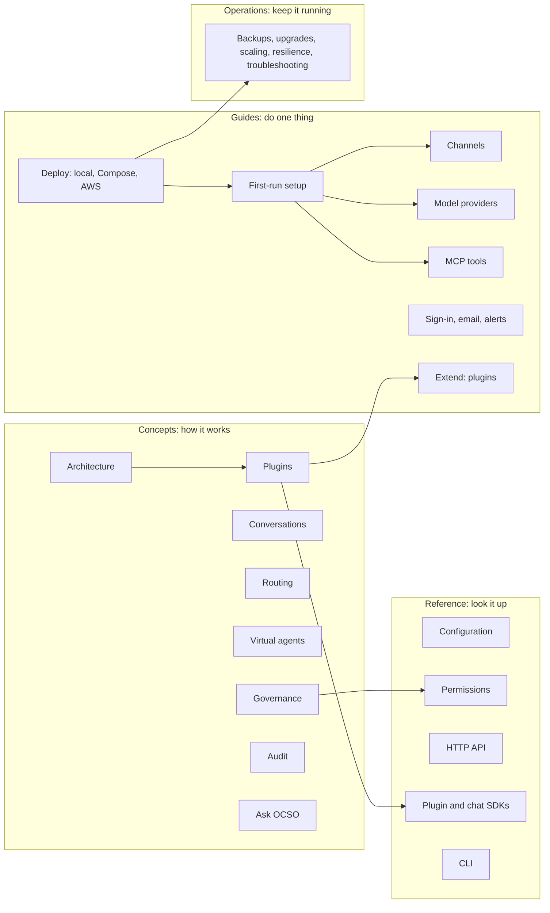

# OCSO documentation

OCSO (Open Customer Success Orchestration) is a self-hosted platform where named AI agents and your
human teams serve customers on WhatsApp, web chat, Slack and Microsoft Teams, on one governed path.
One deployment belongs to one organization, which can have many users. Every configuration change is
approved by a second person, and every privileged action lands in a tamper-evident audit store.

The idea behind OCSO is that **every aspect of customer success is a plugin**. A small core owns the
things that must be the same everywhere: conversations, hand-off, routing, permissions, approvals and
audit. Everything that touches the outside world plugs in behind a contract and is looked up by kind.
That covers channels, model providers, tools, alert destinations, email, storage, secrets, queues,
deployment targets and the audit store itself.
[Architecture](concepts/architecture.md) explains why and how.

## How to read these docs

| If you are… | Start with | Then |
|---|---|---|
| Evaluating OCSO | [Architecture](concepts/architecture.md) | [Governance](concepts/governance.md), [Audit](concepts/audit.md), [Ask OCSO](concepts/ask-ocso.md) |
| Running it for the first time | [Docker Compose](guides/deploy/docker-compose.md) or [local development](guides/deploy/local-development.md) | [First-run setup](guides/first-run-setup.md), then one [channel guide](guides/channels/README.md) and one [model guide](guides/models/README.md) |
| A Head or Lead designing service | [Routing](concepts/routing.md) | [Virtual agents](concepts/virtual-agents.md), [Conversations and hand-off](concepts/conversations.md) |
| Operating a deployment | [Operations runbooks](operations/README.md) | [Configuration](reference/configuration.md), [Troubleshooting](operations/troubleshooting.md) |
| Building a plugin or a chat UI | [Plugins](concepts/plugins.md) | [Build a channel plugin](guides/extending/build-a-channel-plugin.md), [Plugin SDK](reference/plugin-sdk.md), [Chat SDK](reference/chat-sdk.md) |
| Contributing to OCSO | [CONTRIBUTING.md](../CONTRIBUTING.md) | [Engineering rules](contributing/engineering-rules.md), [ADRs](../PM/ARCHITECTURE-DECISIONS.md) |

## Map

## Concepts

| Page | What it covers |
|---|---|
| [Architecture](concepts/architecture.md) | Core vs plugins, the one composition root, open kinds, the plugin-boundary lint, the processes a deployment runs, and how an inbound message flows |
| [Plugins](concepts/plugins.md) | Every plugin kind, its contract and registry, descriptors, the `OCSO_PLUGINS` loader, the trust model, and where the boundary still leaks |
| [Conversations and hand-off](concepts/conversations.md) | The conversation model, control states, hand-off to people, the AI summary, the workspace, leases |
| [Routing](concepts/routing.md) | Channel → router → queue → agent, menus and classifiers, returning customers, transfers |
| [Virtual agents](concepts/virtual-agents.md) | Prompts and versions, going live, model profiles, tools and authorization, escalation, the staff copilot |
| [Governance](concepts/governance.md) | Roles (Tech, Head, Lead, Service), grants, maker–checker, bootstrap, the exception report |
| [Audit](concepts/audit.md) | The outbox, the audit store, the hash chain, signed checkpoints, verification and exports |
| [Ask OCSO](concepts/ask-ocso.md) | The platform copilot: the capability catalog, `get_tools` and `execute_tool`, confirmation cards, Slack and Teams |

## Guides

**Deploy**

- [Run OCSO from source](guides/deploy/local-development.md)
- [Deploy on one VM with Docker Compose](guides/deploy/docker-compose.md): TLS with Caddy, the website overlay, email, scaling
- [Deploy on AWS (ECS Fargate)](guides/deploy/aws.md): what the Terraform creates and what it does not yet do
- [First-run setup](guides/first-run-setup.md): from an empty deployment to a live agent

**Channels**: [overview](guides/channels/README.md) ·
[WhatsApp via Meta Cloud API](guides/channels/whatsapp-meta.md) ·
[WhatsApp via Twilio](guides/channels/whatsapp-twilio.md) ·
[Web chat and the chat SDK](guides/channels/web-chat.md) ·
[Slack](guides/channels/slack.md) ·
[Microsoft Teams](guides/channels/microsoft-teams.md) ·
[Ask OCSO in Slack and Teams](guides/channels/ask-ocso-in-slack-and-teams.md)

**Model providers**: [overview](guides/models/README.md) ·
[OpenAI](guides/models/openai.md) ·
[Anthropic](guides/models/anthropic.md) ·
[AWS Bedrock](guides/models/aws-bedrock.md) ·
[Google Vertex AI](guides/models/google-vertex.md) ·
[Microsoft Foundry](guides/models/microsoft-foundry.md) ·
[Sarvam](guides/models/sarvam.md) ·
[Profiles, fallbacks and pricing](guides/models/profiles-and-pricing.md)

**Tools, sign-in, email, alerts**: [MCP tool servers](guides/tools/mcp.md) ·
[Sign-in, MFA and SSO](guides/sign-in.md) ·
[Email](guides/email.md) ·
[Alerts and webhooks](guides/alerts-and-webhooks.md)

**Extend**: [Build a channel plugin](guides/extending/build-a-channel-plugin.md) ·
[Install a plugin](guides/extending/install-a-plugin.md)

## Reference

| Page | What it covers |
|---|---|
| [Configuration](reference/configuration.md) | Every environment variable, grouped, with defaults and production requirements |
| [Permissions](reference/permissions.md) | The permission catalogue as a matrix against the four role presets, and which check permission approves which kind |
| [HTTP API](reference/http-api.md) | Base paths, authentication, errors and approval responses, controllers by area, the capability catalog |
| [Plugin SDK](reference/plugin-sdk.md) | `@winsendotai/ocso-plugin-sdk`: `definePlugin`, the four public contracts, `checkPlugin` |
| [Chat SDK](reference/chat-sdk.md) | `@winsendotai/ocso-chat` and `@winsendotai/ocso-chat-react` |
| [CLI and operations commands](reference/cli.md) | `migrate`, `audit-migrate`, `audit-verify`, the demo seed, `capabilities:generate`, evals, tests |

## Operations

[Runbooks](operations/README.md):
[backups and restore](operations/backups-and-restore.md) ·
[upgrades](operations/upgrades.md) ·
[worker scaling](operations/worker-scaling.md) ·
[resilience and load testing](operations/resilience-testing.md) ·
[troubleshooting](operations/troubleshooting.md)

## Contributing and history

- [Engineering rules](contributing/engineering-rules.md), [infrastructure drivers](contributing/infrastructure-drivers.md), [scheduled tasks](contributing/scheduled-tasks.md)
- [Architecture decision records](../PM/ARCHITECTURE-DECISIONS.md): ADR-001 to ADR-035. Where a doc and an ADR disagree, check the code; open an issue if the doc is wrong.
- [The original design specs](archive/specs/): the September 2026 specification (01 to 16), kept for history. Each one says which current page supersedes it.
- [Roadmap](../ROADMAP.md): what is planned next and the known gaps.

> [!NOTE]
> The screenshots in these docs come from a local stack running the Meridian Bank demo seed
> (a fictional bank) with the development-only scripted model. Its replies are canned and echo
> tool results verbatim, so the AI text in screenshots reads more mechanically than a real model's.
