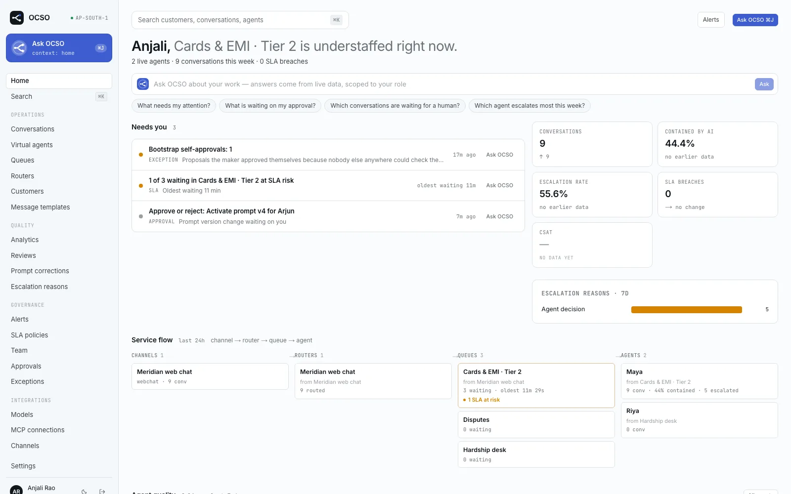
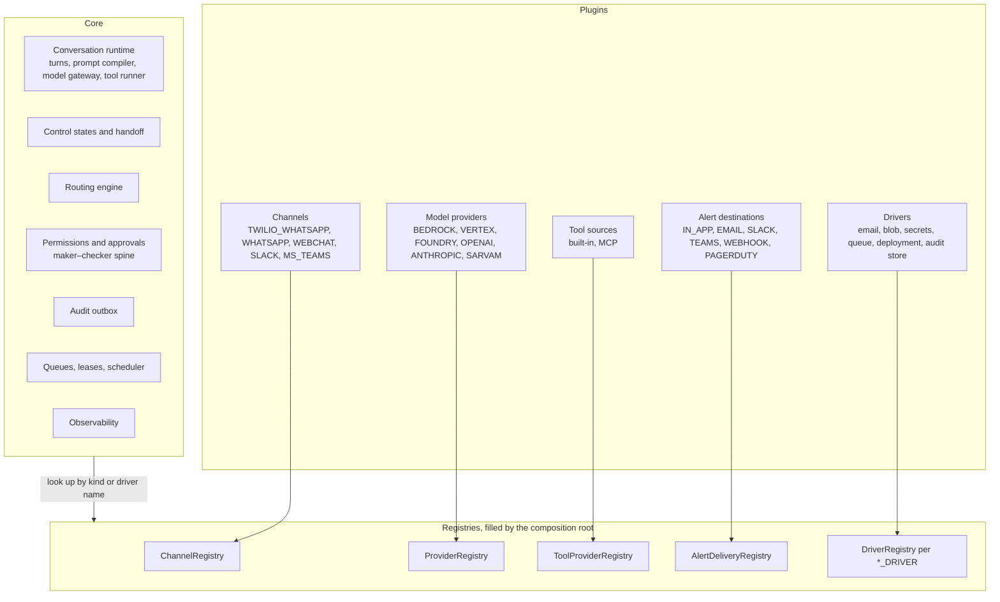
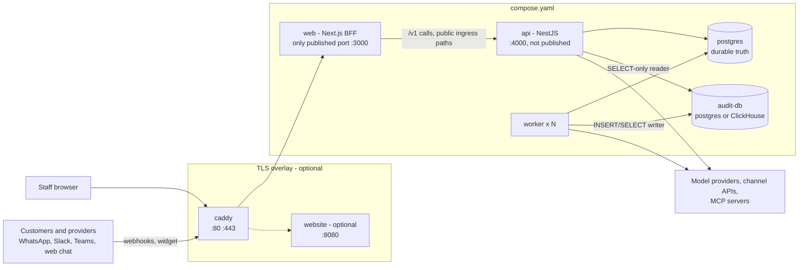
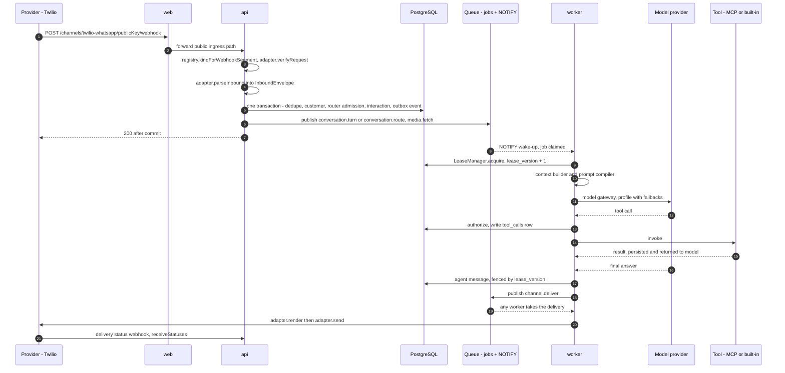

# Architecture

OCSO is a small core surrounded by plugins. The core runs conversations, decides who holds them, and
enforces permissions, approvals and audit. Everything that talks to the outside world is a plugin
behind a contract: every channel, every model provider, every tool, every alert destination, every
email, blob, secrets, queue, deployment and audit-store driver. This page explains that split, the
processes a deployment runs, how an inbound customer message moves through the system, and where each
piece lives in the repository.

It is written for engineers who deploy, operate or extend OCSO. If you only want to add a channel or a
provider, read [plugins.md](plugins.md) next.

## The thesis: every aspect of customer success is a plugin

A customer-success platform has two kinds of code. One kind is the same everywhere: a conversation
has one owner at a time, a handover to a human must not lose context, a configuration change needs a
second pair of eyes, and every action is recorded. The other kind is different in every
organization: which messaging networks your customers use, which model vendor your security team
approved, which systems of record the agent may call, where alerts go, where files and secrets live.

OCSO keeps the first kind in the core and makes the second kind pluggable. The core never names a
specific channel, provider or driver. It looks each one up in a registry by an open string kind and
calls the contract. A lint (`scripts/plugin-boundary.mjs`, described [below](#the-plugin-boundary-lint))
fails the build when core code names a kind, so the boundary stays enforced rather than aspirational.

| The core owns | Plugins own |
|---|---|
| The conversation runtime: turns, context building, the prompt compiler, the model gateway (profiles, fallbacks, usage) and the tool runner (authorization, `tool_calls` audit) | **Channels**: WhatsApp via Twilio, WhatsApp via Meta Cloud API, web chat, Slack, Microsoft Teams |
| Control states and handoff: who holds a conversation (AI or human), transitions, pickup, resume | **Model providers**: AWS Bedrock, Google Vertex AI, Microsoft Foundry, OpenAI, Anthropic, Sarvam, plus a development-only scripted provider |
| The routing engine: channel → router → queue → agent | **Tools**: the built-in OCSO tools and MCP connections, both registered as tool provider sources |
| Permissions: role presets (Tech, Head, Lead, Service), grants, revokes | **Alert destinations**: in-app, email, Slack, Microsoft Teams, signed webhook, PagerDuty |
| Approvals: the maker–checker spine every configuration change goes through | **Email drivers**: Resend, SMTP, log |
| The audit outbox, and the leader tasks that ship, seal and verify it | **Infrastructure drivers**: blob (local, S3), secrets (local, AWS Secrets Manager), queue (PostgreSQL, SQS), deployment (Compose, ECS), audit store (PostgreSQL, ClickHouse) |
| Queues, conversation leases, scheduler leadership, worker lifecycle | **Public SDKs**: `@winsendotai/ocso-plugin-sdk`, `@winsendotai/ocso-chat`, `@winsendotai/ocso-chat-react` |
| Observability: structured logs, metrics, OpenTelemetry spans | |

Two more things plug in without being `OcsoPlugin` contributions. Sign-in methods (password, TOTP,
passkeys, OIDC, SAML) are Better Auth plugins wired in `packages/application/src/identity/auth/server.ts`,
and identity providers are added at runtime from the web app. Any MCP server can be connected at
runtime too. See [sign-in](../guides/sign-in.md) and [MCP tools](../guides/tools/mcp.md).

> [!NOTE]
> "Plugin" here means a contribution registered through the composition root, whether it ships in this
> repository or is installed from npm. Only four kinds are open to third-party packages today
> (channels, model providers, alert destinations, email drivers). The rest are first-party only
> because their contracts still depend on internal packages. [plugins.md](plugins.md) has the full
> table and the places where the boundary still leaks.

## The plugin boundary

### One composition root

Everything is wired in one package, `@ocso/bootstrap` ([`packages/bootstrap`](../../packages/bootstrap)).
It defines the plugin shape, lists the plugins compiled into the build, loads installed ones, and
builds every registry.

- **`OcsoPlugin`** ([`packages/bootstrap/src/plugin.ts`](../../packages/bootstrap/src/plugin.ts)) is
  `{ name, channels?, modelProviders?, alertDestinations?, toolProviders?, emailDrivers?, blobDrivers?,
  secretsDrivers?, queueDrivers?, deploymentDrivers?, auditStoreDrivers? }`. Contributions that need
  nothing from the host (provider definitions, drivers) are listed as they are. Contributions that
  need host services are factories the host calls: channel adapters receive the SSRF-guarded egress
  fetch and the clock, alert adapters the guarded fetch, an SMTP transport and the deployment email
  sender, tool provider sources the database, the secret store and settings.
- **`FIRST_PARTY_PLUGINS`** ([`packages/bootstrap/src/first-party.ts`](../../packages/bootstrap/src/first-party.ts))
  is the list compiled into this build, one entry per package: `@ocso/channels`,
  `@ocso/model-providers`, `@ocso/alerts`, `@ocso/agent-runtime` (built-in tools), `@ocso/mcp`,
  `@ocso/email`, `@ocso/blob`, `@ocso/secrets`, `@ocso/queue`, `@ocso/deployment`, `@ocso/audit-store`.
  The order of channels in that list is the order of the **Add channel** list in the web app.
- **`loadPlugins()`** ([`packages/bootstrap/src/plugins/loader.ts`](../../packages/bootstrap/src/plugins/loader.ts))
  returns `FIRST_PARTY_PLUGINS` followed by the packages `OCSO_PLUGINS` pins. The api, the worker and
  the demo seed all call it, so they run the same plugins, and each logs one `plugins: first-party …;
  installed …` line at start-up so the lists can be compared.

The api and the worker each provide that list once, under the `PLUGINS` injection token
(`apps/api/src/infrastructure/infrastructure.module.ts`, `apps/worker/src/infrastructure/infrastructure.module.ts`),
and build every registry from it:

| Builder (in `@ocso/bootstrap`) | Registry | Filled from |
|---|---|---|
| `createChannelRegistry(deps, plugins)` | `ChannelRegistry` | every plugin's `channels`, each built with the egress fetch |
| `createProviderRegistry(env, plugins)` | `ProviderRegistry` | every plugin's `modelProviders`; `devOnly` ones only when `OCSO_ENABLE_DEV_PROVIDERS=true` |
| `createAlertDeliveryRegistry(deps, plugins)` | `AlertDeliveryRegistry` | every plugin's `alertDestinations` |
| `createRuntimeToolRegistry(db, secrets, settings, plugins)` | `ToolProviderRegistry` | every plugin's `toolProviders` |
| `createDriverRegistries(plugins)` | one `DriverRegistry` each for `EMAIL_DRIVER`, `BLOB_DRIVER`, `SECRETS_DRIVER`, `QUEUE_DRIVER`, `DEPLOYMENT_DRIVER`, `AUDIT_DRIVER` | the matching `*Drivers` lists |

At start-up the api calls `assertDrivers` and the worker `assertWorkerDrivers` (which adds
`DEPLOYMENT_DRIVER`). Each throws one `Invalid OCSO configuration` error that lists every problem: a
`*_DRIVER` value no plugin registered (with the registered names), and each selected driver's own
settings checks.

### Open kinds

A kind is an open string, not an enum. `ChannelKind`, `ProviderKind` and alert `DestinationKind` are
`string`, checked against the pattern `^[A-Z][A-Z0-9_]{1,39}$` and against the registry's `has()`.
The database `kind` columns are `text`. A kind exists in a deployment exactly when a registered plugin
declares it, so adding one needs no migration and no core edit. Driver names follow the same idea in
lower case (`^[a-z][a-z0-9-]{0,39}$`).

Per-kind knowledge (labels, badges, setup guides, form schemas, caching wording, webhook paths) lives
in the plugin's descriptor or definition. The web app reads it from the `/kinds` endpoints
(`GET /v1/channels/kinds`, `GET /v1/model-providers/kinds`, `GET /v1/notification-destinations/kinds`)
and renders forms from JSON Schema, so a kind the web app has never seen still gets a working form.

### Capabilities, not kind names

When core needs to behave differently for different plugins, it asks the plugin what it can do
instead of checking which plugin it is (ADR-028):

- **Message templates** are a channel capability. A channel supports them when its adapter implements
  `listTemplates`, `createTemplate` and `sendTemplate` and its descriptor carries `templates` terms.
  The registry refuses an adapter that has one without the other.
- **The prompt's channel block** is generated from the adapter's `capabilities()` (`maxTextLength`,
  `markdown` level, outbound part types, `sessionWindowHours`) instead of text that names WhatsApp.
- **Embedding**: a descriptor with `embeddable: true` must ship `embed` hooks; core serves the widget
  script, page and public API from them.
- **Identity masking** in lists goes through the adapter's optional `displayIdentity()`.
- **Drivers** expose capabilities too: `BlobStore.verifySignedGet`, `QueueAdapter.inDatabase` and
  `reportsOldestAge`, the deployment status `facts`, `EmailSender.delivers`.

### The plugin boundary lint

`pnpm lint` runs `scripts/check-source-guards.mjs`, which includes the plugin-boundary check in
[`scripts/plugin-boundary.mjs`](../../scripts/plugin-boundary.mjs). What it actually does:

1. **Finds the plugin packages.** It reads `packages/bootstrap/src/first-party.ts` and collects every
   `name: '@…'` entry of `FIRST_PARTY_PLUGINS`. A listed package whose `src` is itself core (for
   example `@ocso/agent-runtime`, which ships the built-in tools) contributes no vocabulary.
2. **Derives the vocabulary from source, not from a list.** In each plugin package's `src` (tests
   excluded) it collects:
   - kinds: `kind: 'X'` or `kind = 'X'` where `X` is upper snake case;
   - driver names: `driver: 'x'` or `driver = 'x'`, plus `name: 'x'` in any file that mentions
     `DriverDefinition` (plugin packages and the composition root).
3. **Scans core.** Core is `apps/api/src`, `apps/worker/src`, `apps/web/app`, `apps/web/components`,
   `apps/web/lib`, and the `src` of `application`, `agent-runtime`, `domain`, `auth`, `events`,
   `prompt-compiler`, plus `packages/db/src/schema`. Seeds (`apps/api/src/seed/`,
   `packages/application/src/alerts/seed.ts`), `test`, `tests`, `testing`, `__tests__`, `e2e`,
   `fixtures`, `migrations` folders and `*.test.ts` / `*.spec.ts` files are exempt. Comments are
   stripped before matching.
4. **Fails on three patterns** in core code, reporting `file:line`:
   - `plugin-kind`: a quoted string literal equal to a plugin kind (`'WHATSAPP'`);
   - `plugin-key`: an object key equal to a plugin kind (`{ SLACK: … }`);
   - `plugin-driver`: a quoted driver name, but only on a line whose code mentions "driver", because
     driver names are everyday words (`log`, `local`, `postgres`).
5. **Allows a reasoned escape.** `// plugin-boundary: allow <reason>` on the line or the line above
   suppresses it; every escape is printed as `ALLOW`. There are none today.

At the time of writing it reports `25 kinds and 12 driver names from 10 plugin packages; 1178 core
files scanned` and passes.

> [!WARNING]
> The lint only sees kinds declared as a literal `kind: 'X'` or `kind = 'X'`. The Teams channel declares
> its kind through a constant (`TEAMS_KIND = 'MS_TEAMS'` in `packages/channels/src/teams/render.ts`), so
> `MS_TEAMS` is not in the vocabulary and core naming it would not fail. The `TEAMS` in the vocabulary
> comes from the alert destination. The vocabulary also picks up non-plugin values that happen to be
> declared as `kind: 'X'` in plugin packages, such as the audit store's verification finding kinds
> (`CHAIN_FORK`, `RECORD_MISSING`, …), so core cannot quote those either.

## Processes and deployment shape

A Compose deployment ([`compose.yaml`](../../compose.yaml)) runs these long-lived services, plus two
one-shot steps (`keygen` creates secrets on the `secrets` volume; `migrate` migrates PostgreSQL and
provisions the audit store's schema and roles):

| Service | What it is | Ports and networks |
|---|---|---|
| `web` | Next.js app: the staff UI and a backend-for-frontend. Its server calls the api over `API_URL`; it forwards the public ingress paths `/channels`, `/public`, `/oauth`, `/.well-known` and `/blobs` to the api (`apps/web/next.config.ts`). | The only published port: `${OCSO_HTTP_BIND:-0.0.0.0}:${OCSO_HTTP_PORT:-3000}`. `default` network only. |
| `api` | NestJS HTTP API: `/v1/*`, provider webhooks, the public web chat API, OAuth callbacks, Better Auth, the SSE stream. | `expose: 4000`, not published. `backend` and `default`. |
| `worker` | NestJS worker: agent turns, delivery, media, routing, copilot drafts, alert delivery, and the scheduler. Two replicas by default (`OCSO_WORKER_REPLICAS`, or `--scale worker=N`). | No published ports; health on 4100 inside the container. `backend` and `default`. |
| `postgres` | PostgreSQL 18: the durable truth. | `backend` only. |
| `audit-db` | A separate PostgreSQL server for the audit store (ADR-032). With `AUDIT_DRIVER=clickhouse` you point `CLICKHOUSE_*` at a ClickHouse server instead. | `backend` only. |

The `backend` network is `internal: true`, so the databases have no outbound internet. `api` and
`worker` sit on both networks because they call model providers, channel APIs and MCP servers.
Optional profiles add `mcp-bank-demo` and `seed` (`demo`), `otel-collector` and `jaeger`
(`observability`), and `seaweedfs` with `s3-init` (`s3`). Two overlay files add a TLS front and the
public website:

- [`infra/compose/tls.yaml`](../../infra/compose/tls.yaml): `caddy` publishes 80 and 443, obtains a
  Let's Encrypt certificate for `OCSO_DOMAIN`, and reverse-proxies to `web:3000` with SSE unbuffered.
- [`infra/compose/website.yaml`](../../infra/compose/website.yaml): the marketing site
  (`apps/website`) on `:8080`, served by the same Caddy for `OCSO_WEBSITE_DOMAIN`. It is not part of
  the product and shares nothing with it but the proxy.

On AWS the same images run on ECS Fargate behind an Application Load Balancer that routes the public
ingress paths to the api (Terraform in [`infra/aws/terraform`](../../infra/aws/terraform)). The AWS
path has not been applied to a real AWS account; see [AWS](../guides/deploy/aws.md) for the known gaps.

## How an inbound customer message flows

This is the path of a WhatsApp message through Twilio. Every channel kind with an inbound webhook
takes the same path; only the adapter differs. Web chat messages arrive through the public web chat
API (`/public/webchat/<publicKey>/…`) instead of a webhook, then join the same ingress.

Step by step, with the code that does it:

1. **Webhook.** `ChannelWebhookController` (`apps/api/src/modules/channels/channel-webhook.controller.ts`)
   serves `/channels/<segment>/<publicKey>/webhook`. The segment comes from the descriptor
   (`webhookSegment`, default: the kind in kebab case), so the route knows no kind.
2. **Verify.** `ChannelIngressService.resolveWebhook` maps the segment to a kind, loads the channel by
   public key, and the adapter's `verifyRequest` checks the provider signature before anything is
   parsed or stored. A rejected signature is a 401/403; a verified handshake (Meta's verify token,
   Slack's `url_verification`) is answered and nothing is stored.
3. **Persist.** `IngressService.receive` (`packages/application/src/conversations/ingress.ts`) runs one
   transaction: an advisory lock on channel + provider message id, a dedupe check on that id, customer
   resolution, `admitConversation` (channel → router → queue → agent), the interaction row, and an
   `interaction.received` event in the outbox. A message on a channel that routes nowhere is rejected
   and recorded in audit as `conversation.inbound_rejected`.
4. **Queue wake-up.** After commit, ingress publishes `conversation.turn` (or `conversation.route` when a
   router must decide first, `media.fetch` per pending attachment, `copilot.suggest` when a human holds
   the conversation). Each job carries a `groupKey` of the conversation id and a `dedupeKey`. The api
   answers the provider only after this, so the provider retries anything that failed. If publishing
   fails, the `sweep-stranded-turns` task re-enqueues the turn within seconds.
5. **Worker lease.** The `conversation.turn` consumer runs `TurnProcessor`
   (`packages/agent-runtime/src/turn/turn-processor.ts`). `LeaseManager.acquire` takes the conversation
   lease and bumps `lease_version`; if another live worker is mid-turn the job is deferred. The turn
   drains every unanswered customer message, not just the one that woke it.
6. **Prompt compiler.** The context builder assembles history, agent configuration, channel
   capabilities and any handover context, and `compilePrompt` (`@ocso/prompt-compiler`) produces the
   prompt, reusing the turn cache where it can.
7. **Model gateway.** `ModelGateway` (`packages/agent-runtime/src/model/gateway.ts`) resolves the
   agent's model profile to a provider adapter from the `ProviderRegistry`, applies policy-bound
   fallback, and records usage for every attempt.
8. **Tools.** `ToolRunner` (`packages/agent-runtime/src/tools/runner.ts`) authorizes each requested call
   in code, writes the `tool_calls` row before any side effect, executes it through the
   `ToolProviderRegistry` (built-in or MCP, one path), and returns a sanitized result to the model. A
   built-in tool can return an effect such as a handoff.
9. **Delivery.** The agent's message is written by `TurnWriter` only if the lease version still
   matches, then `channel.deliver` is published. `DeliveryService`
   (`packages/agent-runtime/src/delivery/delivery.ts`) keeps only customer-safe parts, calls the
   adapter's `render` and `send` (a template message goes through `sendTemplate` instead), and
   records the provider message id. A plain message to a customer whose session window has closed is
   not sent; it is marked `session_window_closed`. Delivery receipts come back through the same webhook and update the
   interaction monotonically.

## Durability and coordination

### PostgreSQL is the durable truth

Conversations, interactions, turns, tool calls, configuration, approvals, leases, jobs and outboxes all
live in the main PostgreSQL database. Workers may keep hot caches (the turn cache, pooled MCP clients,
provider adapters keyed by the row's `updated_at`), but no conversation's correctness depends on
memory. A replacement worker rebuilds a turn from the database.

Media bytes live in the blob store (`BLOB_DRIVER`); PostgreSQL keeps keys and metadata. Secret values
live in the secret store (`SECRETS_DRIVER`); every other table keeps a reference.

### Outbox and LISTEN/NOTIFY realtime

`emitEvent` (`packages/application/src/events/outbox.ts`) writes a domain event to `outbox_events` in
the same transaction as the change and calls `pg_notify('ocso_events', …)`. PostgreSQL delivers the
notification on commit, so subscribers never see events of rolled-back work. Stream deltas and status
updates are ephemeral: notified, never stored. Payloads over about 7 KB are sent truncated and fetched
by id.

Each api instance holds one `LISTEN` connection (`apps/api/src/modules/realtime/realtime.hub.ts`) and
fans events out over server-sent events at `GET /v1/realtime/stream`; each subscriber applies its own
authorization filter per event. The web app proxies the stream to the browser. The same outbox feeds
outbound webhooks (the `webhook-relay` task).

Audit has its own outbox. `recordAudit` writes to `audit_events` in the same transaction as the audited
change; the scheduler leader ships those rows to the separate audit store, seals them into a hash chain
and signs checkpoints. See [audit](audit.md).

### Queues are wake-ups

With `QUEUE_DRIVER=postgres` (the Compose default), jobs are rows in the `jobs` table claimed with
`SKIP LOCKED`, and a `pg_notify('ocso_jobs', topic)` wakes idle consumers so they do not wait for the
next poll. With `sqs`, messages go to SQS. Either way, a message only says "look at this
conversation": the work and its state are in PostgreSQL, so a duplicate or lost message is harmless.

### Leases and fencing

A conversation lease (`conversation_leases`, `packages/agent-runtime/src/leases/lease-manager.ts`) is
the only permission to run a turn. Acquiring it increments `lease_version`, a fencing token checked in
every customer-visible write, so a worker that lost its lease cannot send a stale reply. A worker that
stops heartbeating is declared lost after `max(15 s, 3 × heartbeatIntervalSeconds)`; the
`reap-lost-workers` task drops its leases and returns its running PostgreSQL-queue jobs (SQS
messages come back after their visibility timeout). Lease duration, heartbeat,
turn timeout and conversations per worker are Tech settings with enforced bounds. See
[worker scaling](../operations/worker-scaling.md).

### Scheduler leadership

Every worker runs a `SchedulerService` (`apps/worker/src/scheduler/scheduler.service.ts`), but only the
leader runs tasks. Leadership is a session-level PostgreSQL advisory lock
(`pg_try_advisory_lock(hashtext('ocso:scheduler'))`) held on a dedicated connection
(`apps/worker/src/scheduler/leader.ts`). If the leader process or its connection dies, PostgreSQL
releases the lock and another worker takes it on its next one-second tick. Tasks are idempotent, so a
leadership change mid-interval is harmless.

Leader tasks include sweeping stranded turns, reaping lost workers and expired leases, auto-assignment
and offer expiry, relaying delayed jobs, routing timeouts, MCP health checks, alert evaluation and
re-dispatch, audit shipping, sealing, reconciliation, export and verification, maker–checker sweeps,
retention, template status polling, the model catalog refresh and scaling reconciliation. The core
list is in `scheduler.service.ts`; subsystem tasks are in `apps/worker/src/scheduler/tasks.registry.ts`.
Both are plain arrays in code, not a plugin contribution: intervals are fixed and a new task means
editing one of those lists.

## Package map

| Package | Role |
|---|---|
| `@ocso/bootstrap` | Composition root shared by api and worker: the OCSO plugin list, registries built from it, and driver selection by configuration. Also the plugin loader. |
| `@ocso/domain` | Core domain model: domain errors, conversation control states and transitions, interaction parts, message templates. |
| `@ocso/db` | Drizzle schema, database client, ids and migrations for the main database. |
| `@ocso/config` | Environment parsing and validation for api and worker (including first-party driver settings). |
| `@ocso/auth` | Permissions, role presets (Tech, Head, Lead, Service), rights and the request principal. |
| `@ocso/events` | The event catalogue and envelope for domain events. |
| `@ocso/application` | Use-case services: ingress, routing engine, handoffs, approvals (maker–checker), audit and outbox, alerts engine, analytics, settings, identity (Better Auth), retention. |
| `@ocso/agent-runtime` | The conversation runtime: turn processor, leases, model gateway, tool runner and built-in tools, delivery, routing classifier, copilot, summaries and insights. |
| `@ocso/prompt-compiler` | Compiles prompt components into the model request and hashes them for caching. |
| `@ocso/tools` | Tool contracts: `ToolProvider`, `ToolProviderSource`, the tool provider registry, authorization, argument rules, risk classification, result sanitizing. |
| `@ocso/observability` | Logger, metrics and OpenTelemetry setup. |
| `@ocso/internal-agent` | Ask OCSO: the internal operating agent, meta tools over the capability catalog, confirmation cards. |
| `@ocso/channels` | Channel plugin: the channel contract and registry, and the WhatsApp (Twilio, Meta), web chat, Slack and Teams adapters. |
| `@ocso/model-providers` | Model provider plugin: provider definitions on a shared AI SDK core, the provider registry, model catalog and pricing. |
| `@ocso/mcp` | MCP client: connects to admin-registered MCP servers, discovery, OAuth 2.1, health, egress policy. |
| `@ocso/alerts` | Alert delivery adapters (in-app, email, Slack, Teams, webhook, PagerDuty) and pure rule-evaluation helpers. |
| `@ocso/email` | Transactional email: Resend / SMTP / log senders, typed templates, env-selected deployment sender. |
| `@ocso/blob` | Blob store contract and the local and S3 stores. |
| `@ocso/secrets` | Secret store contract, envelope encryption, and the local and AWS Secrets Manager stores. |
| `@ocso/queue` | Queue contract, the PostgreSQL and SQS queues, and the consumer loop. |
| `@ocso/deployment` | Deployment adapters: map Tech worker scaling settings onto Compose (advisory) or ECS Fargate (Application Auto Scaling + CloudWatch). |
| `@ocso/audit-store` | The audit store: a separate, append-only system of record for audit events (hash chain, Ed25519 checkpoints), with postgres and clickhouse drivers. |
| `@winsendotai/ocso-plugin-sdk` | Public types, helpers and a conformance checker for building plugins: channels, model providers, alert destinations and email drivers. |
| `@winsendotai/ocso-chat` | Headless web chat client: sessions, live streaming, attachments and choices, for browsers and React Native. |
| `@winsendotai/ocso-chat-react` | React and React Native hooks and components for web chat. |

Apps: `apps/api` (NestJS API), `apps/worker` (NestJS worker), `apps/web` (Next.js staff UI and BFF),
`apps/website` (the public marketing site, not part of a deployment unless you add the overlay).

## Related

- [Plugins](plugins.md): every plugin kind, its contract, registry and limits
- [Conversations](conversations.md), [Routing](routing.md), [Agents](virtual-agents.md)
- [Governance](governance.md) and [Audit](audit.md)
- [Plugin SDK reference](../reference/plugin-sdk.md)
- [Build a channel plugin](../guides/extending/build-a-channel-plugin.md)
- [Docker Compose deployment](../guides/deploy/docker-compose.md) and [AWS](../guides/deploy/aws.md)
- [Worker scaling](../operations/worker-scaling.md)
- [Configuration reference](../reference/configuration.md)
