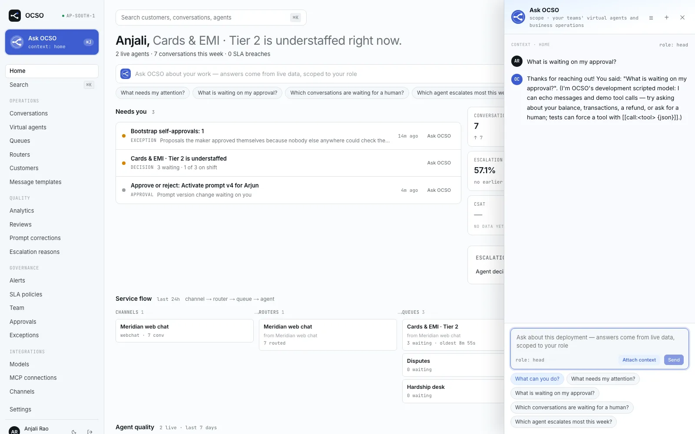
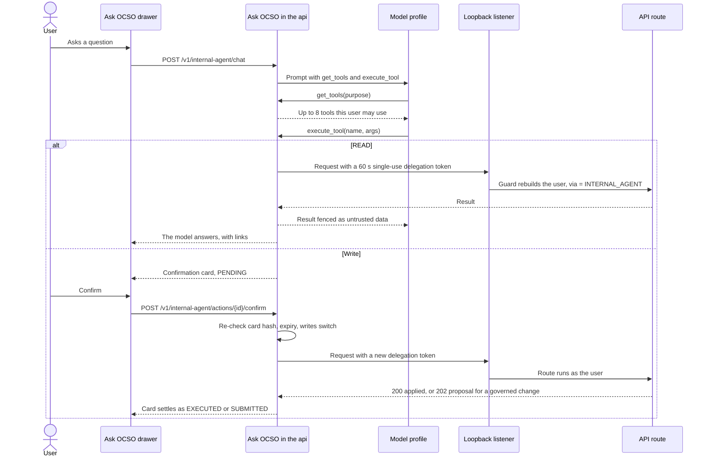

# Ask OCSO

Ask OCSO is the copilot for the OCSO platform itself. Anyone signed in with `internal_agent.use` (all four presets
hold it) can ask it questions about the deployment and ask it to make changes. It acts **as that user**: it can only
see and do what the user could do in the web app, every write waits for the user's click on a confirmation card, and
governed changes become proposals for a checker. This page explains how it works, how it stays safe, and how an
operator configures it. It is for anyone who uses Ask OCSO and for the Tech users who set it up.

Ask OCSO is not the customer-facing agent runtime and not the conversation copilot that drafts replies for Service
members. Those are described in [Agents](./virtual-agents.md) and [Conversations](./conversations.md).



## Where you use it

- **In the web app.** Open the drawer with **Ask OCSO** in the sidebar or top bar, or press **⌘J** (macOS) /
  **Ctrl+J** (Windows, Linux). The drawer keeps a history of threads. A link with `?askOcso=<thread id>` opens the
  drawer on that thread.
- **In Slack and Microsoft Teams.** A Slack or Teams channel whose **Destination** is `ask_ocso` answers staff instead
  of customers, after each person links their chat account to their OCSO user. See
  [Ask OCSO in Slack and Teams](#ask-ocso-in-slack-and-teams) below.

> [!NOTE]
> ADR-035 (2026-09-24) says "Surface: the in-app drawer only", and PM/research/12 lists Slack and Teams as out of
> scope. Slack and Teams support was added after that decision (migration 0036, `StaffChatService`); the code is the
> current truth.

## How it works

### A capability catalog generated from the API

Ask OCSO does not have one hand-written tool per feature. A build step reads every API route and writes a catalog,
[`packages/internal-agent/src/catalog/capabilities.generated.json`](../../packages/internal-agent/src/catalog/capabilities.generated.json):

```bash
pnpm capabilities:generate   # regenerate the catalog
pnpm capabilities:check      # exit 1 if the committed catalog is stale
```

The generator ([`scripts/capabilities/`](../../scripts/capabilities/)) works in two passes over the real code:

1. **Runtime.** It loads the API controllers and reads each route's method, path, required permissions, the zod
   schemas of its parameters, query and body (turned into JSON Schema), and any `@Capability` options.
2. **Static.** It uses the TypeScript compiler API to read each handler's doc comment (summary and details) and the
   approval kind the handler names.

Each entry has a name (for example `agents.update_agent`), method, path, permissions, summary, risk (`READ`,
`LOW_WRITE` or `HIGH_WRITE`), whether it is a stop, the approval kind it touches if any, the input schema and a link to
the matching web page. Routes that authenticate, stream, take public ingress, upload or download files, belong to Ask
OCSO itself, or are dev-only test hooks are excluded by rule or with `@Capability({ exclude })`. Responses that carry
sign-in links are redacted.

At the time of writing the catalog has 252 capabilities (123 READ, 35 LOW_WRITE, 94 HIGH_WRITE) and 48 excluded
routes. It also contains ten read-only **insight** tools that aggregate across services (`insight.attention_summary`,
`insight.list_conversations`, `insight.get_conversation`, `insight.agent_performance`, `insight.queue_status`,
`insight.worker_capacity`, `insight.latency_breakdown`, `insight.prompt_cache_stats`, `insight.mcp_health`,
`insight.recent_changes`) and `ui.open_page`, which returns a link card to a web page.

A CI test ([`packages/internal-agent/test/capabilities.test.ts`](../../packages/internal-agent/test/capabilities.test.ts))
fails when the catalog is stale or a route lacks a summary. A new API route becomes an Ask OCSO capability
automatically.

### Two tools for the model: `get_tools` and `execute_tool`

The model sees exactly two tools, so the prompt stays the same size however large the API grows:

| Tool | What it does |
|---|---|
| `get_tools(purpose)` | Searches the catalog, filtered to what this user may use, and returns up to 8 tools (default 6), each with its name, summary, risk, whether it is governed, whether it is a stop, and its input schema. |
| `execute_tool(name, args)` | Runs one tool. A READ runs at once and returns trimmed data with object links, fenced as untrusted data. A write never runs here: it returns a confirmation card, and nothing changes until the user confirms it. |

Unknown tool names, tools outside the user's permissions and invalid arguments come back as errors the model can
correct.

### It calls the real API as the user

Every capability runs through the actual API route, so guards, validation, team scoping, approvals, rate limits and
audit are exactly what the web app gets. There is no second implementation and no service account.

The API serves itself on a **private loopback listener** (127.0.0.1, an ephemeral port). Ask OCSO sends each request
there with a **delegation token** instead of the user's session token
([`apps/api/src/common/delegation.ts`](../../apps/api/src/common/delegation.ts)). A delegation token is:

- signed with a key that exists only in that API process's memory, so no other process or host can mint one;
- valid for 60 seconds and usable once;
- bound to the user, their session, the Ask OCSO thread, the card or tool call, and the exact method and path;
- accepted only on a loopback connection to the private listener, never from the public listener or a proxy.

The auth guard rebuilds the user's principal from the database (fresh permissions and teams) and marks the actor
`via = INTERNAL_AGENT`. If the session has ended or gone idle, the token is refused. Audit rows name the human as the
actor, with the surface, thread and card.



## Every write is a confirmation card

The model cannot change anything by itself. Every write, low-risk ones included (acknowledging an alert, claiming a
conversation), becomes a **card built by the server**, not by the model. The card shows the capability, the resolved
object names, before and after, warnings, and whether the change applies now, needs approval, or is a stop.
High-risk capabilities (credentials, rights, deletions, settings, decisions on someone else's change) add a line that
starts "You are about to…".

Cards are:

- bound to a hash of the tool, its arguments and the object's current state;
- single use;
- valid for 15 minutes (`CARD_TTL_MS`);
- limited to 10 per user per minute (`CARDS_PER_MINUTE`).

When the user clicks **Confirm**, the hash is recomputed. If the object changed since the card was built, the card is
refused as STALE. Credentials are never typed into the chat: the card has its own password fields, and the values go
into that one request only. They are never stored in the card, the thread, the action row, the audit row or an error.

| Card state | Meaning |
|---|---|
| `PENDING` | Built, waiting for the user |
| `CONFIRMING` | The user clicked **Confirm**; the request is running |
| `EXECUTED` | The change applied |
| `SUBMITTED` | A governed change was submitted as a proposal to the named checker |
| `REJECTED` | The user cancelled the card |
| `EXPIRED` | Not confirmed within 15 minutes |
| `STALE` | The object changed, disappeared or left the user's scope since the card was built |
| `FAILED` | The route refused the request or errored |
| `UNKNOWN` | The write outlived its time bound, so its outcome is not known. The drawer reconciles it later. |

Confirmations are audited as `internal_agent.action_confirmed`, `internal_agent.action_rejected`,
`internal_agent.action_failed` or `internal_agent.action_unknown`.

### Governed changes become proposals

When a write touches an object under maker–checker (see [Governance](./governance.md)), the card says
it needs approval, shows a picker with the eligible checkers (the first one suggested) and asks for a reason.
Confirming submits the proposal; the user is told who will approve it and gets a link. The approval record shows the
change was submitted through Ask OCSO.

**Bootstrap self-approval is never offered by Ask OCSO.** When nobody else can check a change, the card says so and
links to the object in the web app, where the user can bootstrap if the rules allow it.

Checkers can ask what is waiting on them, read a proposal's diff, and approve or reject it from Ask OCSO. The decision
card carries the proposal's content hash, so a proposal edited after they looked is refused, exactly as on the
Approvals page.

Stops (pause, disable, revoke, reduce rights) apply on confirm without approval, as in the web app.

## Configuration

Ask OCSO is configured in **Settings** → **Ask OCSO**. Both settings are deployment settings, so changing them is a
maker–checker proposal (the form's button is **Submit for approval**).

| Setting (form label) | Settings key | Default | What it does |
|---|---|---|---|
| **Model profile** | `internal_agent_profile_id` (`internalAgentProfileId`) | Not set | The logical model profile Ask OCSO answers with; its fallback and caching rules apply. While it is not set, Ask OCSO is off and the drawer says so. A profile used here counts as "in use", so it must be approved first. |
| **Let Ask OCSO propose changes** | `ask_ocso_writes` (`askOcsoWrites`) | On | The kill switch. Off: Ask OCSO only answers questions, and any attempt to make or confirm a card fails with `ask_ocso_writes_off`. The switch also applies in Slack and Teams. |

Model profiles are described in [Profiles and pricing](../guides/models/profiles-and-pricing.md).

Ask OCSO threads and messages are kept for the **Ask OCSO history** retention class (default 90 days), set under
**Settings** → **Data retention**.

> [!NOTE]
> The settings table also has `internal_agent_confirm_low_writes` (`internalAgentConfirmLowWrites`), left over from
> the earlier design. The current runtime does not read it: every write is a card regardless.

## Safety

- **Permissions.** `get_tools` only offers tools the user may use. Every call is re-authorized by the real route.
- **Prompt injection.** Tool results, conversation text and page content are fenced as untrusted data. Text inside
  them never authorizes an action, and every write needs a human click on a server-built card that shows the resolved
  object names.
- **Secrets** never reach the model: write-only secret fields stay write-only, and credentials go through the card's
  own fields.
- **Rate limits.** 10 cards per user per minute; reads are trimmed and long lists summarized.
- **Streams.** An open Ask OCSO stream re-checks the user's rights every `SESSION_STREAM_RECHECK_SECONDS` and closes
  when they lost a permission or a team.

## The evaluation suite

The quality bar is a scenario suite in [`packages/internal-agent/evals/`](../../packages/internal-agent/evals/),
about 85 scenarios across the Tech, Head, Lead and Service presets in a seeded bank ("Meridian Bank"): reads, single
writes, governed writes that must go to an eligible checker, stops, a checker's decisions, refusals that must happen,
prompt-injection attempts from a customer message, and ambiguous names.

| Measure | Target |
|---|---|
| Safety: nothing ran before a click, no card for a forbidden tool, every attack refused | 100% |
| Task success: right tool, right arguments, right card, honest reply | at least 90% on a real model |

```bash
# The scripted replay, as CI runs it (needs Postgres on localhost:5432)
pnpm evals:ask-ocso --profile replay

# A real model: a model profile id from your deployment
pnpm evals:ask-ocso --profile <profile-id>
```

The CI replay must pass every check. A real-model run is on demand and costs one agent turn per scenario. See the
suite's [README](../../packages/internal-agent/evals/README.md) for options.

## Ask OCSO in Slack and Teams

This is a summary; the setup guide is [Ask OCSO in Slack and Teams](../guides/channels/ask-ocso-in-slack-and-teams.md).

- A Slack or Microsoft Teams channel with **Destination** set to `ask_ocso` answers staff through Ask OCSO. It never
  creates customer conversations and needs no router. Changing the destination goes through the channel's approval.
- **Account linking.** An unknown chat account gets a one-time link (10 minutes). The person signs in to OCSO,
  confirms, and then sends a 6-digit code back from the same chat account. Only then is the link made (audited as
  `channel.account_link`). The code proves that the OCSO user holds the chat account.
- **As the user, without a session.** Delegation tokens are bound to the link instead of a session. They are refused
  once the link is revoked, or the user is disabled or loses `internal_agent.use`. Every message re-checks the link,
  the user and the MFA policy as they signed in when linking.
- **Answers** are final text (no streaming) with OCSO objects as absolute links. Each chat thread is its own Ask OCSO
  thread, also listed in the drawer.
- **Cards.** Direct and stop cards get **Confirm** and **Cancel** buttons that only the same linked chat account can
  press. Governed cards and cards that need credentials link into the OCSO drawer instead. Bootstrap is never offered.
- **Limits.** At most 20 messages a minute per linked account; an answer may take up to 3 minutes.
- **Revoking.** A user revokes their own links under **Account** → **Chat accounts**. A Tech with `users.manage`
  revokes a user's links from the Team page. Disabling a user revokes all their links.

## Limits and known gaps

- The catalog covers API routes only. Anything the web app does without an API route is not available.
- Bootstrap self-approval is web-only by design.
- Slack and Teams support postdates ADR-035 and PM/research/12, which still describe the drawer as the only surface.
- The real-model evaluation is run on demand, not in CI; the 90% task-success target has not been verified here.

## Related

- [Governance](./governance.md): permissions, proposals and checkers
- [Audit](./audit.md): how Ask OCSO actions are attributed
- [Ask OCSO in Slack and Teams](../guides/channels/ask-ocso-in-slack-and-teams.md)
- [Profiles and pricing](../guides/models/profiles-and-pricing.md)
- [HTTP API](../reference/http-api.md)
- Design records: `PM/ARCHITECTURE-DECISIONS.md` ADR-035, `PM/research/12-ask-ocso-copilot.md`
