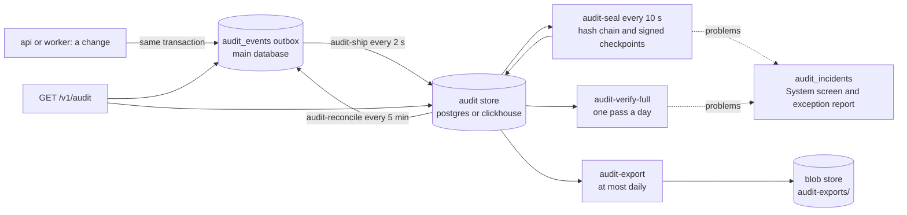
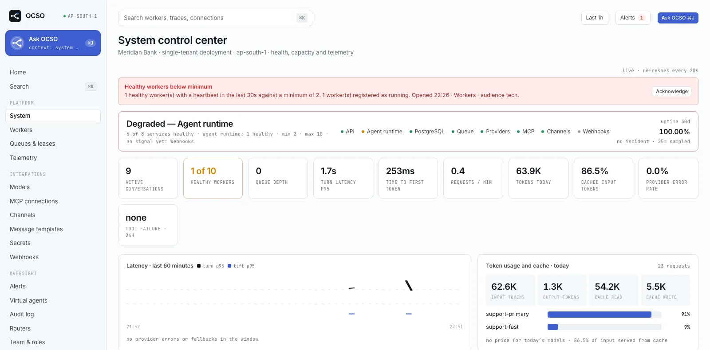
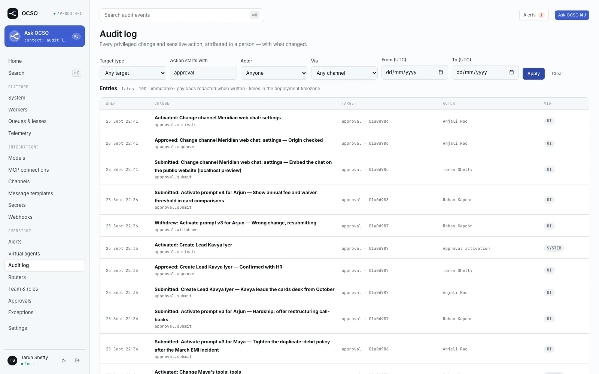

# Audit

This page explains how OCSO records what happened, how that record reaches a separate audit store, and how anyone can
check that it was not changed afterwards. It covers the outbox, the audit store drivers, the worker tasks that ship,
seal and export events, the hash chain and signed checkpoints, key rotation, verification in the UI and offline,
incidents, who can read what, and retention. It is for operators who run OCSO and for auditors who need to trust its
audit trail.

For day-to-day operation of the store (provisioning, backups, restore), see
[Backups and restore](../operations/backups-and-restore.md) and [Configuration](../reference/configuration.md). The
approvals and permissions that generate most audit events are described in [Governance](./governance.md).

## The design in brief

- Every change writes its audit row **in the same database transaction** as the change itself. If the change commits,
  so does its audit row. This is the outbox (`audit_events` in the main database).
- The worker ships those rows, within seconds, to the **audit store**: a separate database, reached with separate
  credentials, that the application cannot rewrite.
- In the store, records are sealed into a **SHA-256 hash chain**, and the chain head is **signed with Ed25519** at
  regular checkpoints. Signed ranges are **exported** daily to the blob store.
- The chain is re-verified continuously and in full once a day. Anyone with the public key can verify it offline
  with the `audit-verify` bin.



## The outbox

`recordAudit` writes a row to `audit_events` inside the caller's transaction. Each row carries the actor, the action,
the target, a summary, before/after payloads where relevant, a correlation id, and `team_ids`: the teams the event
concerns (the target's teams plus an agent actor's teams), fixed at write time. That field is what lets the separate
store apply team scoping later.

`audit_events` is append-only at the database level. A trigger permits only three things:

- an UPDATE that sets `shipped_at` or `verified_at` and nothing else (a row is never verified without being shipped);
- a DELETE of rows older than the retention cutoff the transaction declares (at least 365 days);
- a DELETE of rows the store has **verified** and that are older than the local window, when the transaction
  explicitly opts in to local pruning.

TRUNCATE is always refused.

## The audit store

The store is a plugin driver kind (ADR-028, ADR-032). The package
[`@ocso/audit-store`](../../packages/audit-store/) registers two drivers, selected with `AUDIT_DRIVER`:

| Driver | What it is | Guarantee |
|---|---|---|
| `postgres` (default) | Its own PostgreSQL database. `audit_records` is range-partitioned by UTC month, with `audit_chain` and `audit_checkpoints` beside it. | **Append-only.** Triggers refuse UPDATE, DELETE and TRUNCATE for every role, the owner included. Only the owner (or a superuser) could disable those triggers, so the owner credentials are what an auditor must control. |
| `clickhouse` | ClickHouse over its HTTP interface. MergeTree tables partitioned by month; reads keep the first stored copy of a record. | **Tamper-evident, not append-only.** The writer can only SELECT and INSERT, but an INSERT can add a second copy of a record or a second chain row at a position. Verification reports these as `RECORD_CONFLICT` and `CHAIN_FORK`. |

Credentials are split by role:

| Credential | Who holds it | Rights |
|---|---|---|
| Owner (`AUDIT_DATABASE_OWNER_URL`, or `CLICKHOUSE_ADMIN_USER`) | The migrate step only (`audit-migrate`) | Creates the schema, roles and grants, and sets the minimum retention |
| Writer (`AUDIT_DATABASE_URL`, or `CLICKHOUSE_USER`) | The worker | INSERT and SELECT, plus (postgres) two `SECURITY DEFINER` functions for creating partitions and purging whole months past retention |
| Reader (`AUDIT_READER_URL`, or `CLICKHOUSE_READER_USER`) | The api | SELECT only |
| Purge user (`CLICKHOUSE_PURGE_USER`, clickhouse only, optional) | The worker | ALTER DELETE on `audit_records`, needed to drop a partition. Treat it like owner credentials. Without it the ClickHouse store is never purged. |

In production, `audit-migrate` refuses a writer that is the owner or a superuser unless `AUDIT_ALLOW_OWNER_WRITER=true`,
and the System screen warns when the connected credentials are the owner's or when the api can write. Every store call
is time-bounded (`AUDIT_STORE_TIMEOUT_MS`, default 15 seconds).

Compose runs the store as its own `audit-db` service; the AWS reference gives it its own RDS instance by default. See
[Docker Compose](../guides/deploy/docker-compose.md) and [AWS](../guides/deploy/aws.md). Every api and worker start
needs `AUDIT_DATABASE_URL` (or the ClickHouse settings). The full list of `AUDIT_*` and `CLICKHOUSE_*` settings is in
[Configuration](../reference/configuration.md).

## Worker leader tasks

The leader worker runs five audit tasks
([`apps/worker/src/audit/audit.module.ts`](../../apps/worker/src/audit/audit.module.ts)). Each has a 60-second deadline.
While the shipper is backing off from a failing store, the other four skip their store work, so a store that hangs
never stalls the rest of the worker.

| Task | Interval | What it does |
|---|---|---|
| `audit-ship` | 2 s | Takes up to 500 of the oldest unshipped outbox rows, appends them to the store idempotently, and stamps `shipped_at`. On failure it opens a `SHIP_FAILED` or `STORE_DOWN` incident and backs off exponentially from 2 to 60 seconds. OCSO keeps serving. The next successful round resolves the incident. |
| `audit-reconcile` | 5 min | For rows shipped more than 30 seconds ago but not yet verified, asks the store whether it holds them. If yes, stamps `verified_at`. If not, clears `shipped_at` so the row ships again and opens `RECONCILE_MISSING`. |
| `audit-seal` | 10 s | Takes unsealed records in arrival order and appends them to the hash chain. Every 1,000 entries, or hourly, re-verifies what is new since the last checkpoint (at most 50,000 entries per run) and signs a checkpoint at the verified end. New problems open or widen `CHAIN_BROKEN`; nothing is signed over a break, but later ranges that verify on their own are still signed. One sealer at a time, fenced by an advisory lock in the main database. |
| `audit-verify-full` | every minute until done | Re-verifies the whole chain in 50,000-entry pages, one full pass a day, resuming where it left off. A record altered long ago is found here. |
| `audit-export` | checked hourly, at most daily | Writes the sealed range up to the latest checkpoint to the blob store as `audit-exports/YYYY/MM/DD/<from>-<to>.ndjson.gz` plus a signed `.manifest.json` (checkpoint, public key, sha256 of the file). Opens `EXPORT_FAILED` on error, or when no newer checkpoint by this key allowed an export for two periods. |

> [!IMPORTANT]
> An export is an independent copy only if the blob store keeps `audit-exports/` write-once (for example S3 Object
> Lock). OCSO does not configure or check this: nothing in Compose or Terraform turns it on, and the local `blobs`
> volume cannot be made write-once.

## The hash chain

- `recordHash = sha256(canonicalJson(record))` over a fixed set of fields: sorted keys, no whitespace, ISO dates with
  millisecond precision, absent payloads as `null`.
- `chainHash = sha256(prevHash ‖ recordHash)` over the two hex strings. The genesis `prevHash` is 64 zeros.
- Chain order is **seal order** (arrival in the store), not event time, so a record re-shipped later is still sealed.

Changing, removing or reordering any sealed record changes every chain hash after it, which no longer matches the
signed checkpoints.

## Signed checkpoints

A checkpoint signs the chain head with the deployment's Ed25519 key. The signed message is:

```text
ocso-audit-checkpoint
<upToPosition>
<chainHash>
<createdAt ISO>
```

The key id is the first 16 hex characters of the sha256 of the public key (SPKI DER). Only the worker signs
checkpoints and exports. The api also holds the private key, because a person signs the weekly exception report there
(see [Governance](./governance.md#weekly-signed-report)).

## Keys and rotation

| Setting | What it is |
|---|---|
| `AUDIT_SIGNING_KEY_FILE` | Path to the Ed25519 private key (PKCS#8 PEM). Compose keygen creates it as `app/audit_signing_key`. Back it up. |
| `AUDIT_SIGNING_KEY` | The same key inline, for platforms that inject secrets as variables (ECS). On AWS it is its own Secrets Manager secret. |
| `AUDIT_TRUSTED_PUBLIC_KEYS` / `AUDIT_TRUSTED_PUBLIC_KEYS_FILE` | A PEM bundle of retired public keys that should still be trusted. |

Production refuses to start without a signing key. In development, a key is created on first use at
`<workspace>/.ocso/audit_signing_key.pem` and shared by the api and worker; the api logs a warning.

**Rotation is by trust, not re-signing.** Old checkpoints stay signed by the old key. To rotate:

1. Install the new private key in `AUDIT_SIGNING_KEY_FILE` (or `AUDIT_SIGNING_KEY`).
2. Put the old public key (`openssl pkey -in old.pem -pubout`) in `AUDIT_TRUSTED_PUBLIC_KEYS_FILE`.
3. Restart the api and the worker.

A checkpoint signed by a key the deployment does not trust shows as `CHECKPOINT_UNKNOWN_KEY` in verification and opens
a `SIGNING_KEY_CHANGED` incident. A lost or silently regenerated key therefore shows up. If keygen created a new key
because the secrets volume was lost, restore the old key rather than trusting the new one blindly.

The public keys are at `GET /v1/audit/keys` (`audit.read` or `audit.verify`). Auditors should pin keys from there or
from their own records, never from an export manifest: a forger would replace both.

## Verifying

**In the UI.** The System screen has an **Audit store** panel showing the driver, status, shipping lag and backlog,
the sealed position, the last checkpoint and signing key, exports, the last full check and open incidents. **Verify
recent entries** (needs `audit.verify`, which Tech holds) re-verifies the latest entries. The same is available as
`POST /v1/audit/verify {from?, to?}`: the latest 10,000 entries by default, at most 100,000, audited as `audit.verify`
with the key ids used.



**Offline.** The `audit-verify` bin re-verifies any range with no entry cap. It needs read access to the store
(the reader URL is enough) and the public keys you trust:

```bash
# Docker Compose: the bin ships in the migrate image
docker compose run --rm migrate node audit-store/dist/bin/audit-verify.js --from 1 --public-key audit_signing_key.pub.pem
```

```text
audit-verify [--from N] [--to N] [--public-key FILE]... [--max-unsigned N]
```

It checks every link, every record hash, every checkpoint signature, forks and conflicting copies, and prints a JSON
report with the unsealed backlog and the key ids it trusted. Without `--public-key` it trusts the public half of
`AUDIT_SIGNING_KEY(_FILE)` plus `AUDIT_TRUSTED_PUBLIC_KEYS(_FILE)`. Exit codes:

| Exit | Meaning |
|---|---|
| `0` | The range verified |
| `1` | A problem: a broken link or hash, no valid checkpoint signs the range, more than `--max-unsigned` (default 5,000) entries follow the last checkpoint, or records exist but nothing was ever sealed |
| `2` | Usage or connection error |

On AWS there is no ready-made ECS task for `audit-verify`; run it from a host inside the VPC (see
[AWS](../guides/deploy/aws.md)).

## Incidents

Problems are recorded in `audit_incidents`, one open row per kind, shown on the System screen and listed by the
exception report (`audit_shipping` and `audit_chain` checks):

| Incident | Opened when | Closed when |
|---|---|---|
| `SHIP_FAILED` | An append to the store failed while the store answered its health check | The next successful shipping round |
| `STORE_DOWN` | The store did not answer | The next successful shipping or reconciliation round |
| `RECONCILE_MISSING` | A shipped row was not found in the store (the row is re-shipped) | The next reconciliation round that finds nothing missing |
| `CHAIN_BROKEN` | Sealing or full verification found a problem (the detail records the position range) | A person with `audit.verify` acknowledges it with a note (**Acknowledge break**, `POST /v1/audit/incidents/:id/acknowledge`). The acknowledgement is audited; nothing in the store is rewritten, and later verifications treat that range as a known break. |
| `EXPORT_FAILED` | An export failed, or no export was possible for two periods | The next successful export |
| `SIGNING_KEY_CHANGED` | The last checkpoint was signed by a key the deployment does not trust | No automatic close was found in the code: the incident stays open (and in the exception report) after you trust the old key or restore it. There is no acknowledge endpoint for it. |

## Reading the audit log

The `/audit` page (`GET /v1/audit`, `audit.read`) reads the unshipped outbox first, then the store, removes
duplicates and merges them newest first. Shipping lag never hides an event, and rows shipped but not yet verified
stay visible until reconciliation confirms them. If the store fails or does not answer within 5 seconds, the page
serves the main database's local window instead (response header `x-ocso-audit-source: local`) and shows a banner.
You can filter by target type, action prefix, actor, channel and time range, and open an event to see its before and
after.



### Who can read what

- `audit.read_all` (Tech) reads every event.
- Everyone else with `audit.read` (Lead, Head) reads events they performed, events whose `team_ids` overlap their
  teams, and changes to shared configuration (queues, SLA policies, teams, routers, channels, message templates).
- Team scope is fixed when the event is written. Moving a person or an agent between teams does not re-scope history.
- Events from before the audit store existed were backfilled with their target's teams (and an agent actor's), not
  the acting user's current teams.
- Ask OCSO's recent-changes insight reads through the same scope as the asking user.

Audit rows made through Ask OCSO name the human as the actor, with `via = INTERNAL_AGENT` and the thread and card (see
[Ask OCSO](./ask-ocso.md)).

## Retention

Retention is set per data class in **Settings** → **Data retention** (a governed deployment setting). The **Audit
trail** class defaults to 2,555 days (about 7 years) and cannot be set below 365.

- **The store.** The worker's retention run asks the store to purge whole months older than the audit retention. The
  store never drops anything younger than its own floor, `AUDIT_MIN_RETENTION_DAYS` (at least 365, set by
  `audit-migrate` with owner credentials), whatever the setting says. Every drop is logged in the append-only
  `audit_purges`, and verification counts a missing record as purged only under a logged purge; anything else is
  `RECORD_MISSING`.
- **The local window.** The main database keeps verified audit rows for `audit_local_window_days` (default 90,
  allowed 90 to 3,650) and then prunes them, but only after asking the store once more that it still holds them.
  Rows the store no longer holds (for example after the store was restored from a backup) are re-shipped instead.

> [!WARNING]
> After restoring the audit store from a backup, events shipped after the backup point are re-shipped only while they
> are still inside the local window. Restore within `audit_local_window_days` of the backup, then let reconciliation
> run and verify with `audit-verify`. See [Backups and restore](../operations/backups-and-restore.md).

## Limits and known gaps

- The store copy is not atomic with the change: it arrives within seconds, at least once. The outbox row is atomic;
  reconciliation before any local prune makes sure nothing is lost.
- ClickHouse is tamper-evident, not append-only, and its minimum retention is enforced by the driver, not the server.
- On AWS with `audit_store.separate_instance = false`, the audit database shares the main instance, whose master user
  the api and worker hold. A compromised api could disable the triggers. Terraform warns on every plan; do not use it
  for a regulated deployment.
- OCSO does not enable write-once storage for exports.
- Moving from the postgres driver to ClickHouse does not copy existing records; keep the old store read-only for its
  retention. The System screen's Storage panel says when a columnar store is worth considering.
- There is no Merkle tree: proving that one record is included means verifying the chain range around it.

## Related

- [Governance](./governance.md): approvals, permissions and the exception report
- [Ask OCSO](./ask-ocso.md): how copilot actions are attributed
- [Configuration](../reference/configuration.md): `AUDIT_*` and `CLICKHOUSE_*` settings
- [Backups and restore](../operations/backups-and-restore.md)
- [Docker Compose](../guides/deploy/docker-compose.md) and [AWS](../guides/deploy/aws.md)
- [Plugins](./plugins.md): audit store drivers are a plugin kind
- Design record: `PM/ARCHITECTURE-DECISIONS.md` ADR-032
