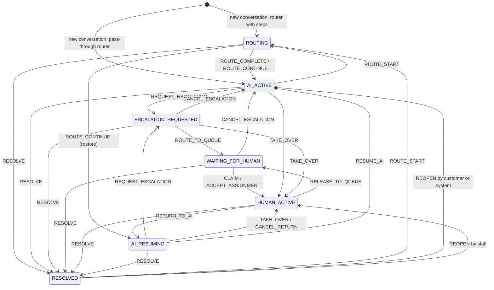
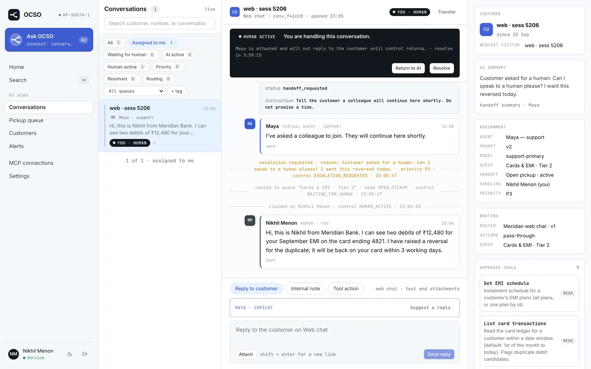
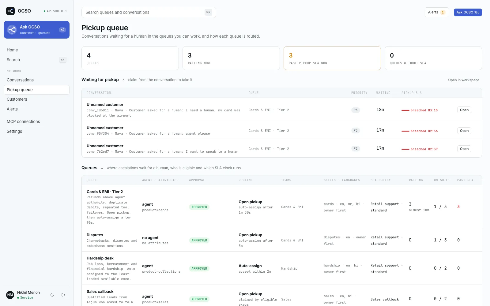

# Conversations and hand-off

This page explains how OCSO models a customer conversation: who is driving it at any moment (the AI agent, a router, or a person), how it moves between those states, how a hand-off to a human works, and what staff see in the workspace. It is for anyone who configures or operates OCSO — Leads and Heads setting up queues, Service members working the inbox, and engineers reading the code.

The rules described here live in core, not in plugins: the state machine is in [`packages/domain/src/conversation`](../../packages/domain/src/conversation/), and the hand-off logic is in [`packages/application/src/handoffs`](../../packages/application/src/handoffs/). Channels such as WhatsApp or Slack only turn provider messages into OCSO's own message format and back. They never decide who answers.

## The model

| Entity | What it is |
|---|---|
| **Customer** | An external person. One customer can have several channel identities, such as a WhatsApp number and a web chat user id. A customer also carries a `language`, free-form `attributes` and an optional account owner (a staff user). |
| **Conversation** | One thread between one customer and your organization on **one channel**. A customer has at most one open conversation per channel. A conversation has a queue, an agent (the AI agent that answers it), a control state, a priority (`P1`–`P4`), a type (`SUPPORT`, `SALES`, `COLLECTIONS`, `ONBOARDING`, `CUSTOM`, taken from the agent), SLA deadlines, tags and an optional disposition. |
| **Interaction** | One entry in the conversation's record. Every interaction has a monotonic `seq`, an actor type (`CUSTOMER`, `AGENT`, `HUMAN`, `SYSTEM`, `TOOL`, `ROUTER`), a direction (`INBOUND`, `OUTBOUND`, `INTERNAL`), a visibility (`CUSTOMER` or `INTERNAL`) and a delivery status. Once the status reaches `FAILED` it stays there, and otherwise it only moves forward. |
| **Interaction part** | An interaction holds one or more parts: `TEXT`, `IMAGE`, `AUDIO`, `VIDEO`, `DOCUMENT`, `LOCATION`, `CONTACT`, `STRUCTURED` and `TOOL_RESULT`. Media parts carry a reference to the blob store, never the bytes. A `TOOL_RESULT` part is never sent to a customer channel. See [`interaction/parts.ts`](../../packages/domain/src/interaction/parts.ts). |
| **Internal note** | A note for staff only, stored in its own table (`internal_notes`, ADR-013) and never inside the interaction stream, so it cannot reach a channel by accident. A note can be marked **pass to agent**. The agent then sees it as context the next time it takes the conversation back. |
| **Turn** | One run of the AI agent. It answers every customer message that has not been processed yet (`seq > last_processed_seq`). Turns are recorded with their outcome (`REPLIED`, `HANDOFF`, `NO_REPLY`, `AWAITING_CONFIRMATION`, `TRANSFERRED`), their steps, latency, provider and model. |
| **Handoff** | The record of one request for a human: its trigger, reason, the agent's summary, mode, queue, priority and status (`WAITING`, `OFFERED`, `ACTIVE`, `RETURNED`, `RESOLVED`). |

Structured parts are how channel-neutral UI travels. For example, a router's menu question is a `STRUCTURED` part with schema `ocso.choices`, and each channel renders it natively or as numbered text. See [Routing](routing.md#how-a-menu-reaches-the-customer).

## Control states

A conversation is always in exactly one control state. The state decides who may write to the customer.

| State | Label in the UI | Who drives | AI may reply? |
|---|---|---|---|
| `ROUTING` | Routing | A router is asking the customer, or classifying, before a queue and agent are chosen. | No. The router sends its own questions. |
| `AI_ACTIVE` | AI active | The AI agent. | **Yes.** This is the only state in which the agent may send without a human. |
| `ESCALATION_REQUESTED` | Waiting for human | The agent or a rule asked for a human, and the hand-off is being routed. This state normally lasts for one transaction. | No |
| `WAITING_FOR_HUMAN` | Waiting for human | Nobody. The conversation waits in a queue for pickup or an auto-assign offer. | No |
| `HUMAN_ACTIVE` | Human active | A person. The agent stays attached but silent. | No |
| `AI_RESUMING` | Returning to AI | A person handed control back. The agent answers on the customer's next message. | Not yet. The next turn moves it to `AI_ACTIVE`. |
| `RESOLVED` | Resolved | Nobody. | No. A new customer message can reopen the conversation (see [Reopening](#reopening-and-the-72-hour-window)). |

The worker checks the state twice: before it starts generating, and again right before any write the customer will see. If a person takes over in the middle of a turn, the agent's reply is never delivered.

### Commands and transitions

Transitions are commands checked against an explicit table in [`transitions.ts`](../../packages/domain/src/conversation/transitions.ts). Any command not listed there is rejected with `invalid_control_transition`.

| Command | From | To | Who may issue it |
|---|---|---|---|
| `ROUTE_START` | `AI_ACTIVE`, `RESOLVED` | `ROUTING` | System: a returning customer is asked whether to continue or start new |
| `ROUTE_COMPLETE` | `ROUTING` | `AI_ACTIVE` | System: the router chose a queue |
| `ROUTE_CONTINUE` | `ROUTING` | the pre-routing state (`AI_ACTIVE`, or `AI_RESUMING` if that was it) | System: the returning customer chose to continue |
| `REQUEST_ESCALATION` | `AI_ACTIVE`, `AI_RESUMING` | `ESCALATION_REQUESTED` | Agent, system, human |
| `ROUTE_TO_QUEUE` | `ESCALATION_REQUESTED` | `WAITING_FOR_HUMAN` | System |
| `CLAIM` | `WAITING_FOR_HUMAN` | `HUMAN_ACTIVE` | Human. Refused if the conversation is assigned to someone else. |
| `ACCEPT_ASSIGNMENT` | `WAITING_FOR_HUMAN` | `HUMAN_ACTIVE` | Only the human it was offered to |
| `TAKE_OVER` | `AI_ACTIVE`, `AI_RESUMING`, `ESCALATION_REQUESTED` | `HUMAN_ACTIVE` | Human |
| `RELEASE_TO_QUEUE` | `HUMAN_ACTIVE` | `WAITING_FOR_HUMAN` | Human, system |
| `RETURN_TO_AI` | `HUMAN_ACTIVE` | `AI_RESUMING` | Human |
| `CANCEL_RETURN` | `AI_RESUMING` | `HUMAN_ACTIVE` | Human |
| `RESUME_AI` | `AI_RESUMING` | `AI_ACTIVE` | System (the agent's next turn) |
| `CANCEL_ESCALATION` | `ESCALATION_REQUESTED`, `WAITING_FOR_HUMAN` | `AI_ACTIVE` | Human, system |
| `RESOLVE` | any open state, including `ROUTING` | `RESOLVED` | Human, agent, system |
| `REOPEN` | `RESOLVED` | `AI_ACTIVE` (customer or system), `HUMAN_ACTIVE` (a staff member, who then holds it) | Customer, human, system |
| `TRANSFER_QUEUE` | `AI_ACTIVE`, `WAITING_FOR_HUMAN`, `HUMAN_ACTIVE` | unchanged | The agent (only while `AI_ACTIVE`) or a human (only while waiting or holding) |

The diagram leaves out `TRANSFER_QUEUE` because it keeps the state the conversation already has (a self-loop on `AI_ACTIVE`, `WAITING_FOR_HUMAN` and `HUMAN_ACTIVE`).

> [!NOTE]
> The table allows `ROUTE_CONTINUE` back to `AI_RESUMING`, but ingress only starts the returning-customer question from `AI_ACTIVE` or `RESOLVED`. In practice a continuing customer always lands in `AI_ACTIVE`.

A customer message starts an AI turn only in `AI_ACTIVE`, `AI_RESUMING` or `RESOLVED`. It never starts one in `ROUTING`, because the router consumes the reply. Messages that arrive while the conversation is waiting for a human or held by one are stored and streamed to the workspace, but no AI turn runs.

## Hand-off to a human

### What triggers it

A hand-off always goes through `requestHandoff` ([`handoffs/request.ts`](../../packages/application/src/handoffs/request.ts)). In the current code it is triggered by:

| Source | Trigger recorded |
|---|---|
| The agent calls the built-in tool `ocso_request_handoff` with a reason and a three-line summary | `CUSTOMER_REQUEST` if the agent set `customerAskedForHuman`, otherwise `AGENT_DECISION` |
| The agent proposed a tool call that needs human confirmation | `SENSITIVE_ACTION`, priority `P1` |
| The agent hit its tool-step limit without finishing | `TOOL_FAILURE` |
| The model stayed unavailable after retries and fallbacks | `POLICY`, reason `ai_unavailable`, priority `P2` |
| A router placed the conversation on a queue whose agent cannot answer (paused, draft, or no model profile) | a hand-off opens on that queue immediately |

**Escalation rules** are configured per agent (or platform-wide) on the agent's **Escalation** tab: a trigger, conditions (**Keywords**, **Consecutive tool failures**, **Amount above**, customer asks for a human), a **Handoff mode**, a **Target queue** and a **Priority**. They go through maker–checker like other agent configuration. See [Agents](virtual-agents.md#escalation-rules).

> [!WARNING]
> Known gap: the runtime does not evaluate escalation-rule conditions yet. No code path passes a rule id into `requestHandoff`, so a rule's mode, target queue and priority are only applied if something supplies that id. Today the agent decides when to escalate from its prompt: the **Escalation rules** prompt component, plus the runtime contract that tells it to call `ocso_request_handoff`. Treat escalation rules as documented policy until this is wired in.

### Routing the hand-off

In one transaction, the conversation goes from `AI_ACTIVE` to `ESCALATION_REQUESTED` and then to `WAITING_FOR_HUMAN`:

1. **Queue.** The rule's target queue if there is one, else the conversation's queue, else the agent's default queue. The conversation's queue is its service unit: that queue's teams take the hand-off.
2. **Mode.** The rule's mode, else the queue's **Pickup mode**, else open pickup.
3. **Priority.** It only ever rises (`P1` is highest).
4. **Human hours.** The queue's own hours if it has them, else the agent's **Business hours**. The AI answers around the clock. Hours only say when people can be offered work. Outside those hours the conversation still lands in the queue and is visible for pickup, but the pickup SLA clock and auto-assign offers start at the next opening.
5. **SLA deadlines.** The pickup deadline comes from the queue's SLA policy. The resolution deadline is measured from when the conversation opened.

If a conversation already has an open hand-off, or is not AI-driven, a second request does nothing.

### Pickup modes

| Mode | UI label | Behaviour |
|---|---|---|
| `OPEN_PICKUP` | **Open pickup — eligible execs claim** | The conversation appears in the queue. The first eligible person to press **Claim conversation** gets it. Racing claims are safe: exactly one succeeds. If the queue sets **Auto-assign after (seconds)**, an unclaimed conversation is offered automatically once that delay passes. |
| `AUTO_ASSIGN` | **Auto-assign — least active eligible exec** | OCSO offers the conversation to one person right away. They see **Accept** and **Decline**. If they do nothing within **Accept within (seconds)** (the queue's `acceptTimeoutSeconds`, default 120), the offer expires and goes to the next eligible person. People who declined or timed out are skipped for that hand-off. |

**Who is eligible**: members of the queue's teams who are `AVAILABLE`, below their personal maximum of concurrent conversations, have every skill in the queue's **Required skills**, and still hold `conversations.read` and `conversations.reply`. Eligibility uses effective permissions, so a revoked permission stops new offers at once.

**Ranking**: the customer's account owner (when the queue has `preferAccountOwner`), then someone who speaks the customer's language, then the lowest load ratio, then the fewest active conversations, then the longest time since their last assignment, with user id as a stable tie-break. See [`routing/assignment-strategy.ts`](../../packages/domain/src/routing/assignment-strategy.ts).

> [!NOTE]
> A queue also stores a **Languages** list, but assignment does not read it today. The language match compares the customer's language with each person's own languages.

The worker's scheduler leader runs the timers behind this: offer expiry, pickup-then-auto-assign, and re-offering waiting auto-assign conversations as capacity frees up. It also repairs any conversation stuck in `ESCALATION_REQUESTED` for more than 60 seconds by completing the route.

### SLA policies

An SLA policy is attached to a queue, and creating or changing one goes through approval. It sets:

- **First human response (minutes)**: the default pickup target.
- **Pickup target by priority (minutes)**: overrides per `P1`–`P4`.
- **Resolution target by conversation type (hours)**.
- **At risk after (% of the window)**.

Timers show as `OK`, `AT_RISK` or `BREACHED` while running, and as `MET` or `MISSED` once complete. See [`sla/sla.ts`](../../packages/domain/src/sla/sla.ts).

### Handing back

| Action | What happens |
|---|---|
| **Return to AI** | Requires a **Handover summary**. The conversation moves to `AI_RESUMING`, the summary is stored as a `HANDOVER` summary, and everything so far counts as answered. The agent speaks again only when the customer next writes. It then gets the handover summary and any internal notes marked pass to agent as context. |
| **Cancel return** | Takes it back before the customer writes. |
| **Transfer** | Moves the conversation to another queue (and that queue's agent, if the agent is live) or to a specific person. It waits for a human again. Only queues a checker has approved can be targets. |
| **Resolve** | Takes an optional disposition and tags. Closes the open assignment and hand-off. |

## The workspace

The workspace lives at `/conversations` and has three panes: the inbox, the conversation, and a customer rail.

- **Inbox.** It has the views **All**, **Assigned to me**, **Waiting for human**, **AI active**, **Human active**, **Priority**, **Resolved** and **Routing**, filters for **All agents**, **All queues** and tags, and search over customer names, identities, message previews and conversation ids. Each row shows who is driving: "You · human", "Offered to you", "Waiting for human" and so on.
- **Control banner.** It says who holds the conversation and shows only the actions this person may take:

  | State | Actions |
  |---|---|
  | `AI_ACTIVE` | **Take over** |
  | `ESCALATION_REQUESTED`, `WAITING_FOR_HUMAN` | **Claim conversation**, **Accept** / **Decline** when offered to you, **Take over** |
  | `HUMAN_ACTIVE` | **Return to AI**, **Transfer**, **Resolve** |
  | `AI_RESUMING` | **Cancel return**, **Take over** |
  | `RESOLVED` | **Reopen** |

  The banner also shows the hand-off reason, how long the conversation has waited, the queue and the SLA timer.
- **Timeline.** Customer, AI, human and router messages, tool actions and internal notes, in order.
- **Composer.** It has the tabs **Reply to customer**, **Template**, **Internal note** and **Tool action**. Replies are allowed only while you hold the conversation in `HUMAN_ACTIVE` (or you are a Lead with `conversations.assign`). On channels with a customer-service window, such as WhatsApp's 24 hours, a free-form reply after the window closes is refused with `session_window_closed`, and **Template** sends an approved message template instead.
- **Customer rail.** It has the cards **Customer**, **Facts** (customer attributes), **AI summary**, **Assignment** (agent, prompt version, model profile, queue, hand-off mode and status, who is handling it, priority), **Routing** (which router placed the conversation, the outcome, the deciding rule and the collected attributes), **Approved tools**, **Recent actions** and **Previous conversations**.

The Service role sees the same queues as a **Pickup queue** page at `/queues`. Leads and Heads see **Queues**, with configuration.

### AI summary and handover summary

- **Rolling summary.** As a conversation grows, older answered messages (anything beyond the most recent 20) are folded into a versioned summary of at most 12 lines once at least 10 new messages fall outside the window. It uses the agent's **Summarizer** model profile, or its main profile if none is set. The full history stays in PostgreSQL. See [`jobs/summarize.ts`](../../packages/agent-runtime/src/jobs/summarize.ts).
- **Hand-off summary.** When the agent calls `ocso_request_handoff` it writes a three-line summary: what happened, what it did, what the human needs to decide. While a hand-off is open, the **AI summary** card shows this summary instead of the rolling one.
- **Handover summary.** This is written by the human on **Return to AI**, or by the transferring agent on an AI-to-AI transfer. It is given to whoever answers next.

### Copilot reply drafts

While a person holds the conversation, or it waits for one (`WAITING_FOR_HUMAN`, `HUMAN_ACTIVE`), the composer shows a copilot card: **Suggest a reply**, then **Insert**, **Rewrite shorter** or **Dismiss**. Drafts are never sent by OCSO ("not sent until you send it"). The copilot uses the agent's **Copilot** model profile (else its main profile). It can be turned off per agent, needs `copilot.use`, and its model usage is recorded as `COPILOT`. See [Agents](virtual-agents.md#the-staff-copilot).

## Reopening and the 72-hour window

When a customer writes to a conversation that was resolved in the last 72 hours on the same channel, it reopens to the AI (`REOPEN` → `AI_ACTIVE`) with a fresh resolution deadline. After 72 hours a new conversation starts. The 72 hours is currently hard-coded where the API builds its ingress service ([`channels.module.ts`](../../apps/api/src/modules/channels/channels.module.ts)) and is not a setting.

Staff can reopen a resolved conversation with **Reopen**. They then hold it (`HUMAN_ACTIVE`), and the **Template** composer can reopen and send in one step. This is refused if the customer already has a newer open conversation on that channel.

If the channel's router has a returning-customer question and the gap since the customer's last message reaches its `returning.askAfter`, the customer is first asked whether to continue or start new. See [Routing](routing.md#returning-customers).

## CSAT

OCSO records one satisfaction score (1–5, optional comment) per resolution cycle. A second response in the same cycle is rejected. The web chat collects it through its public endpoint (`public/webchat/:publicKey/csat`). Staff can read responses and record one collected elsewhere at `/v1/conversations/:conversationId/csat`. Each response notes whether a human sent a customer-visible message in the conversation, so AI-only and human-assisted conversations can be compared. See [`quality/csat.ts`](../../packages/application/src/quality/csat.ts).

## Worker leases and turn concurrency

AI turns run on the worker pool, and any worker can serve any conversation.

- **Leases.** A worker must hold the conversation's lease to run a turn. `lease_version` is a fencing token, re-checked inside every transaction that writes something the customer will see. If another worker took over, the stale turn is closed as `SUPERSEDED` and nothing reaches the customer. Leases last `leaseDurationSeconds` (default 45, extended by heartbeats). They stay warm on the same worker for `idleLeaseSeconds` (default 300) so the next turn reuses its caches. Both are worker settings. See [Worker scaling](../operations/worker-scaling.md) and ADR-008.
- **Draining.** A turn answers every customer message not yet processed, then checks again before it releases the lease. A job that arrives for a conversation already being handled is deferred, not run twice.
- **Messages that arrive mid-turn.** The per-agent setting **Customer writes while the agent is answering** has two values. **Queue new messages behind the running turn** (`QUEUE_BEHIND`) is the default (ADR-019): new messages are answered together in the next turn. **Cancel the running turn and restart with the new message** (`CANCEL_AND_RESTART`) aborts only if nothing customer-visible was sent and no tool with side effects ran. Otherwise the turn finishes and the new message queues behind it.

## Related

- [Routing](routing.md): how a conversation gets its queue and agent
- [Agents](virtual-agents.md): prompts, tools, escalation rules, copilot
- [Governance](governance.md): maker–checker approvals
- [Architecture](architecture.md)
- [Permissions reference](../reference/permissions.md)
- [Worker scaling](../operations/worker-scaling.md)
- ADR-005 (control state machine), ADR-008 (leases), ADR-013 (internal notes), ADR-019 (queue behind) in [`PM/ARCHITECTURE-DECISIONS.md`](../../PM/ARCHITECTURE-DECISIONS.md)
