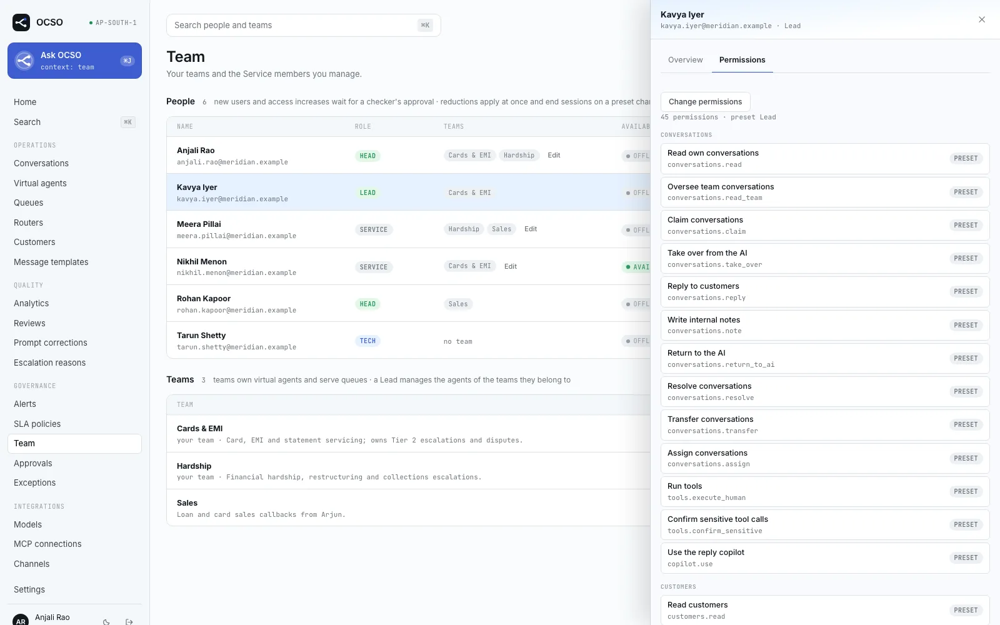
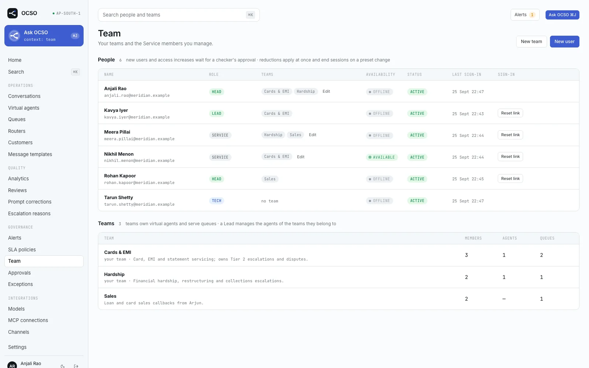
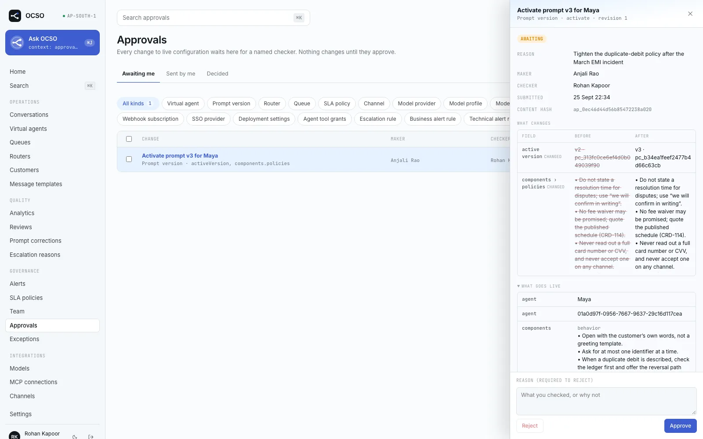
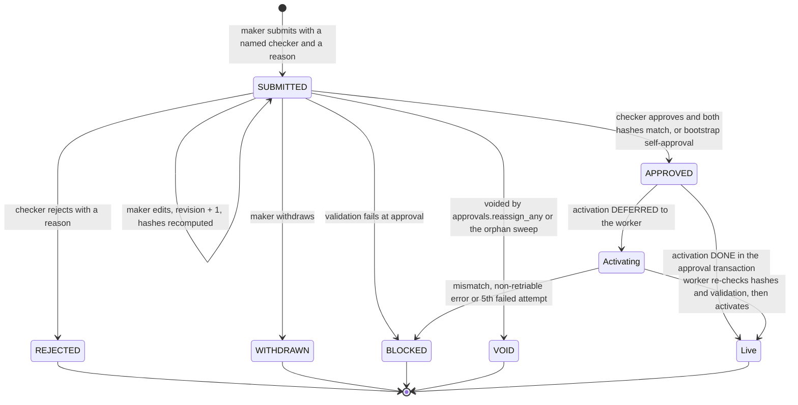
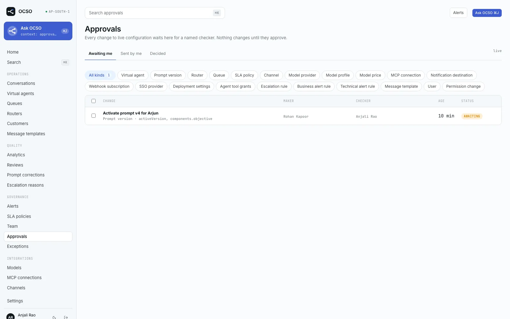
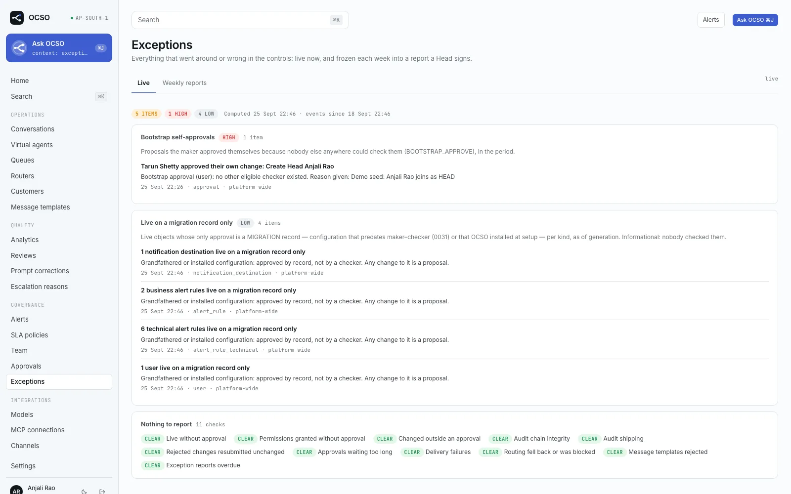

# Governance: roles, permissions and maker–checker

This page explains who can do what in OCSO and how changes to live configuration get a second pair of eyes. It covers
the four role presets, team scoping, per-user grants and revokes, the maker–checker approval spine, and the weekly
exception report that shows where the controls were bypassed or failed. It is written for the people who run an OCSO
deployment (Tech and Head users) and for anyone who has to explain the controls to an auditor.

The full permission-by-preset matrix is in [Permissions reference](../reference/permissions.md). The audit trail that
records all of this is described in [Audit](./audit.md).

## The model in one paragraph

A person's rights are a **preset** (Tech, Head, Lead or Service) plus per-user **grants** minus per-user **revokes**,
and they only apply inside the **teams** the person belongs to. Any change that takes access away applies at once.
Any change that widens access, and any change to live configuration, is a **proposal** that a second, named person
(the **checker**) approves or rejects. The checker approves exactly what they saw: content and dependency hashes are
checked again when they decide. Stops (pausing an agent, disabling a channel, removing a tool grant, revoking a
permission) are never held for approval. Everything is audited, and the exception report lists anything that went
around these rules.

## Roles (presets)

Presets are defined in [`packages/auth/src/roles.ts`](../../packages/auth/src/roles.ts). A preset is a starting set of
permissions, not a level: every rule, including who may check whose work, is written in terms of permissions
([`permissions.ts`](../../packages/auth/src/permissions.ts)), never preset names. Service ⊂ Lead ⊂ Head. Tech is a
separate set.

| Preset | What it is for | Checks (approves) |
|---|---|---|
| **Service** | Frontline work in their teams' queues: claim, take over, reply, add notes, resolve, transfer, return to AI, use human tools and the copilot, read their teams' agents and queues. Can read the proposals of their teams on `/approvals`, but decides nothing. | Nothing |
| **Lead** | Runs their teams. Everything Service has, plus drafting and proposing configuration: agents, prompts, tool grants, escalation rules, queues, routers, SLA policies, message templates, business alert rules. Can pause agents (a stop). Manages colleagues who share a team (`users.manage_team`). Reads business analytics and the team-scoped audit log. | Nothing |
| **Head** | Full authority inside their teams. Everything Lead has, plus team management, deleting agents and templates (through approval), `permissions.manage`, and all five `approvals.check.*` permissions. Reads and signs the exception report. | Agents, routing, channels, platform, permissions |
| **Tech** | Owns the platform: model providers and profiles, channels, MCP connections, secrets, webhooks, pricing, technical alerts, notification destinations, deployment settings, every user (`users.manage`), the whole audit log (`audit.read_all`, `audit.verify`). Reads every agent and can reassign owning teams, but cannot edit prompts, tools or take agents live. | Platform, permissions |

> [!IMPORTANT]
> **Tech never reads conversation content.** The Tech preset does not hold `conversations.*`, `customers.*`, human
> tools, the copilot, reviews, corrections, `prompts.edit` or business analytics, and these can never be granted to a
> Tech user either (`NON_GRANTABLE_BY_PRESET` in
> [`rights-plan.ts`](../../packages/auth/src/rights-plan.ts)). A request to grant one is refused with
> `400 grant_not_allowed_for_preset`, and the rule is checked again when an approval applies, so no checker and no
> bootstrap self-approval can override it. Technical debugging uses traces, usage and turn metadata, which never
> include transcript text.

A few permissions carry most of the governance weight:

| Permission | Held by | What it allows |
|---|---|---|
| `approvals.check.agents` | Head | Check agent, prompt, tool grant, escalation rule and business alert rule changes |
| `approvals.check.routing` | Head | Check router, queue and SLA policy changes |
| `approvals.check.channels` | Head | Check channel and message template changes |
| `approvals.check.platform` | Head, Tech | Check providers, profiles, prices, MCP connections, destinations, webhooks, SSO, deployment settings, technical alert rules |
| `approvals.check.permissions` | Head, Tech | Check new users, re-enabled users and access increases |
| `approvals.reassign_any` | Tech | See every proposal, reassign any checker, void a stuck proposal |
| `exceptions.read` / `exceptions.sign` | Head, Tech (read); Head (sign) | Read the exception report; sign and export it |



## Team scoping

Every person acts only inside the teams they belong to, Head included (ADR-026). Agents are owned by one or more teams
(`agent_teams`), and people reach agents only through team membership. The rules live in the application services,
so the web app, the REST API, Ask OCSO and realtime events all get the same answer.

- **Manage.** A Lead or Head can change an agent (prompts, tools, escalation rules, reviews, corrections, evaluations,
  business alert rules) only if they hold the permission **and** belong to one of the agent's owning teams.
- **Read.** `agents.read_all` (Tech) reads every agent. Otherwise `agents.read` reads the agents your teams own.
  Service members also read agents reachable through their teams' queues, for display.
- **Out of scope is 404, never 403.** Another team's agent does not leak its existence. Lists filter silently.
- **Owners.** Tech (`agents.assign_owner`) can set any owning teams, for example when a Lead leaves. A Lead can add or
  remove only their own teams, and an agent always keeps at least one owning team.
- **Conversations.** `conversations.read_team` covers conversations assigned to you, of agents your teams own, or
  routed to queues your teams serve. Customers are visible only through a visible conversation.
- **Alerts, analytics, audit.** Agent alerts are visible to readers of that agent. Analytics aggregate over the same
  scope. The audit log is scoped too: `audit.read_all` sees everything, everyone else sees their own actions, events
  on their teams' objects and changes to shared configuration (see [Audit](./audit.md#who-can-read-what)).

A Lead or Head in no team manages nothing. The web shows "Join or create a team to create agents". The person who
creates a team joins it without approval, because a new team owns nothing yet.

> [!NOTE]
> Known gap from ADR-026: queue configuration is shared, not team-owned.



## Per-user grants and revokes

On top of the preset, each user can have per-permission **overrides** (ADR-029, table `user_permission_grants`):

- A **GRANT** adds a permission. It can have an expiry (`expires_at`). Expiry is computed on every read, never swept
  by a job, so an expired grant stops working at once.
- A **REVOKE** removes a permission the preset would give. Revokes never expire: a lapsing revoke would hand rights
  back without approval.
- Every override has a reason and records its maker. There is one live override per permission and user.
- The table is its own history. A database trigger allows a row to change only by being cleared once, and refuses
  deletes. A user with grant history cannot be deleted.

Effective permissions are computed fresh on every request (`loadPrincipal`), so a grant or revoke takes effect on the
next request. A preset change or deactivation also ends every session. Open streams (the staff realtime stream and
Ask OCSO) re-check the user's rights every `SESSION_STREAM_RECHECK_SECONDS` (default 60) and close when the user lost
a permission or a team.

Effective permissions, not presets, are used wherever a person is picked or checked: handoff eligibility, the MCP
OAuth callback, and MFA. If "require MFA" lists a preset, anyone granted a permission that preset holds and their own
preset lacks must use a second factor too (see [Sign-in](../guides/sign-in.md)).

In the web app: **Team** → a person's name → **Permissions** tab → **Change permissions** (grant, revoke, clear;
optional expiry; reason). The dialog says which parts apply at once and which need approval.

## Reductions apply at once, increases need approval

A single change set (preset, status, team memberships, grants, revokes, clears) is split in two by `planRightsChange`
in [`@ocso/auth`](../../packages/auth/src/rights-plan.ts):

| Applies at once (reduction) | Needs approval (increase) |
|---|---|
| A REVOKE | A permission the user does not hold today |
| Clearing a grant | Joining a team |
| Shortening a live grant | A new grant, or a grant that lasts longer |
| Leaving a team | Activating or re-enabling a user |
| A downgrade to a preset contained in the old one | An upgrade to a preset that is not contained in the old one |
| Disabling a user | |

The reductions in a request apply even when the same request also asks for an increase. Without a named checker the
increase answers `409 approval_required`, and the response says what was already applied (`details.applied`).

Who may make a change (the **maker**):

- Grants and revokes need `permissions.manage`. Creating users, presets and memberships need `users.manage` (Tech) or
  `users.manage_team` (Lead, Head).
- Nobody changes their own rights. You may leave your own teams; nobody adds themselves to a team.
- Without `users.manage`, the target must share a team with you, a new user must be placed in one of your teams, and
  the target's rights before and after must fit inside your own (containment).
- Break-glass: the last active Tech with password sign-in and `users.manage` cannot be downgraded, disabled, or have
  `users.manage` revoked.

New users are created **PENDING_APPROVAL**. A pending user is an inert draft: they cannot sign in (password sign-in
answers `403 ACCOUNT_PENDING_APPROVAL`, SSO `account_pending_approval`), and their preset and teams can be edited
directly. Their creation is a `user` proposal; approval activates them and the worker sends the invite. SSO
auto-provisioning creates the new Service member as pending too. An approved user stays governed while disabled, so
"disable, upgrade, re-enable" cannot slip an upgrade past a checker.

> [!WARNING]
> `OCSO_DEV_SKIP_ACCESS_APPROVAL=true` lets user creation, preset upgrades, re-enabling and team additions apply
> directly. It is refused when `NODE_ENV=production`, accepted only when `NODE_ENV` is set explicitly to `development`
> or `test`, and logged as a warning at start-up. Grants are never skipped. The demo seed also creates its people
> active. Every skipped approval is audited with `approvalSkipped: 'dev_flag' | 'demo_seed'` and listed by the
> exception report.

## Maker–checker

Every change to live configuration is a **proposal** checked by a named second person (ADR-030 and its amendments).
Approval state lives in two tables, `approval_proposals` and `approval_decisions`, never as a column on the
configured object. "Approved" means an APPROVED proposal exists for the object.

### The lifecycle rule

The same rule applies to every approvable kind:

1. **Drafts are written directly.** An object that has never been approved is a draft. It is inert: a draft agent
   does not answer customers, a draft channel receives nothing, a new rule is created off.
2. **ACTIVATE and DELETE are always proposals.** Going live, resuming and deleting always need a checker.
3. **Once approved (or live), every change is a proposal.** An approvable endpoint accepts
   `approval: {checkerId, reason}` beside its normal body. With it the API answers **202** with the proposal. Without
   it the API answers **409 `approval_required`** with `{objectKind, objectId, action}`.
4. **Stops are immediate.** Pausing an agent, disabling a channel, router, connection or rule, removing or narrowing
   tool grants, and every reduction of a person's rights never go through the spine and work even while a proposal
   is open. Resuming a stopped object is an ACTIVATE.
5. **Runtime work is never approved.** Claiming, replying, resolving, deliveries, probes, token refresh and catalog
   refresh are not proposals. The approval registry refuses to register runtime kinds.

While a proposal is open, the object is locked: other writes get `409 approval_open`. Related objects share the lock.
For example, an agent and its prompt versions lock each other, and an agent's owners, tool grants and escalation
rules are locked while the agent has a proposal open. There is one open proposal per object.

### Named checkers and eligibility

The maker names the checker when submitting. The **Submit for approval** dialog lists the eligible people. A checker
is eligible when they:

- are ACTIVE and hold the kind's `approvals.check.*` permission;
- are not the maker (and, for identity changes, not the person whose access changes);
- share a team with the object, or the object is platform-wide.

**Platform-wide fallback.** When nobody in the owning teams (the maker excluded) can check, any ACTIVE holder of the
check permission anywhere in the deployment can. Without this, a team with one Head would always self-approve, and a
Head could manufacture that situation by reshaping owners or membership.

The decision re-reads the checker's rights from the database. A checker who was disabled, lost the permission or left
the owning teams since the submit cannot decide (`403 checker_invalid`). The `approval-checker-sweep` leader task
(every 5 minutes) flags such proposals as needing a new checker; it never reassigns by itself.

> [!NOTE]
> Two behaviours are built but, per ADR-030, still await the owner's sign-off: Service members can read their teams'
> proposals on `/approvals` (deviation 10), and the platform-wide fallback checker (deviation 11).

### Content and dependency hashes

"Approve what you saw" is enforced mechanically:

- The **content hash** covers the object's identifiers (not display names), the proposed change and the revision. A
  rename elsewhere does not void a proposal; a real change to the object does.
- The **dependency hash** covers what the change relies on, as `kind:id@updated_at` entries.

The checker's decision carries the content hash they were shown. On APPROVE, both hashes are recomputed from the live
state. A mismatch answers `409 content_changed` or `409 dependency_changed`, and the maker refreshes the proposal by
editing it. REJECT skips the hash checks, so a stale proposal can always be closed.

Approval also re-runs the kind's validation. If validation fails, the proposal ends **BLOCKED** and the object is not
touched. Otherwise the change is applied in the same transaction as the approval, so there is no window where a
proposal is approved but its content is stale.



### Proposal lifecycle



`Live` and `Activating` are not separate statuses: they are an APPROVED proposal with and without `activated_at`.
Proposal rows are frozen once decided (a database trigger allows only APPROVED → BLOCKED before activation and the
activation and notification stamps), and `approval_decisions` is append-only.

**Deferred activation.** Some kinds need a provider call that cannot run inside a database transaction: MCP
connection go-live (the worker probes the server and compares its tool-set hash with the approved snapshot), message
template submission and deletion at the provider, alert rule deletion, and the new-user invite. The worker's
`approval.activate` consumer runs one attempt at a time per proposal, re-checks both hashes and validation before any
provider call, and blocks the proposal after `MAX_ACTIVATION_ATTEMPTS` (5) failed attempts or a non-retriable error.

### Approvable kinds

The one composition point is `createApprovalRegistry` in
[`packages/application/src/approvals/composition.ts`](../../packages/application/src/approvals/composition.ts), and
`coverage.test.ts` pins the list. Core never switches on a kind; a new kind registers a descriptor.

| Kind | Label | Actions | Make permission | Checked with |
|---|---|---|---|---|
| `agent` | Virtual agent | ACTIVATE, UPDATE, DELETE | `agents.manage` (DELETE: `agents.delete`) | `approvals.check.agents` |
| `prompt_version` | Prompt version | ACTIVATE | `prompts.activate` | `approvals.check.agents` |
| `agent_tool_grant` | Agent tool grants | UPDATE (widening only) | `agent_tools.manage` | `approvals.check.agents` |
| `escalation_rule` | Escalation rule | ACTIVATE, UPDATE, DELETE | `escalation.manage` | `approvals.check.agents` |
| `alert_rule` | Business alert rule | ACTIVATE, UPDATE, DELETE | `alert_rules.business.manage` | `approvals.check.agents` |
| `router` | Router | ACTIVATE, UPDATE, DELETE | `routers.manage` | `approvals.check.routing` |
| `queue` | Queue | CREATE, UPDATE | `queues.manage` | `approvals.check.routing` |
| `sla_policy` | SLA policy | CREATE, UPDATE | `sla.manage` | `approvals.check.routing` |
| `channel` | Channel | ACTIVATE, UPDATE, DELETE | `channels.manage` | `approvals.check.channels` |
| `message_template` | Message template | CREATE, DELETE | `message_templates.manage` (DELETE: `message_templates.delete`) | `approvals.check.channels` |
| `model_provider` | Model provider | ACTIVATE, UPDATE, DELETE | `providers.manage` | `approvals.check.platform` |
| `model_profile` | Model profile | ACTIVATE, UPDATE, DELETE | `model_profiles.manage` | `approvals.check.platform` |
| `model_pricing` | Model price | ACTIVATE, UPDATE, DELETE | `pricing.manage` | `approvals.check.platform` |
| `mcp_connection` | MCP connection | ACTIVATE, UPDATE, DELETE | `mcp.manage` | `approvals.check.platform` |
| `notification_destination` | Notification destination | ACTIVATE, UPDATE, DELETE | `notification_destinations.manage` | `approvals.check.platform` |
| `webhook_subscription` | Webhook subscription | ACTIVATE, UPDATE, DELETE | `webhooks.manage` | `approvals.check.platform` |
| `sso_provider` | SSO provider | ACTIVATE, UPDATE, DELETE | `deployment_settings.manage` | `approvals.check.platform` |
| `deployment_settings` | Deployment settings | UPDATE | `deployment_settings.manage` (workers section also `system.configure`) | `approvals.check.platform` |
| `alert_rule_technical` | Technical alert rule | ACTIVATE, UPDATE, DELETE | `alert_rules.technical.manage` | `approvals.check.platform` |
| `user` | User | CREATE, ACTIVATE | `users.manage` or `users.manage_team` | `approvals.check.permissions` |
| `permission_change` | Permission change | UPDATE (the widening part) | `permissions.manage`, `users.manage`, `users.manage_team` or `teams.manage` | `approvals.check.permissions` |

Some notes on individual kinds:

- **Agents.** "Take X live" shows the checker the full configuration going live: the active prompt text, tool grants
  and escalation rules. A draft agent's prompts activate directly; once the agent is approved, activating a prompt
  version is a proposal. Deleting is refused for LIVE agents and agents with conversation history.
- **Model profiles** have no status column: a profile is live when it is in use (by a LIVE or PAUSED agent, by the
  Ask OCSO setting `internal_agent_profile_id`, or by a CLASSIFY step of an active router). Nothing can put an
  unapproved profile in use.
- **Secrets** never enter a payload, snapshot, decision or audit row. A replacement credential is staged in the
  secret store at submit and the proposal carries only a reference.
- **Deployment settings** allow one open proposal at a time; the maker edits it to add a section.
- Configuration that existed before maker–checker (migration 0031) and configuration OCSO installs at setup (the setup
  admin, default alert rules, the default in-app destination) is recorded as APPROVED with `origin = 'MIGRATION'`.

### Working with proposals

The `/approvals` page has four tabs: **Awaiting me**, **Sent by me**, **All open** and **Decided**. Opening a proposal
shows a drawer with the diff and a decision form that carries the hashes.



- **Approve and reject.** Approve takes an optional reason. Reject requires a reason of at least 3 characters.
- **Edit.** Only the maker edits an open proposal (never the locked object). The revision goes up, the hashes are
  recomputed and the proposal is marked edited after submission until decided.
- **Withdraw.** The maker withdraws with a reason; the checker is notified.
- **Bulk approve.** A checker approves up to 50 proposals at once (`BULK_APPROVE_MAX`), approve only, with one
  reason. Each item runs in
  its own transaction through the same path, with a shared batch id. Items with a blocking warning, a hash mismatch,
  failed validation or outside the checker's scope are skipped with a code.
- **Reassign.** A holder of `approvals.reassign_any` or the kind's check permission can name another eligible checker.
  The **All open** tab has a "Needs a new checker" filter.
- **Void.** A holder of `approvals.reassign_any` can void an open proposal that nobody can decide any more, with a
  reason. Nothing is applied. The `approval-void-orphans` leader task (every 15 minutes) also voids open proposals
  whose object is gone or whose maker is no longer ACTIVE or no longer holds the make permission.
- **Notifications.** The worker emails the checker when a proposal arrives, the maker when it is decided, and Tech
  and the maker when the checker becomes invalid. Open proposals older than `approval_age_warning_hours` (default 72)
  carry an `aged` warning.

The API is under `/v1/approvals`: list and `counts`, `kinds`, `checkers`, `state`, `/:id`, `/:id/checkers`, `PATCH /:id`,
`/:id/withdraw`, `/:id/decision`, `bulk-decision`, `/:id/checker` (reassign) and `/:id/void`. See
[HTTP API](../reference/http-api.md).

### Bootstrap self-approval

A fresh deployment often has a single Tech user and nobody else who could check anything. For that case, a maker may
approve their own proposal (`approval: {bootstrap: true}`), recorded as a `BOOTSTRAP_APPROVE` decision. It is allowed
only when all of these hold:

- the maker holds the kind's check permission (or, for channels, `approvals.check.platform`: a sole Tech can take the
  first channel live while nobody holds `approvals.check.channels`);
- nobody else anywhere in the deployment is an eligible checker, the platform-wide fallback included;
- nobody else lost the check permission in the last 30 days (disabled, demoted, revoked, or a grant expired). A stop
  is immediate, so it must not be usable to manufacture "nobody else can check". For identity changes this is
  `bootstrap_checker_disabled`; re-enabling or restoring a checker is the one change that may still be self-approved
  then.

As soon as another eligible checker exists, bootstrap is refused and the proposal must go to them. Ask OCSO never
offers bootstrap; it is available in the web app only. Every bootstrap approval appears in the exception report.

## The exception report

Maker–checker, per-user permissions and the audit store are controls. The exception report (ADR-033) is the evidence
of where they were bypassed or failed. It lives at `/exceptions`.



### The checks

The checks are registered in `EXCEPTION_KINDS`
([`packages/application/src/exceptions/registry.ts`](../../packages/application/src/exceptions/registry.ts)), in
report order:

| Check | Severity | What it finds |
|---|---|---|
| `live_without_approval` | critical | For every registered approvable kind, live objects without an applied approval that puts them live. It walks the approval registry, so a new kind is covered automatically. |
| `permission_bypass` | critical | Active grants whose approval is missing or not APPROVED, and access increases or sign-in enablements in the period that no approval applied (including `approvalSkipped` events). |
| `changed_outside_approval` | high | Configuration writes by a person in the period, on an approved object or taking an object live, that were not part of applying an approval. From the audit trail. |
| `audit_chain` | critical | Hash-chain breaks and untrusted checkpoint keys that overlapped the period, and full-chain verifications that found problems. |
| `audit_shipping` | high | Audit store incidents (shipping failed, store down, events missing, exports failed) and a shipping lag above 60 seconds. |
| `bootstrap_approvals` | high | `BOOTSTRAP_APPROVE` decisions in the period. |
| `resubmitted_unchanged` | high | Proposals resubmitted with exactly the payload of an earlier rejected one for the same object ("checker shopping"). |
| `approvals_aged` | medium | Open proposals older than the age warning, proposals decided late, and approvals still activating an hour after the decision. |
| `delivery_failures` | medium | Failed outbound customer messages, webhook deliveries and alert notifications, grouped by channel, subscription or destination and error. |
| `routing_fallback` | medium | Conversations sent to a router's fallback queue, routing that could not place a customer, and messages refused because no router was active. |
| `templates_rejected` | low | Message templates the provider rejected. |
| `report_hygiene` | medium | Weekly reports not generated within 30 hours, weekly reports unsigned 7 days after the week, and unsigned reports whose checks failed. |
| `installed_only` | low | Live objects whose only approval is a MIGRATION record (pre-existing or installed configuration). Informational. |

All checks run over one read-only, repeatable-read snapshot. A check that fails is recorded in its section with an
error class, never silently dropped. The live view recomputes every check on read over the last 7 days; a report
keeps up to 5,000 items per check and the true total.

### Weekly signed report

- The `exception-weekly` leader task freezes the last complete Monday-to-Monday week in the deployment's time zone,
  starting after setup is complete. Missed weeks are back-filled. An exclusion constraint prevents overlapping weekly
  reports.
- A generated report is a **draft**. A person with `exceptions.sign` (Head) signs it. The signer confirms the content
  hash they were shown and acknowledges each attestation flag that applies: `self_attested` (they are the actor or
  subject of a critical or high item), `failed_checks`, `truncated`, `incomplete_data`.
- The signature is Ed25519 with the audit signing key (the same key as audit checkpoints, see
  [Audit](./audit.md#keys-and-rotation)). A signed report cannot be changed or deleted (database trigger). An unsigned
  draft can be regenerated with a reason; the old draft is marked SUPERSEDED.
- Signers can also freeze an ad-hoc report for any ended period of up to 31 days within the last 90.

### Export bundle

`GET /v1/exceptions/reports/:id/export` (signed reports only, `exceptions.sign`, audited) returns a ZIP with
`report.json`, `items.csv`, `manifest.json`, `signed-message.txt`, `signature.bin`, `public-key.pem` and `VERIFY.txt`.
An auditor can verify it offline:

```bash
sha256sum report.json      # equals contentHash in manifest.json
openssl pkeyutl -verify -pubin -inkey public-key.pem -rawin -in signed-message.txt -sigfile signature.bin
openssl pkey -pubin -in public-key.pem -outform DER | sha256sum | cut -c1-16   # equals keyId
```

> [!WARNING]
> Compare `public-key.pem` with a key you pinned from the deployment (`GET /v1/audit/keys`). A bundle can carry any
> key; a forger would replace both.

**Scope.** `exceptions.read` sees platform-wide items and items of their teams; items about a person's access are
visible to readers who also hold `users.read`, whatever that person's teams. Only `exceptions.sign` sees the whole report, the signature and the export.

## Limits and known gaps

- ADR-030 deviations 10 (Service reads proposals) and 11 (platform-wide fallback checker) are built but await owner
  sign-off.
- Disabling a safety escalation rule or a default alert rule is a stop: immediate and audited, never approved.
- Only the maker can edit or withdraw an open deployment-settings proposal; voiding it needs `approvals.reassign_any`.
- Queue configuration is shared across teams, not team-owned.
- Handoffs already assigned to someone whose `conversations.read` or `conversations.reply` is revoked are not
  requeued automatically.

## Related

- [Permissions reference](../reference/permissions.md): the full matrix of permissions and presets
- [Audit](./audit.md): the audit store, hash chain and signed checkpoints
- [Ask OCSO](./ask-ocso.md): proposing and approving changes from the copilot
- [Agents](./virtual-agents.md) and [Routing](./routing.md): the objects most proposals are about
- [Sign-in](../guides/sign-in.md): SSO, passkeys and MFA per role
- [HTTP API](../reference/http-api.md)
- Design records: `PM/ARCHITECTURE-DECISIONS.md` ADR-026, ADR-029, ADR-030 (and amendments A and B), ADR-033
