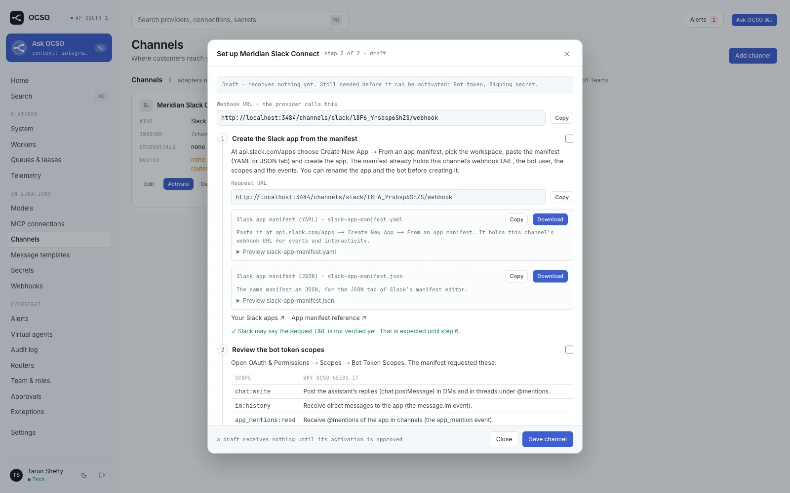

# Plugins

This page lists every kind of plugin OCSO has: its contract, the registry that holds it, what ships
today, and whether a third-party npm package can provide one. It also covers how plugins describe
themselves to the web app, how the registries validate them, how installed plugins are loaded, the
trust model, and where the boundary still leaks.

It is for engineers who want to understand the extension model before building or installing a
plugin. For the why and the overall shape, read [architecture](architecture.md) first. For
step-by-step how-tos, see [Build a channel plugin](../guides/extending/build-a-channel-plugin.md),
[Install a plugin](../guides/extending/install-a-plugin.md) and the
[plugin SDK reference](../reference/plugin-sdk.md).

## Plugin kinds at a glance

Every plugin is an `OcsoPlugin` object ([`packages/bootstrap/src/plugin.ts`](../../packages/bootstrap/src/plugin.ts)).
Each property below is one contribution list. "Public SDK" means `@winsendotai/ocso-plugin-sdk`
carries the contract and an installed plugin may contribute it (plugin API version 1, ADR-034).
"Internal" means only a package compiled into OCSO can contribute it, because the contract still needs
`@ocso/db` or `@ocso/config`.

| Contribution | Contract | Registry | Shipped implementations | Public SDK |
|---|---|---|---|---|
| `channels` | `ChannelAdapter` in [`packages/channels/src/contract/types.ts`](../../packages/channels/src/contract/types.ts), `ChannelKindDescriptor` in [`contract/descriptor.ts`](../../packages/channels/src/contract/descriptor.ts) | `ChannelRegistry` ([`contract/registry.ts`](../../packages/channels/src/contract/registry.ts)) | `TWILIO_WHATSAPP`, `WHATSAPP` (Meta Cloud API), `WEBCHAT`, `SLACK`, `MS_TEAMS` | Yes |
| `modelProviders` | `ProviderDefinition` in [`packages/model-providers/src/providers/definition.ts`](../../packages/model-providers/src/providers/definition.ts), `ModelProviderAdapter` in [`contract/types.ts`](../../packages/model-providers/src/contract/types.ts) | `ProviderRegistry` ([`registry.ts`](../../packages/model-providers/src/registry.ts)) | `BEDROCK`, `VERTEX`, `FOUNDRY`, `OPENAI`, `ANTHROPIC`, `SARVAM`; `DEV_SCRIPTED` (development only) | Yes |
| `alertDestinations` | `AlertDeliveryAdapter` in [`packages/alerts/src/contract.ts`](../../packages/alerts/src/contract.ts) | `AlertDeliveryRegistry` ([`registry.ts`](../../packages/alerts/src/registry.ts)) | `IN_APP`, `EMAIL`, `SLACK`, `TEAMS`, `WEBHOOK`, `PAGERDUTY` | Yes |
| `emailDrivers` | `EmailDriverDefinition`, `EmailSender` in [`packages/email/src/contract.ts`](../../packages/email/src/contract.ts) | `DriverRegistry` for `EMAIL_DRIVER` | `resend`, `smtp`, `log` | Yes |
| `toolProviders` | `ToolProviderSource`, `ToolProvider` in [`packages/tools/src/registry.ts`](../../packages/tools/src/registry.ts) and `provider.ts` | `ToolProviderRegistry` | `ocso-builtin` (from `@ocso/agent-runtime`: `ocso_request_handoff`, `ocso_search_history`, `ocso_transfer_to_queue`), `mcp` (from `@ocso/mcp`: one provider per MCP connection) | Internal |
| `blobDrivers` | `BlobDriverDefinition`, `BlobStore` in [`packages/blob/src/contract.ts`](../../packages/blob/src/contract.ts) | `DriverRegistry` for `BLOB_DRIVER` | `local`, `s3` | Internal |
| `secretsDrivers` | `SecretStoreDriverDefinition`, `SecretStore` in [`packages/secrets/src/contract.ts`](../../packages/secrets/src/contract.ts) | `DriverRegistry` for `SECRETS_DRIVER` | `local` (AES-256-GCM envelope encryption), `aws` (Secrets Manager) | Internal |
| `queueDrivers` | `QueueDriverDefinition`, `QueueAdapter` in [`packages/queue/src/contract.ts`](../../packages/queue/src/contract.ts) | `DriverRegistry` for `QUEUE_DRIVER` | `postgres`, `sqs` | Internal |
| `deploymentDrivers` | `DeploymentDriverDefinition`, `DeploymentAdapter` in [`packages/deployment/src/contract.ts`](../../packages/deployment/src/contract.ts) | `DriverRegistry` for `DEPLOYMENT_DRIVER` (worker only) | `compose` (advisory), `ecs` | Internal |
| `auditStoreDrivers` | `AuditStoreDriverDefinition`, `AuditStore` in [`packages/audit-store/src/contract.ts`](../../packages/audit-store/src/contract.ts) | `DriverRegistry` for `AUDIT_DRIVER` | `postgres`, `clickhouse` | Internal |

The first-party infrastructure driver definitions are in
[`packages/bootstrap/src/drivers/first-party.ts`](../../packages/bootstrap/src/drivers/first-party.ts);
the audit store's are in [`packages/audit-store/src/drivers.ts`](../../packages/audit-store/src/drivers.ts)
and the email drivers' in [`packages/email/src/drivers.ts`](../../packages/email/src/drivers.ts).

### Extension points that are not plugin contributions

These have a contract and their own registry or list, but they are core-internal: you add one by
editing OCSO, not by writing a plugin.

| Extension point | Contract | Where it is registered |
|---|---|---|
| Alert conditions | `EvaluatorDefinition` in `packages/application/src/alerts/evaluators/contract.ts` | `packages/application/src/alerts/evaluators/registry.ts` |
| Scheduled tasks | `ScheduledTask` in `apps/worker/src/scheduler/scheduler.service.ts` | Two plain arrays: the `SchedulerService` constructor and `subsystemTasks()` in `apps/worker/src/scheduler/tasks.registry.ts`. There is no registry object. |
| Ask OCSO insight tools | `InternalTool` in `packages/internal-agent/src/contract.ts` | `INSIGHT_TOOLS` and `InternalToolRegistry` in `packages/internal-agent/src/registry.ts` (ten read tools, reached through Ask OCSO's meta tools over the capability catalog; see [Ask OCSO](ask-ocso.md)) |
| Sign-in methods | Better Auth plugins (password, TOTP, passkeys, OIDC, SAML) | `packages/application/src/identity/auth/server.ts`; identity providers are added at runtime ([sign-in](../guides/sign-in.md)) |
| MCP servers | Any MCP server over Streamable HTTP | Added at runtime in the web app; no code ([MCP tools](../guides/tools/mcp.md)) |

Telemetry export has no in-code contract: the api and worker export OpenTelemetry over OTLP, and you
point a collector at your backend.

## Plugins describe themselves

Core never holds per-kind knowledge. Each plugin carries its own labels, forms and setup help, and
the web app renders them from the `/kinds` endpoints. A kind the web app has never seen still gets a
working form, because forms are rendered from JSON Schema.

### Channels: `describe()`

A channel adapter implements `describe(): ChannelKindDescriptor`. `GET /v1/channels/kinds` serves
every registered kind's descriptor plus what the registry derives from the adapter
(`registry.describeAll()`). The fields, from
[`packages/channels/src/contract/descriptor.ts`](../../packages/channels/src/contract/descriptor.ts):

| Field | What it is |
|---|---|
| `kind` | Upper snake case, 2–40 characters. Must equal the adapter's `kind`. |
| `label`, `description` | Name and one-line description on the **Add channel** list, e.g. `WhatsApp — Twilio`. |
| `mark` | The badge conversations carry: `{ code, name, tone? }`. `code` is 1–3 letters or digits (`WA`, `SL`, `MT`, `WB`). It names the network, not the provider, so Twilio and Meta WhatsApp share `WA`. |
| `settingsSchema` | JSON Schema (input shape) of the non-secret settings. The first-party channels generate it from zod with `z.toJSONSchema`. |
| `secrets` | `ChannelSecretField[]`: `key`, `label`, `required`, `hint`, optional `generate` (`server` or `client`), `prefix`, `reveal: 'once'`. Values go to the secret store and are never returned by the API. |
| `identitySetting` | Optional: which setting identifies an instance on the channel card (`{ label, keys }`), e.g. the WhatsApp sender. |
| `setupGuide` | `ChannelSetupStep[]`: the numbered checklist in the channel dialog. Each step has `title`, `body`, and optionally `items`, a two-column `table`, `values` to copy (may use `{{webhookUrl}}`), https `links`, setup `files` to offer, `form: true` on the one step where the admin fills OCSO's form, and a `check`. Plain text only. |
| `setupSteps` | Deprecated plain sentences. A kind with only `setupSteps` gets a guide with one step per sentence. |
| `troubleshooting` | `{ id, problem, fix }[]`, shown under the guide. A connection check can link to one by `id`. |
| `setupFiles` | Files to paste or upload in the provider's console, such as a Slack app manifest or a Teams app package (zip built on the server). Only `{{webhookUrl}}`, `{{webhookHost}}` and `{{settings.<key>}}` are filled in; secrets never are. |
| `inboundWebhook`, `webhookSegment`, `webhookEvents` | Whether the provider calls OCSO, at `/channels/<webhookSegment>/<publicKey>/webhook` (segment default: the kind in kebab case), and what it posts there. |
| `embeddable` | Customers reach it through OCSO's widget: `/ocso-webchat.js`, `/chat/<publicKey>` and `/public/webchat/<publicKey>/*`. Requires the adapter's `embed` hooks. |
| `templates` | Present when the adapter implements the message-template methods: `reviewer` (as in "submitted for WhatsApp approval"), `placeholderScope` (`template` or `component`), optional `mediaHeaderUnsupported`. |
| `staffDestination`, `staffSurface` | The kind can carry Ask OCSO for staff (Slack, Teams). Core then adds its own `destination` setting (`router` or `ask_ocso`) to the schema. `staffSurface` names the kind in Ask OCSO threads and audit rows. |

The registry adds `setupGuide` (always present), `troubleshooting` (always an array),
`connectionCheck` (the adapter implements `checkConnection`, used by `POST /v1/channels/:id/test`) and
`messageTemplates`.

Two per-kind behaviours are adapter methods rather than descriptor fields:
`capabilities(config)` (inbound and outbound part types, `maxTextLength`, `markdown` level, streaming,
delivery receipts, media limits and MIME types, `sessionWindowHours`, identity kinds, choice limits)
and the optional `displayIdentity(identityKind, value)`, which masks a customer identity for lists.
Slack, Teams and web chat implement `displayIdentity`; for the WhatsApp adapters core masks
generically.

Shipped channel descriptors:

| Kind | Label | Mark | Webhook segment | Embeddable | Templates | Staff destination |
|---|---|---|---|---|---|---|
| `TWILIO_WHATSAPP` | WhatsApp — Twilio | `WA` | `twilio-whatsapp` | No | Yes | No |
| `WHATSAPP` | WhatsApp — Meta Cloud API | `WA` | `whatsapp` | No | Yes | No |
| `WEBCHAT` | Web chat | `WB` | none | Yes | No | No |
| `SLACK` | Slack | `SL` | `slack` | No | No | Yes |
| `MS_TEAMS` | Microsoft Teams | `MT` | `ms-teams` | No | No | Yes (`teams`) |

Source: `packages/channels/src/<kind>/descriptor.ts`.

### Model providers: the definition

A `ProviderDefinition` describes itself with `kind`, `label`, `mark` (1–4 characters, e.g. `OAI`,
`ANT`, `AWS`, `GCP`, `MSF`, `SVM`), `cachingSummary`, `devOnly`, `settingsSchema` and
`credentialsSchema` (zod; OCSO converts them to form fields, so zod 4 is a peer dependency of provider
plugins), an optional `catalog` mapping to the open-source model catalogs for pricing (ADR-027), and
methods: `capabilities(model, settings)`, `providerOptions(...)` (cache markers, cache keys,
reasoning), optional `describeCaching` and `baseModel`, and `create(config, deps)` which returns the
`ModelProviderAdapter`. `GET /v1/model-providers/kinds` serves the kinds and their form fields.

A `devOnly` definition (the scripted provider) is only registered when
`OCSO_ENABLE_DEV_PROVIDERS=true`, and its usage is never priced.

### Alert destinations: `configSchema`

An `AlertDeliveryAdapter` carries `kind`, `label`, `description`, the lifecycle `events` it receives,
`configSchema` (JSON Schema draft 2020-12, input shape; a config with variants is a `oneOf` whose
branches pin one property with `const`, like the email destination's `transport`), `secret` (a
`SecretRequirement` with `required`, `secretKind`, `label`, `description` and an optional `when` that
makes it conditional on config values, or null), and methods `validateConfig`, `validateSecret`,
`summary(config)` and `deliver(message, config, secret)`. `GET /v1/notification-destinations/kinds`
serves the description; the web form renders from the schema.

### Email drivers

An `EmailDriverDefinition` has `name` (the `EMAIL_DRIVER` value), `label` (shown in
**Settings → Email**), `delivers` (false for a driver that never hands a message to anyone, like
`log`), `resolve(env, ctx)` (validate settings, resolve secrets, record problems) and
`create(options, sender, deps)`. See [email](../guides/email.md).

## Registries and validation

Every registry has the same shape (`register`, `get`/`require`, `has`, list) and refuses bad input at
start-up, so a misconfigured plugin stops the process instead of failing later.

| Registry | Refuses |
|---|---|
| `contributions()` (all) | A plugin with an empty name, or two plugins with the same name. |
| `ChannelRegistry` | A kind that is not upper snake case; a duplicate kind; a descriptor whose `kind` differs from the adapter's; a bad mark code; `embeddable` without `embed` hooks (or the reverse); `templates` without `listTemplates`, `createTemplate` and `sendTemplate` (or the reverse); invalid setup files or setup guide; a bad `staffSurface`; a `destination` setting in a staff-destination kind's schema; an invalid or duplicate webhook segment. |
| `ProviderRegistry` | A kind that is not upper snake case; a duplicate kind. |
| `AlertDeliveryRegistry` | A kind that is not upper snake case; a duplicate kind; an adapter with no events or unknown events. |
| `ToolProviderRegistry` | A duplicate source; a second connection-backed source; first-party tools on a connection-backed source; a tool name that is not provider-safe; a first-party tool classed `SENSITIVE`; two sources providing the same tool name. |
| `DriverRegistry` | A driver name that is not lower case `a-z0-9-` (1–40 characters); a duplicate name. At start-up, a `*_DRIVER` value no plugin registered, listing the registered names, plus the selected driver's own settings checks. |

The web app and the API validate every kind a user submits against these registries, never against a
hard-coded list.

## Installing third-party plugins: the loader

The loader is [`packages/bootstrap/src/plugins/loader.ts`](../../packages/bootstrap/src/plugins/loader.ts).
The api, the worker and the demo seed call `loadPlugins()`, which returns `FIRST_PARTY_PLUGINS`
followed by the configured plugins.

| Variable | Meaning |
|---|---|
| `OCSO_PLUGINS` | Comma-separated `name@exactVersion` pins, e.g. `@acme/ocso-channel-line@1.2.3,@acme/ocso-alerts-opsgenie@0.4.0`. Ranges and tags are refused. |
| `OCSO_PLUGINS_DIR` | Where the packages are installed; each is read from `<dir>/node_modules/<name>`. Default `/app/plugins`. |

Both are read from the raw environment. For each pin the loader:

1. reads `package.json` from `<dir>/node_modules/<name>` and requires its `name` and `version` to equal
   the pin (install with `npm install --prefix <dir> <name>@<version>`);
2. resolves the package entry the way Node's ESM `import` does (`exports["."]` with the `node`,
   `import` and `default` conditions, else `main`, else `index.js`), and refuses an entry that points
   outside the package, including through a symlink;
3. imports it and takes the plugin from `default` or a `plugin` export (whichever declares
   `apiVersion`);
4. checks the shape: `apiVersion` must be `1`, the name must be non-empty, not taken by another
   plugin, and not in the reserved `@ocso/` scope; only `channels`, `modelProviders`,
   `alertDestinations` and `emailDrivers` may be present;
5. registers the plugin together with every plugin loaded so far into throwaway registries built
   with inert dependencies (no network, no mail, dev providers on), so a kind that clashes with a
   first-party kind or fails any registry check is refused.

Any problem stops start-up with one `Invalid OCSO plugin configuration (OCSO_PLUGINS)` error that
lists every problem. Each loaded plugin is logged, the start-up `plugins:` line names first-party and
installed plugins with versions, and `GET /v1/system/plugins` (permission `system.read`) serves the
list to the **Plugins** section of the System page.

Methods of installed contributions are wrapped so that errors a plugin marks with the SDK's
`pluginError(category, code, message)` become OCSO's own typed errors at the boundary; other errors
pass through unchanged.

> [!TIP]
> `@winsendotai/ocso-plugin-sdk/testing` exports `checkPlugin`, which runs the same validations as the
> registries, so you can test a plugin without an OCSO checkout.
> [`examples/ocso-plugin-example-channel`](../../examples/ocso-plugin-example-channel) is a complete
> channel plugin built only on the SDK.

## Trust model

> [!WARNING]
> Installed plugins run in-process with full trust. There is no sandbox. A plugin can do anything the
> api or worker process can: read the environment (including secret files mounted into the
> container), open network connections, and reach the database with the process's credentials.
> Install only code you have reviewed or whose publisher you trust, and pin exact versions.

The host hands channel and alert adapters an SSRF-guarded `fetch`, and a channel adapter built without
one gets `NO_NETWORK`. That keeps well-behaved plugins on the egress policy, but it is a convention,
not an enforcement boundary: plugin code can import `node:http` itself. An out-of-process transport
is left open by ADR-034 and not built.

Pinning is what protects you from supply-chain drift: the loader refuses a package whose installed
version differs from the pin, and the api and worker log their plugin lists so a mismatch between
processes is visible.

## Where the boundary still leaks

Each of these was listed as a known limit in ADR-028 or ADR-034 and checked against the code on
2026-09-25.

- **Driver settings are declared centrally.** `packages/config/src/env.ts` declares the first-party
  drivers' settings (`S3_BUCKET`, `SQS_QUEUE_URLS`, `ECS_CLUSTER`, `SMTP_HOST`, `RESEND_API_KEY`,
  `CLICKHOUSE_*`, …) and the parsed env strips unknown keys. A driver from another package has to read
  its own settings from `process.env`. Installed plugins can only contribute email drivers among the
  drivers, and `EmailEnv` only carries the Resend and SMTP settings.
- **Six contributions are first-party only.** Tool provider sources and the blob, secrets, queue,
  deployment and audit-store drivers are refused from installed plugins (`INTERNAL_CONTRIBUTIONS` in
  `packages/bootstrap/src/plugins/validate.ts`) because their contracts need `@ocso/db` or
  `@ocso/config`.
- **Three extension points are not plugins at all.** Alert conditions and Ask OCSO tools have
  registries; scheduled tasks are two arrays in the worker with fixed intervals. None is an
  `OcsoPlugin` contribution. (ADR-028 says scheduled tasks "have registries"; in code they do not.)
- **Message templates follow WhatsApp.** Templates are a channel capability, but the draft rules in
  `packages/domain/src/templates/draft.ts` (categories, limits, button types, fixed authentication
  text) are the common subset of Twilio's and Meta's WhatsApp rules. A non-WhatsApp template channel
  would inherit them.
- **One widget API path for every embeddable kind.** The public web chat API is
  `/public/webchat/:publicKey/*` (`apps/api/src/modules/webchat/webchat.controller.ts`) whatever the
  kind. A second embeddable kind would share that path and its controller, dispatching through the
  adapter's `embed` hooks.
- **Built-in tools cannot be revoked per agent.** They have no `tools` rows. Every live agent is
  offered `ocso_request_handoff` and `ocso_search_history`, with an implicit enabled grant
  (`packages/agent-runtime/src/tools/catalog.ts`); `ocso_transfer_to_queue` is added per conversation.
- **The public contracts are copies.** The SDK carries its own copy of the four public contracts. A
  type-level test (`packages/bootstrap/test/sdk-conformance.types.ts`) fails CI when an internal
  contract drifts from its public copy, and an agreement test runs `checkPlugin` and the registries
  side by side. Breaking the public contract means plugin API version 2.
- **The lint misses kinds declared through constants.** The boundary lint only learns kinds written as
  `kind: 'X'` or `kind = 'X'`. `MS_TEAMS` is declared as `TEAMS_KIND = 'MS_TEAMS'`, so core code
  naming it would not fail the build (none does today). See
  [the plugin boundary lint](architecture.md#the-plugin-boundary-lint).
- **Seeds and tests name kinds on purpose.** The demo seed creates a web chat channel and uses the
  scripted provider; seeds, tests and fixtures are exempt from the lint.

## Related

- [Architecture](architecture.md): core vs plugins, the composition root, the lint
- [Plugin SDK reference](../reference/plugin-sdk.md)
- [Build a channel plugin](../guides/extending/build-a-channel-plugin.md)
- [Install a plugin](../guides/extending/install-a-plugin.md)
- [Channels](../guides/channels/README.md), [Model providers](../guides/models/README.md),
  [MCP tools](../guides/tools/mcp.md), [Alerts and webhooks](../guides/alerts-and-webhooks.md),
  [Email](../guides/email.md), [Sign-in](../guides/sign-in.md)
- [Configuration reference](../reference/configuration.md)
