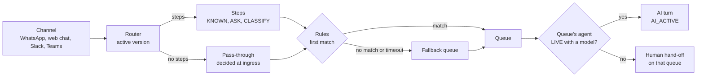
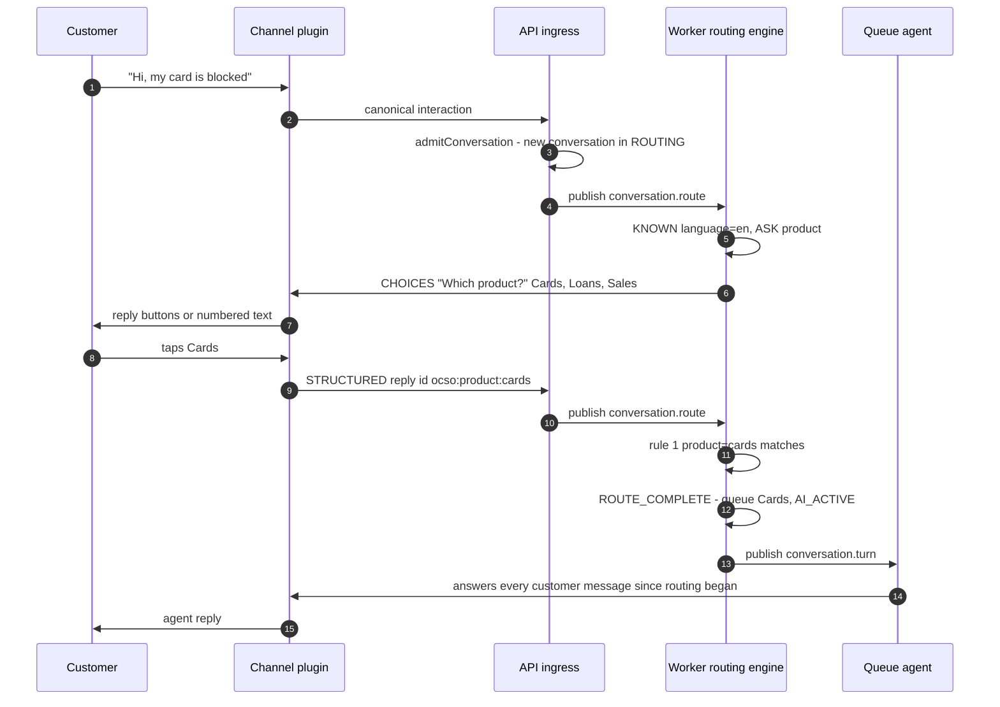
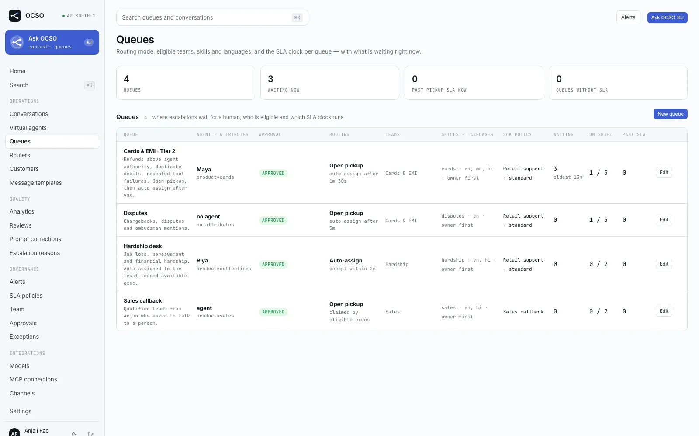

# Routing: channels, routers, queues and agents

This page explains how a new customer message finds the right AI agent and the right human team. A channel names a **router**. The router picks a **queue**. The queue has exactly one **AI agent** and the human teams who take its hand-offs. The page is for Leads and Heads who design routing, and for engineers working on the routing engine.

The routing engine is core. The router definition and its state machine are pure code in [`packages/domain/src/routing`](../../packages/domain/src/routing/), and the engine, admission, approvals and simulator are in [`packages/application/src/routing`](../../packages/application/src/routing/). Channel plugins take part in only two ways: they render the menu question (natively or as text) and they turn a tapped button back into a reply. The design is ADR-031 in [`PM/ARCHITECTURE-DECISIONS.md`](../../PM/ARCHITECTURE-DECISIONS.md).

## The chain

- A **channel** is attached to at most one router. A channel with no active router rejects *new* conversations with `no_router`. The rejection is logged and recorded as the audit event `conversation.inbound_rejected`, without the message text.
- A **router** decides once per conversation. It asks the customer, classifies what they wrote, or reads facts OCSO already knows, collects **attributes** (`language=ta`, `product=cards`), and matches them against its rules.
- A **queue** is the service unit: one AI agent, the teams that take its hand-offs, an SLA policy, human hours, a pickup mode, attributes and transfer targets.
- The queue's **agent** answers. If that agent is paused, still a draft, or has no model profile, a human hand-off opens on the queue straight away, so the customer is never left with an AI that never replies.

Conversations already under way never depend on the channel's router. Disabling or detaching a router only stops new conversations. Customers who are mid-conversation, whether with the AI, a person or a menu running on its pinned version, keep reaching it.

## Routers

A router has a draft definition, immutable numbered **versions** and a status (`DRAFT`, `ACTIVE`, `DISABLED`). Only an approved version routes anyone. The draft is always editable because it is inert.

### Definition

The definition is validated by `RouterDefinitionSchema` in [`router-definition.ts`](../../packages/domain/src/routing/router-definition.ts):

| Field | Meaning | Limits |
|---|---|---|
| `steps` | Up to 10 steps, run in order. `[]` makes it a pass-through router. | ≤ 10 |
| `rules` | `{ when: { attribute: value \| [values] }, queueId }`. Checked in order and the first match wins. Every key must match, an array matches any of its values, values compare case-insensitively, and an empty `when` matches everyone. | ≤ 100 |
| `fallbackQueueId` | Where anyone goes when no rule matches, when the router times out, or when a pass-through router has no unconditional rule. | required |
| `returning` | The optional returning-customer question (see [below](#returning-customers)). | |
| `timeoutMinutes` | How long the router waits for an answer before it decides with what it has, which means the fallback. | 1–1440, default 10 |

Attribute keys are lower snake case: `a-z`, `0-9` and `_`, at most 40 characters.

### Step kinds

| Kind | UI label | What it does | Key settings |
|---|---|---|---|
| `KNOWN` | **Known fact** | Copies a fact OCSO already has into an attribute, without asking. | `from`: `customer.language` or `customer.attribute:<key>` (an attribute set by the host application or a tool) |
| `ASK` | **Ask (menu)** | Sends a question with 2–10 options and waits for the answer. | **Options (label shown · value stored · synonyms)**, **Ask at most (times)** (`maxAttempts`, 1–5), `skipIfKnown` |
| `CLASSIFY` | **Classify (model)** | Asks a model to pick one label from the customer's messages so far. It can ask a clarifying follow-up. | **Model profile**, **Instructions**, **Labels (value · when to choose it)** (2–20), **Minimum confidence**, **Follow-up questions** (`maxFollowUps`, 0–3), `skipIfKnown` |

**How replies are matched to options.** A tapped button id wins first. Then the router tries the option number (`2`), then the value, label or a synonym (case-insensitive, punctuation trimmed), and finally a reply that mentions exactly one option's label, value or synonym. An unclear reply is asked again until **Ask at most** runs out, and then the step moves on with the attribute unset. See [`router-match.ts`](../../packages/domain/src/routing/router-match.ts).

**How classification works.** The classifier gets the step's labels and instructions and returns `{label, confidence, followUp}`. The attribute is set only when the label is one of the step's labels and `confidence ≥ minConfidence`. Otherwise the router sends the model's follow-up question, if follow-ups remain, or moves on unset. A model failure is recorded as an error on the session, which keeps it distinct from low confidence, and routing moves on. An outage never strands the customer. Model usage is recorded as `CLASSIFIER`. See [`classifier.ts`](../../packages/agent-runtime/src/routing/classifier.ts).

### Outcomes

Every decision is stored on the conversation's routing record and emitted as `conversation.routed`, with the router version, the queue, the agent and the outcome. The workspace **Routing** card shows it.

| Outcome | Shown as |
|---|---|
| `RULE` | matched a rule |
| `MODEL` | decided by the model (the matching rule used a classified attribute) |
| `FALLBACK` | fallback queue |
| `PASS_THROUGH` | pass-through |
| `TIMEOUT` | no answer — fallback |
| `CONTINUE` / `NEW` | the returning customer continued, or started a new conversation |
| `TRANSFER` | transferred (set by an AI or human transfer later on) |

When the chosen queue's agent cannot answer, OCSO tries the fallback queue's agent. If neither queue has an agent at all, the conversation stays in `ROUTING` and the sweep retries every minute.

## How a menu reaches the customer

A router question with options is written as a `STRUCTURED` part with schema `ocso.choices`. It also carries a numbered-text fallback, so every channel can show it. A channel plugin declares a `choices` capability (`{ buttons, list }`), and the core helper `choicesPresentation` picks buttons, a list or text:

| Channel | Buttons up to | List up to | Otherwise |
|---|---|---|---|
| WhatsApp (Meta Cloud API) | 3 (reply buttons) | 10 (list message; its button reads "Choose") | numbered text |
| WhatsApp (Twilio) | — | — | always numbered text |
| Web chat | 10 | — | numbered text |
| Slack | 25 | — | numbered text |
| Microsoft Teams | 6 (Adaptive Card) | 10 (choice set) | numbered text |

These limits come from each channel's `capabilities.ts` under [`packages/channels/src`](../../packages/channels/src/). A tap comes back as a `STRUCTURED` reply whose `data.id` is the option id (`ocso:<stepId>:<value>`). A typed answer is matched as described above.

Outside a channel's customer-service window (WhatsApp's 24 hours), free text cannot reach the customer. Each router message can map an approved template per channel, which is sent instead when the window is closed. The builder's **Create template for &lt;channel&gt;** drafts one and opens its approval.

A pass-through router (no steps) skips steps 4–12. Ingress decides synchronously and the conversation is created directly in `AI_ACTIVE`.

## Returning customers

When a router sets `returning`, a customer writes to a conversation that is `AI_ACTIVE` or was recently resolved, and the gap since their last message is at least `returning.askAfter` (`{ value, unit: HOURS | DAYS | MONTHS }`), the router first asks the returning question, using **Continue label** and **New label**:

- **Continue**: back to the conversation as it was. A resolved one reopens to the AI, and the agent answers what they wrote.
- **New**: the old conversation is resolved with disposition `CUSTOMER_STARTED_NEW`, and a new one starts routing from step 1. It carries copies of the messages that brought the customer back.
- An unclear answer is asked again once (at most 2 prompts in total). After that, or on timeout, the customer continues.

The returning check does not apply to conversations a human is holding or waiting for.

## Queues

The queue form (**New queue** on `/queues`) has these fields:

| Field (UI label) | Setting | Notes |
|---|---|---|
| **Queue name**, **Description** | `name`, `description` | The name is unique. |
| **AI agent** | `agentId` | Exactly one agent answers every conversation routed here. One agent may serve many queues. With **No agent yet**, routers cannot use the queue. |
| **Attributes** | `attributes` | What the queue serves, for example `language = ta`, `product = sales`. Stored lower case and unique across queues. **Rules from queue attributes** in the router builder writes rules from them. |
| **May transfer to** | `transferTargetIds` | Queues a conversation may move to from here, by a human or by the AI (see [Transfers](#transfers)). |
| **Eligible teams** | queue teams | The teams whose members take hand-offs. |
| **Pickup mode** | `mode` | **Open pickup** or **Auto-assign**. See [Conversations](conversations.md#pickup-modes). |
| **Auto-assign after (seconds)** | `autoAssignAfterSeconds` | Open pickup only: offer an unclaimed conversation automatically after this delay. |
| **Accept within (seconds)** | `acceptTimeoutSeconds` | Auto-assign offer timeout, 15–3600, default 120. |
| **Required skills**, **Languages** | `requiredSkills`, `languages` | Required skills filter eligible people. Languages is stored but not used by assignment today. |
| **SLA policy** | `slaPolicyId` | Pickup and resolution targets. |
| **Human hours** | `businessHours` | **Use the agent’s hours**, or a **Time zone** with per-day hours, or **Humans 24×7**. This only controls when people are offered hand-offs. The AI answers around the clock. |

The Service role sees `/queues` as a **Pickup queue**: live work only, with no configuration.

## Transfers

A conversation can change queue after routing. The command is `TRANSFER_QUEUE`, which keeps the control state.

- **By a human.** **Transfer** in the workspace. It is shown while you hold the conversation, and the API also accepts it for a waiting conversation from the assigned person or a Lead with `conversations.assign`. Pick a queue (and optionally a person). The conversation waits for a human again. When the target queue has a live agent, that agent becomes the conversation's agent. Only queues a checker has approved can be targets (`queue_not_approved` otherwise).
- **By the AI.** The built-in tool `ocso_transfer_to_queue` ([`transfer-tool.ts`](../../packages/agent-runtime/src/tools/transfer-tool.ts)). It is added to a turn only when the conversation's queue has transfer targets that are approved and whose agent is `LIVE` with a model, excluding the current agent. The model sees `queue` as an enum of exactly those queue names, each with its agent and attributes. It must give a reason and a summary. The receiving agent gets that summary as a `HANDOVER` and answers at once. The tool refuses a second transfer before the customer writes again, which prevents A → B → A loops. To reach a person the agent uses `ocso_request_handoff` instead.

Every transfer that changes the agent is emitted as `conversation.routed` with outcome `TRANSFER`, and the SLA deadlines are recomputed for the new queue.

## The simulator

The router page has a **Simulate** panel (`POST /v1/routers/:id/simulate`). It runs the draft, or a chosen version, through the same pure state machine the engine uses, with **Customer messages (one per line)**. It can also start at the returning question and take customer facts for `KNOWN` steps (**Customer language (known facts)**). The **Decision trace** shows each router message, each classification with its confidence and source, and the final queue with its agent and reason. Nothing is written and nothing is sent.

`CLASSIFY` steps use a pinned answer when you give one. Otherwise they call the real model, but only for people with `routers.manage`, because the model costs money and reaches a provider. Anyone with only `routers.read` sees model steps as unclassified.

## Versions and approval

Routing configuration follows the maker–checker spine (see [Governance](governance.md)). Checkers need `approvals.check.routing`. That permission is in the Head preset. Leads make and propose changes but cannot approve them.

| Change | How it applies |
|---|---|
| Edit the router draft (**Save draft**) | Direct, always. It is inert. |
| **Save as new version** | Freezes the draft into the next immutable version. It routes nothing yet. |
| **Activate vN** / **Resume with vN** | Always a proposal. It is pinned by content hash, so freezing another version first voids the proposal. |
| Rename a router, attach a channel | Direct while the router is a draft. A proposal once it has been approved. |
| **Disable** a router, detach a channel | A stop: immediate and never gated. The channel takes no new conversations until it is routed again. |
| Delete a router | Always a proposal. Refused while channels are attached or conversations are being routed. A router that ever routed anyone cannot be deleted, so disable it instead. |
| New queue | A draft. **Submit** it for its first approval before routers or transfers can use it. |
| Change an approved queue | A proposal. The exceptions are unlinking teams and removing transfer targets, which are stops and apply at once. Unlinking the last team of a live queue is refused. |
| New or changed SLA policy | A draft until approved. A change to an approved policy, or one a live queue uses, is a proposal. |

Before an activation is approved, OCSO checks that every queue the version routes to is approved and has a `LIVE` agent, that every model profile its `CLASSIFY` steps use is approved, and that every per-channel template belongs to that channel and is approved. A reference that is itself still waiting for approval is a soft problem: the maker can submit, the checker sees it, and approval waits until that reference is approved.

## Limits and known gaps

- Router messages are single-language text. Per-channel templates only cover the case where the channel's window is closed.
- The WhatsApp list button text is fixed ("Choose").
- The returning question is skipped for conversations a human holds or is waiting for.
- A queue's **Languages** field is not used in assignment.
- The reopen window for resolved conversations is fixed at 72 hours in code.

## Related

- [Conversations and hand-off](conversations.md)
- [Agents](virtual-agents.md)
- [Governance](governance.md)
- [Channels](../guides/channels/README.md)
- [First-run setup](../guides/first-run-setup.md)
- [HTTP API reference](../reference/http-api.md)
- [Permissions reference](../reference/permissions.md)
