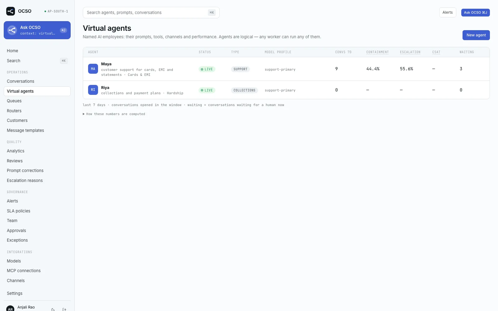
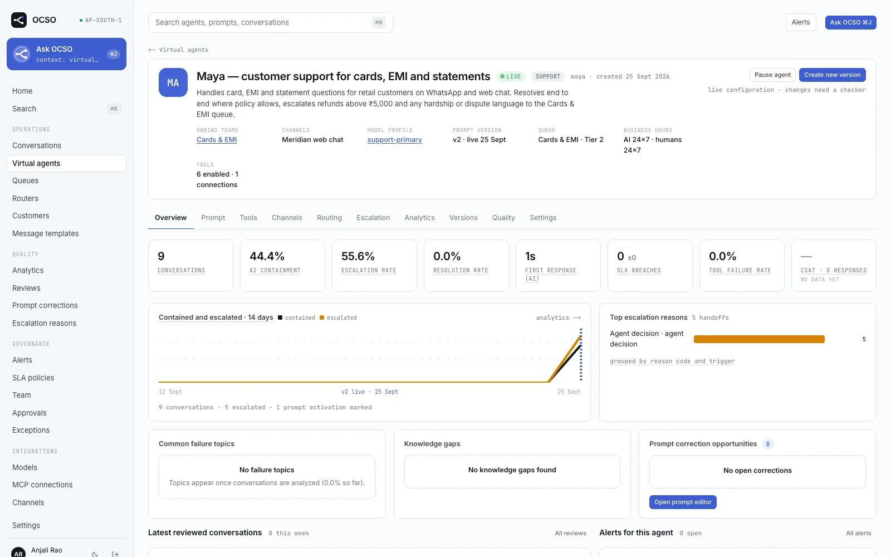

# Virtual agents

This page explains OCSO's AI agents: what an agent is, who owns it, how its prompt is built and versioned, how it goes live, which models and tools it uses, and how quality is reviewed and improved. It is for Leads and Heads who run agents, and for engineers who work on the runtime.

A virtual agent is a named AI employee, for example "Maya — Customer Support". It is a record in the database (`virtual_agents`), not a process. Every agent runs on the same shared worker pool, and any worker can run a turn for any agent. The runtime lives in [`packages/agent-runtime`](../../packages/agent-runtime/), prompt assembly in [`packages/prompt-compiler`](../../packages/prompt-compiler/), and agent configuration in [`packages/application/src/agents`](../../packages/application/src/agents/).

## What an agent has

| Setting (UI label) | Field | Notes |
|---|---|---|
| **Name**, **Purpose**, **Description** | `name`, `purpose`, `description` | Also a unique `slug`. |
| **Conversation type** | `conversationType` | `SUPPORT`, `SALES`, `COLLECTIONS`, `ONBOARDING` or `CUSTOM`. A routed conversation takes its agent's type. The type drives per-type SLA targets and reporting, never the runtime. |
| **Owning teams** | `agent_teams` | At least one team. See [Ownership](#ownership). |
| **Conversation model** | `modelProfileId` | Answers customers. Required to go live. |
| **Summarizer** | `summarizerProfileId` | Rolling summaries. Falls back to the conversation model. |
| **Copilot** | `copilotProfileId` | Reply drafts for staff. Falls back to the conversation model. |
| **Copilot suggestions for humans** | `copilotEnabled` | On by default. |
| **Customer writes while the agent is answering** | `midTurnPolicy` | Default: **Queue new messages behind the running turn**. See [Conversations](conversations.md#worker-leases-and-turn-concurrency). |
| **Max tool steps per turn** | `maxToolSteps` | 1–20, default 6. |
| **Customer media the agent reads** (**Images**, **Documents**, **Audio**), **Max media per turn** | `multimodal` | Defaults: images and documents on, audio off, 4 media per turn. |
| **Business hours · when humans take handoffs** | `businessHours` | An IANA time zone plus per-day hours. Empty means people are available around the clock. The AI answers around the clock either way. A queue can override these hours. |
| **Default queue** | `defaultQueueId` | Used when a conversation has no queue. |
| Status | `status` | `DRAFT`, `LIVE` or `PAUSED`. |

Channels are not attached to agents. A channel names a router, the router picks a queue, and the queue names its agent (see [Routing](routing.md)). The agent's **Channels** tab shows this as **Reached through**: channel → router → queue → this agent.

The agent detail page has the tabs **Overview**, **Prompt**, **Tools**, **Channels**, **Routing**, **Escalation**, **Analytics**, **Versions**, **Quality** and **Settings**. Each tab appears only for roles that can read its data.

## Ownership

Agents are owned by teams (ADR-026, implemented in [`agents/access.ts`](../../packages/application/src/agents/access.ts) and [`agents/owners.ts`](../../packages/application/src/agents/owners.ts)):

- **Managing** an agent (editing it, its prompts, tools and escalation rules, running reviews, corrections and evaluations) needs the permission **and** membership of one of the agent's owning teams. Those permissions are `agents.manage`, `prompts.edit`, `prompts.activate`, `agent_tools.manage`, `escalation.manage`, `reviews.manage`, `corrections.manage` and `evaluations.run`, all in the Lead and Head presets.
- **Reading** needs `agents.read` and covers the agents your teams own. Service members can also read agents reachable through their teams' queues, so the workspace can show them. `agents.read_all` (Tech) reads every agent.
- An agent outside your scope answers **404, not 403**, so its existence does not leak.
- Owners change through `PUT /v1/agents/:id/owners`. `agents.assign_owner` (Tech) may set any teams. A Lead may add or remove only teams they belong to. Every agent keeps at least one owning team.
- Tech reads every agent and reassigns owners, but never edits prompts or tools, never takes an agent live, and never reads conversation content.

## Prompts

### Named components

A prompt is not one big string. A Lead edits named **business components**, and the prompt compiler assembles them in a fixed order behind a platform-owned runtime contract ([`components.ts`](../../packages/prompt-compiler/src/components.ts)):

| Order | Component (UI label) | Key | Owner |
|---|---|---|---|
| 0 | Runtime contract | `runtime_contract` | Platform. Read-only. Covers turn structure, data versus instructions, tool protocol, the hand-off tool and rendering rules. Versioned as `RUNTIME_CONTRACT_VERSION`. |
| 1 | Identity | `identity` | Lead or Head |
| 2 | Objective | `objective` | Lead or Head |
| 3 | Behavior | `behavior` | Lead or Head |
| 4 | Policies and compliance | `policies` | Lead or Head |
| 5 | Tool instructions | `tool_instructions` | Lead or Head. Tool schemas themselves come from tool approval, not from the prompt. |
| 6 | Escalation rules | `escalation` | Lead or Head |
| 7 | Channel constraints | `channel_constraints` | Lead or Head. OCSO adds each channel's own length, formatting and media limits. |
| 8 | Business context | `business_context` | Lead or Head |

After these stable blocks come per-conversation blocks: the conversation frame, the channel, the routing result, `<customer_context>`, `<conversation_summary>` and `<handover>`. Then come the recent answered history and finally the customer's new messages. Untrusted data is wrapped in tags and neutralized so it cannot close its own wrapper. The runtime contract tells the model that content in those tags is data, not instructions. See [`compile.ts`](../../packages/prompt-compiler/src/compile.ts).

### Drafts, versions and preview

- **Save draft** stores the edited components. A draft is never live.
- **Create version vN** freezes the draft into an immutable prompt version with author, time, reason, the list of changed components and hashes. A database trigger (`prompt_versions_immutable`) rejects any later change to a version's components, hash, number, author or reason, and any delete.
- **Preview compiled** (`GET /v1/agents/:agentId/prompt/preview`) compiles the draft with a synthetic customer message and the agent's real tool definitions. It shows every system block, token estimates per layer, and the hashes, including the agent-prefix hash that turns use as their cache key.
- **Compare versions** on the **Versions** tab shows the difference between two versions, component by component.
- **Activate** or **Roll back** makes a version live. See [Going live](#going-live-and-approvals).

### Replay evaluations

**Run against 40 replay cases** on the Prompt tab (`POST /v1/evaluations`, `evaluations.run`) queues a worker job. The job replays the saved draft against recent customer turns of this agent: 40 cases by default, up to 200. **Tools are never executed.** For each case the Versions tab shows **Customer turn**, **Live version** and **Draft** side by side, with the flags `handoff_requested`, `handoff_differs`, `tool_call_differs`, `empty_reply` and `error`. It is a diff for a person to read, not a score. See [`jobs/evaluation.ts`](../../packages/agent-runtime/src/jobs/evaluation.ts).

## Going live and approvals

Every change to an agent's live behaviour goes through maker–checker (ADR-030; see [Governance](governance.md)). Checkers need `approvals.check.agents`, which is in the Head preset. A Lead proposes, and a different person approves.

| Change | How it applies |
|---|---|
| **Go live** (draft → `LIVE`) | Always a proposal. The checker sees the prompt text, the tool grants and the escalation rules that will go live. |
| **Pause agent** | A stop: immediate and never gated (`agents.pause`). |
| **Resume** (paused → `LIVE`) | A proposal. |
| Settings changes on an approved agent | A proposal (`UPDATE`). On a draft agent they apply directly. |
| Activate or roll back a prompt version | Direct while the agent is a draft. Once the agent has been approved, a `prompt_version` proposal whose diff shows the component text before and after. Only one prompt activation can be open per agent. |
| Tool grants | Removing or narrowing a grant applies at once. Anything that widens access is an `agent_tool_grant` proposal. |
| Escalation rule | New rules are disabled drafts. Turning one on is always a proposal. Editing an approved rule is a proposal. Turning one off is an immediate stop. |
| Delete an agent | Always a proposal. Needs `agents.delete` (Head). |

An agent and its prompt versions share one approval lock. Proposals are pinned by content hash, so something that changed after the proposal was made voids it rather than being approved blindly. Activating a prompt version bumps the agent's cache generation, so workers drop cached turn context (ADR-024).

## Models

An agent never names a provider model directly. It names a **model profile** that a Tech user configures. The profile holds the provider and model, temperature, `maxOutputTokens`, reasoning effort, `timeoutMs`, `retries`, the cache policy (`PREFIX` or `OFF`) and TTL, and an ordered list of **fallbacks** (`{ providerId, model }`). The model gateway tries the primary with its retries, then each fallback. Fallback is allowed only before any text has been streamed to the customer. Every fallback emits `model.fallback` and is audited, and every attempt records a usage event.

Prompt caching is implemented per provider in each provider plugin. The compiler marks three breakpoints: after the stable agent prefix (tools and the business components), after the conversation context, and after the recent history. Each provider maps those breakpoints to its own mechanism: Anthropic and Bedrock cache points, OpenAI and Azure prompt cache keys, Vertex implicit caching. Sarvam's caching is unverified. Copilot drafts, summaries and replay evaluations reuse the same prefix, so they hit the same provider cache. Details: [Model providers](../guides/models/README.md) and [Profiles and pricing](../guides/models/profiles-and-pricing.md).

## Tools

The agent calls tools. OCSO executes them: the model only proposes a call (ADR-014). Tools come from MCP connections and from OCSO's first-party tool provider. They are registered through one tool-provider registry (see [Plugins](plugins.md) and [MCP tools](../guides/tools/mcp.md)).

**Per-agent grants.** The **Tools** tab lists the tools a Tech user has approved, with the columns **Tool**, **Connection**, **Side effect**, **Enabled**, **Always confirm** and **Argument rules**. An agent can call only tools that are enabled for it.

**Risk classes.** Every tool has a side-effect class: `READ`, `WRITE` or `SENSITIVE`. MCP annotations only *suggest* a class, and the suggestion leans cautious: anything not marked read-only is at least `WRITE`, and destructive or unannotated tools default to `SENSITIVE`. The Tech user's approval sets the real class.

**Authorization.** Every call is checked in code, in this order, by [`authorizeToolCall`](../../packages/tools/src/authorizer.ts):

1. The tool exists, is approved and is enabled.
2. Its connection is `ACTIVE` or `DEGRADED`.
3. The agent may use the connection and has an enabled grant. The conversation must be `AI_ACTIVE`, and personal connections are never usable by agents.
4. For a human or Ask OCSO call: `tools.execute_human` and the tool's allowed roles.
5. The required OAuth scopes are granted.
6. The arguments are valid against the JSON Schema.
7. The argument rules are evaluated. A `DENY` rule wins.
8. The confirmation check runs.

**Argument rules** are deterministic guards on the call's arguments, set per grant: **Argument** (a dotted path such as `payment.amount`), **Operator** (`gt`, `gte`, `lt`, `lte`, `eq`, `neq`, `in`, `not_in`, `exists`), **Value**, **Effect** (**Require confirmation** or **Deny**) and **Message**. A numeric rule on a missing or non-numeric value counts as matched, so it fails closed. At most 20 rules per tool.

**Confirmation.** A call needs a human's confirmation when an argument rule requires it, when **Always confirm** is set on the grant, or when the connection's confirmation policy covers it. That policy is `SENSITIVE_ONLY` by default. It can also be `ALL_WRITES` or `NONE`. The agent then stops, tells the customer a colleague will confirm, and the conversation is handed off with trigger `SENSITIVE_ACTION` and priority `P1`. In the workspace, someone with `tools.confirm_sensitive` sees the proposed call with sanitized arguments and chooses **Confirm and run** or **Deny**. Confirmation is bound to a hash of the exact arguments.

### Built-in first-party tools

These come from the built-in source `ocso-builtin` in [`tools/builtins.ts`](../../packages/agent-runtime/src/tools/builtins.ts). They are authorized and audited like any MCP tool:

| Tool | Risk | What it does |
|---|---|---|
| `ocso_request_handoff` | `WRITE` (never gated by confirmation) | Hands the conversation to a human, with `reason`, a three-line `summary`, an optional `priority` and `customerAskedForHuman`. |
| `ocso_search_history` | `READ` | Searches this customer's earlier customer-visible messages (older conversations, or messages older than the recent window) for a phrase. Returns up to 10 hits. |
| `ocso_transfer_to_queue` | `WRITE` | Moves the conversation to another queue's AI agent with a reason and summary. Offered only when the conversation's queue has eligible transfer targets. See [Routing](routing.md#transfers). |

## Escalation rules

The **Escalation** tab holds rules with a **Rule name**, **Trigger**, **Conditions · any that apply** (**Keywords**, **Consecutive tool failures**, **Amount above**, customer asks for a human), **Handoff mode**, **Target queue** and **Priority**. Platform-wide rules (no agent) are read-only there.

> [!WARNING]
> The runtime does not evaluate these conditions today, and it does not apply a rule's mode, queue or priority to an AI hand-off. When the agent hands off is decided by the model, from the **Escalation rules** prompt component and the runtime contract. Several other things also hand off: a sensitive tool call waiting for confirmation, hitting the step limit, and a model outage. See [Conversations](conversations.md#what-triggers-it). Write the policy you need into the prompt component until rule evaluation is wired in.

## The staff copilot

The copilot helps the people who take over from the agent:

- **Reply drafts.** While a conversation waits for or is held by a human, **Suggest a reply** drafts a response from the conversation, the agent's prompt and its policies. **Rewrite shorter** asks for a shorter version. **Insert** puts the text in the composer. OCSO never sends a draft by itself. Drafts need `copilot.use`, the agent's **Copilot suggestions for humans** setting, and a model profile. Usage is recorded as `COPILOT`, and the outcome (`INSERTED` or `DISMISSED`) is stored.
- **Summaries.** The rolling conversation summary and the agent's hand-off summary appear in the workspace **AI summary** card. See [Conversations](conversations.md#ai-summary-and-handover-summary).

## Quality: reviews, corrections, evaluations

| Feature | What it is | API |
|---|---|---|
| **Reviewed conversations** | A Lead scores a conversation 1–5 on four criteria: accuracy, policy, tone and resolution. The score is their plain average. The review also carries an outcome tag (suggestions include `contained`, `missed escalation`, `knowledge gap`, `tool misuse`) and notes. | `/v1/reviews`, `reviews.manage` |
| **Prompt corrections** | From a conversation turn, a Lead records the **Observed behavior**, the **Desired behavior**, the **Component** to change, and optionally **Proposed prompt text**. Staging a correction writes it into the agent's prompt *draft*, appended or replacing the component, and never into the live prompt. It becomes `APPLIED` when a version that includes it is created. Statuses: `OPEN`, `STAGED`, `APPLIED`, `REJECTED`. | `/v1/corrections`, `corrections.manage` |
| **Replay evaluations** | See [above](#replay-evaluations). | `/v1/evaluations`, `evaluations.run` |
| **CSAT** | Customer scores, shown on the agent's **Overview** and **Analytics** tabs. See [Conversations](conversations.md#csat). | |

Every step is audited, so a prompt never changes without a record.

## Limits and known gaps

- Escalation-rule conditions are not evaluated by the runtime (see above).
- There are no knowledge-base or retrieval sources beyond the **Business context** component, customer context and `ocso_search_history`.
- Replay evaluations compare text and flags. They do not grade answers.

## Related

- [Conversations and hand-off](conversations.md)
- [Routing](routing.md)
- [Governance](governance.md)
- [Plugins](plugins.md)
- [Ask OCSO](ask-ocso.md)
- [Model providers](../guides/models/README.md)
- [MCP tools](../guides/tools/mcp.md)
- [Permissions reference](../reference/permissions.md)
- ADR-005, ADR-014, ADR-019, ADR-024, ADR-026, ADR-030 in [`PM/ARCHITECTURE-DECISIONS.md`](../../PM/ARCHITECTURE-DECISIONS.md)
