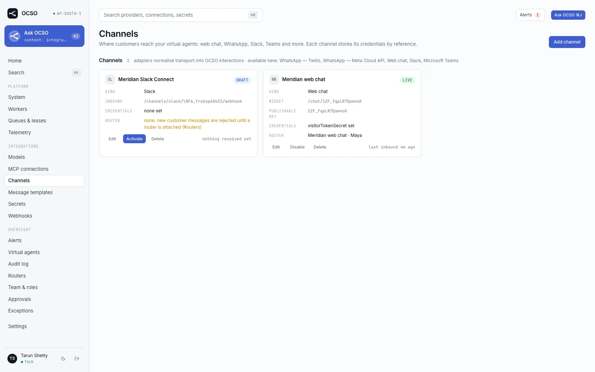
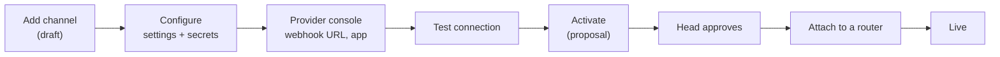
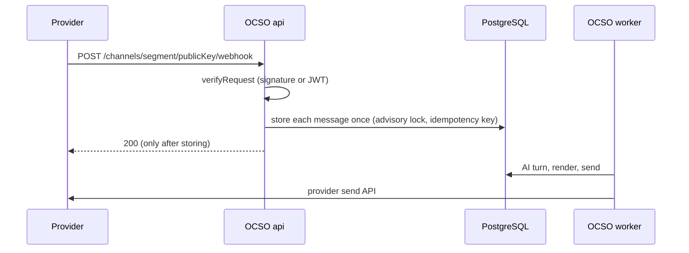

# Channels

A channel is where people reach OCSO: a WhatsApp number, a web chat widget, a Slack app or a Microsoft Teams bot.
This page is for the Tech admin who connects channels and the Head who approves them. It lists the channel kinds
this build ships, what each can carry, and the path every channel takes from draft to live. Each kind then has its
own step-by-step guide.

Every channel kind is a plugin. Core never names a kind: the form, the setup guide, the badge in the inbox and the
webhook URL all come from the kind's descriptor (`packages/channels/src/<kind>/descriptor.ts`). To add a kind of
your own, see [Build a channel plugin](../extending/build-a-channel-plugin.md).

## The channel kinds

The "Add channel" list shows them in this order (the order of `FIRST_PARTY_PLUGINS` in
[packages/bootstrap/src/first-party.ts](../../../packages/bootstrap/src/first-party.ts)).

| Kind | Label in OCSO | Guide | Text limit | Media in / out | Choice questions (CHOICES) | Message templates | 24-hour window | Test connection |
|---|---|---|---|---|---|---|---|---|
| `TWILIO_WHATSAPP` | WhatsApp — Twilio | [whatsapp-twilio.md](whatsapp-twilio.md) | 1,600 | images, audio, video, documents, locations; one media item per message | numbered text | yes (Twilio Content API) | yes | yes |
| `WHATSAPP` | WhatsApp — Meta Cloud API | [whatsapp-meta.md](whatsapp-meta.md) | 4,096 | images, audio, video, documents, locations, contacts | reply buttons (up to 3) or a list (up to 10) | yes (needs the WABA id) | yes | no |
| `WEBCHAT` | Web chat | [web-chat.md](web-chat.md) | 8,000 | images and documents (audio in, if turned on) | buttons (up to 10) | no | no | no |
| `SLACK` | Slack | [slack.md](slack.md) | 40,000 | none: text only | Block Kit buttons (up to 25) | no | no | yes |
| `MS_TEAMS` | Microsoft Teams | [microsoft-teams.md](microsoft-teams.md) | 7,000 | none: text only | Adaptive Card buttons (up to 6) or a drop-down (up to 10) | no | no | yes |

Other properties, from each kind's `capabilities.ts`:

| Kind | Webhook segment | Embeddable | Delivery receipts | Markdown | Staff destination (Ask OCSO) |
|---|---|---|---|---|---|
| `TWILIO_WHATSAPP` | `twilio-whatsapp` | no | yes | basic, converted to WhatsApp formatting | no |
| `WHATSAPP` | `whatsapp` | no | yes | basic, converted to WhatsApp formatting | no |
| `WEBCHAT` | none (the widget uses the public web chat API) | yes | no | CommonMark | no |
| `SLACK` | `slack` | no | no | basic, converted to Slack mrkdwn | yes |
| `MS_TEAMS` | `ms-teams` | no | no | basic, sent as Teams markdown | yes |

A choice question is the router's "ask the customer" step. It goes out as one structured part with a numbered
text fallback, so a channel that cannot draw buttons still sends something the customer can answer ("2" or
"Loans"). See [Routing](../../concepts/routing.md).

### What has been tested, and how

> [!IMPORTANT]
> All channel tests run offline: unit tests against recorded provider-shaped payloads, and integration tests
> through the real API against local provider stubs (`apps/api/test/int/`). The repository records no run
> against a live WhatsApp Business number (Meta or Twilio), a live Slack workspace or a live Microsoft 365 tenant.
> The README and [ROADMAP.md](../../../ROADMAP.md) list WhatsApp live verification as owed; the checklist is in
> [packages/channels/README.md](../../../packages/channels/README.md#needs-live-verification). Check your channel
> end to end before customers use it.

## From draft to live

Three presets take part, and maker and checker are always two different people. The permission names are exact;
the presets that hold them come from
[packages/auth/src/roles.ts](../../../packages/auth/src/roles.ts).

| Step | Who | Permission |
|---|---|---|
| Create and configure the channel | Tech | `channels.manage` |
| Approve activation, and later changes | Head (a second person) | `approvals.check.channels` |
| Attach the channel to a router | Lead or Head | `routers.manage` (a proposal once the router is approved) |
| Create message templates (WhatsApp) | Tech, Lead or Head | `message_templates.manage` |

### 1. Add the channel as a draft

1. Open **Integrations → Channels** and choose **Add channel**.
2. Pick the **Channel type** and give the channel a **Name**.
3. For kinds the provider calls back (WhatsApp, Slack, Teams), choose **Create draft and continue**. OCSO creates a
   draft with only a type and a name, so the webhook URL exists before you open the provider's console. The dialog
   then becomes the kind's setup guide: a numbered checklist with the webhook URL (**Copy**), files to download,
   and OCSO's own settings and secrets form inside the step where you paste them.
4. For web chat there is no webhook: the dialog shows the form directly and **Add channel** saves it.

A draft is inert. Ingress refuses it, so it takes in no customer messages. It may be incomplete: a setting or
secret you have not entered yet is not reported until activation, but any value you do enter is checked on every
save. Close the dialog at any time and come back with **Edit** on the channel card.

The webhook URL is `OCSO_PUBLIC_URL`'s origin plus `/channels/<segment>/<publicKey>/webhook`, for example
`https://ocso.meridian.example/channels/slack/Xq3v9Lk2pD8sT0aB/webhook`. The public key is random and identifies the
channel; it is not a secret. Providers only call public https URLs, so `OCSO_PUBLIC_URL` must be the https origin
they can reach (see [Configuration](../../reference/configuration.md)).

### 2. Configure it

- **Settings** come from the kind's settings schema. Blank fields take the default shown.
- **Secrets** are write-only. OCSO stores them in the secret store by reference and never shows them again; the card
  lists only their names ("botToken, signingSecret set"). A secret marked **Generate** gets a random value you copy
  into the provider's console. Some secrets are generated by OCSO when left empty (web chat's visitor token
  secret and secret key).
- Problems come back under the field they belong to, as `settings.<path>: …` or `secrets.<key>: …`.

> [!NOTE]
> The edit form still shows a **Default virtual agent** select. The web app drops the value before saving: a
> channel no longer names an agent. The router decides (step 5).

### 3. Test the connection

Slack, Teams and Twilio have a **Test connection** button (`POST /v1/channels/:id/test`). It checks the saved
credentials against the provider with read-only calls and never sends a message. A failed check links to the
matching troubleshooting entry under the guide. Meta WhatsApp and web chat have no connection check.

### 4. Activate it

Choose **Activate** on the channel card. Activation is always a proposal: the submit dialog asks for a checker and a
reason. A Head with `approvals.check.channels` approves it under **Approvals**. Activation checks the whole
configuration, so missing required values fail here. See [Governance](../../concepts/governance.md).

After approval:

- every change to name, settings or secrets is an UPDATE proposal (**Submit change**), and new secrets travel as
  references until approved;
- **Disable** stops the channel at once and is never gated;
- **Re-enable** and **Delete** are proposals.

### 5. Attach it to a router

A channel points at a router, the router decides the queue, and the queue's AI agent answers:
channel → router → queue → agent. Open **Routers**, pick a router, tick the channel under **Channels** and choose
**Save channels**. On a draft router this applies at once; on an approved router it is a proposal. Unticking
detaches immediately.

Until a router is attached, the channel card says "none: new customer messages are rejected until a router is
attached". Those messages are logged and recorded in the audit log as `conversation.inbound_rejected` (without the
text). Conversations already under way keep reaching their agent or person.

Slack and Teams channels whose **Destination** is `ask_ocso` need no router: they serve staff, not customers. See
[Ask OCSO in Slack and Teams](ask-ocso-in-slack-and-teams.md).

### 6. Verify it works

- Send a message through the provider. The channel card shows "last inbound … ago" instead of "nothing received
  yet".
- The conversation appears in the workspace inbox with the kind's badge (`WA`, `WB`, `SL`, `MT`).
- The API logs one `channel webhook` line per delivery with `accepted`, `duplicates`, `rejected` and `ignored`
  counts. A `channel webhook: customer messages rejected` warning names the reason, for example `no_router`.

## How messages flow

- The API answers only after every message is stored, so a provider that times out retries and gets a duplicate,
  not a second message.
- The provider's message id is the idempotency key. Delivery statuses never move backwards.
- Outbound, only customer-safe parts your channel accepts reach it: tool results and internal notes never render.
  Failed sends that can be retried back off, up to 8 attempts.
- Sends are at-least-once. If a provider accepts a message and OCSO crashes before recording its id, a retry can
  deliver a duplicate.

## Limits and known gaps

- **Slack and Teams carry text and choice buttons only.** No files in or out, no proactive messages, no delivery
  receipts.
- **Web chat has no message templates** and no session window; it streams replies.
- **Live verification is owed** (see the note above).
- **SMS, RCS and voice** have no adapter. Each would be a plugin.
- The kinds this deployment offers are the first-party ones plus any installed plugin. **System → Plugins** lists
  them.

## Related

- [WhatsApp through Meta Cloud API](whatsapp-meta.md)
- [WhatsApp through Twilio](whatsapp-twilio.md)
- [Web chat](web-chat.md)
- [Slack](slack.md)
- [Microsoft Teams](microsoft-teams.md)
- [Ask OCSO in Slack and Teams](ask-ocso-in-slack-and-teams.md)
- [Routing](../../concepts/routing.md) and [Governance](../../concepts/governance.md)
- [Build a channel plugin](../extending/build-a-channel-plugin.md)
- [Permissions reference](../../reference/permissions.md)
