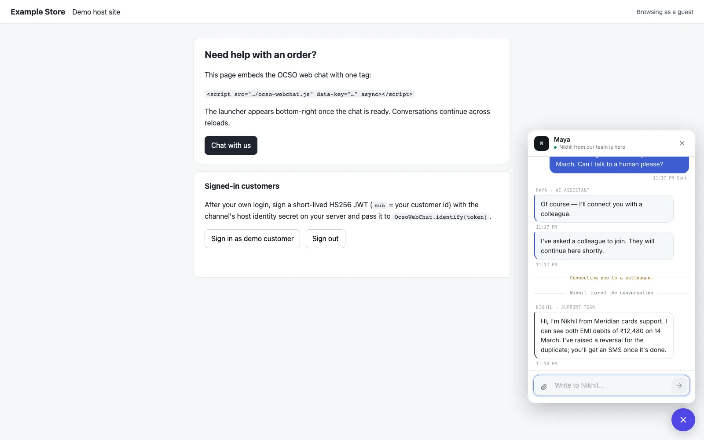

# Web chat

This guide puts OCSO's customer chat on your website or in your app, as the `WEBCHAT` channel kind (label **Web
chat**). You can embed OCSO's hosted widget with one script tag, link to the hosted chat page, or build your own UI
with the chat SDK (`@winsendotai/ocso-chat`, plus `@winsendotai/ocso-chat-react` for React and React Native). It is for
the Tech admin who creates the channel and the web or app developer who embeds it.

The adapter is in [packages/channels/src/webchat/](../../../packages/channels/src/webchat/). The SDK API is in the
[chat SDK reference](../../reference/chat-sdk.md).



## How it fits together

| Piece | Where | What it is |
|---|---|---|
| Embed script | `https://<OCSO host>/ocso-webchat.js` with `data-key="<publishable key>"` | Adds a launcher button and a panel holding the chat page in an iframe. No dependencies. |
| Chat page | `https://<OCSO host>/chat/<publishable key>` | The hosted chat UI. The iframe shows it; you can also link to it directly. |
| Public API | `https://<OCSO host>/public/webchat/<publishable key>/…` | What the page and the SDKs call: `config`, `session`, `session-pass`, `messages`, `attachments`, and the live stream. |
| Chat SDK | `@winsendotai/ocso-chat`, `@winsendotai/ocso-chat-react` | Headless client and React / React Native components over the same API. |

The **publishable key** is the channel's public key. It is safe to ship in a page or an app. The **secret key**
(`sk_…`) is not: it stays on your server.

Web chat has no provider and no webhook. Replies stream to the browser over server-sent events (native streaming,
no session window, no message templates).

## Prerequisites

- A Tech admin (`channels.manage`) to create the channel, and a Head (`approvals.check.channels`) to approve its
  activation.
- A router to attach the channel to (Lead or Head, **Routers**).
- The origins of every site that will embed the chat, for example `https://www.meridian.example`.
- For signed-in customers: either your identity provider's JWKS URL, issuer and audience, or the ability to sign an
  HS256 token on your server.

## Set it up

1. **Add the channel.** Open **Integrations → Channels → Add channel**, choose **Web chat**, enter a **Name**, and
   set the settings below (at least **Auth mode** and **Allowed origins**). Leave **Visitor token secret** and
   **Secret key** empty: OCSO generates them. Choose **Add channel**.
2. **Copy the secret key now.** After saving, the dialog shows the generated secret key once. Store it in your
   backend's secret store (the snippets read it as `OCSO_SECRET_KEY`). You can rotate it later from the edit form.
   You only need it for `client` and `user` modes and for token passthrough.
3. **Embed it.** The dialog's **Next · embed the widget** panel shows the **Publishable key** and one tab per way in:
   **Script tag**, **React**, **React Native** and **Server** (see below). In `client` mode the **Script tag** tab is
   left out: the hosted widget cannot fetch session passes.
4. **Restrict the sites.** List every site that embeds the widget under **Allowed origins**. With the list empty,
   any site may embed it.
5. **Activate** the channel. A Head approves it under **Approvals**.
6. **Attach it to a router** under **Routers**. Until then new chats are rejected with `no_router`.

## Settings

| Setting (form label) | Default | Meaning |
|---|---|---|
| `allowedOrigins` | `[]` | Up to 50 origins that may embed the chat: `https://shop.example.com`, `http://localhost:8080`, or one wildcard label, `https://*.example.com`. No paths. The same list drives the chat page's CSP `frame-ancestors`, the widget's `postMessage` checks and the public API's `Origin` check. Empty = any site. |
| `auth.mode` (Auth mode) | `anonymous` | `anonymous`: anyone on an allowed site. `client`: every session needs a session pass your backend mints. `user`: every session needs a verified signed-in user. |
| `auth.allowNativeApps` | `false` | In `anonymous` mode, accept requests with no `Origin` header (native apps, servers). Other modes always accept them: the pass or the user token is the proof. |
| `auth.userToken` (User token verification) | none | How user tokens are verified: **JWKS** (`jwksUrl` over https, required `issuer` and `audience`, optional `algorithms` from RS256…EdDSA; never `none` or HMAC) or **HS256** with the host identity secret (optional `issuer`, `audience`). |
| `context.allow` (Allowed context keys) | `[]` | Up to 20 keys your site may pass with a session (`plan`, `orderId`). Other keys are dropped. |
| `context.maxBytes` | `2048` | Largest accepted context, in bytes of JSON (64 to 4,096). |
| `toolIdentity` (Tool identity) | `ocso` | `ocso`: agent tool calls carry OCSO-signed customer claims. `passthrough`: they also carry the verified user token, to MCP connections that opt in. |
| `branding.title`, `subtitle`, `greeting`, `accentColor`, `theme`, `position`, `launcherLabel` | theme `light`, position `right` | The widget's look. The title defaults to the answering agent's name; the greeting is shown above the composer and never stored as a message. |
| `maxAttachmentsPerMessage` | `5` | 0 to 10. |
| `audioAttachments` | `false` | Accept mp3, m4a and ogg audio from customers (up to 16 MB). |
| `visitorTokenTtlSeconds` | 30 days | Lifetime of anonymous visitor tokens (5 minutes to 90 days). |
| `hostJwtIssuer`, `hostJwtAudience` | none | Required `iss` / `aud` of HS256 host tokens when set. |

| Secret (form label) | Generated | Meaning |
|---|---|---|
| `visitorTokenSecret` (Visitor token secret) | by OCSO when empty | Signs anonymous visitor sessions (32+ characters). Rotating it signs every visitor out. |
| `hostJwtSecret` (Host identity secret) | **Generate** button | Optional HS256 secret (32+ characters) your server signs user tokens with. |
| `secretKey` (Secret key) | by OCSO when empty, shown once | `sk_` + 32+ url-safe characters. Your backend uses it to mint session passes; it also protects held user tokens. Never ship it in a page or app. |

The form refuses combinations that cannot work: `client` mode without a secret key, `user` mode without a JWKS URL or
host identity secret, HS256 verification without the host identity secret, and `passthrough` without verified
user tokens and a secret key.

## Embedding

### Script tag (hosted widget)

```html
<script src="https://ocso.meridian.example/ocso-webchat.js" data-key="Xq3v9Lk2pD8sT0aB" async></script>
```

Add it to every page that should show the launcher. The script exposes a small page API; calls made before it
loads can be queued with `window.OcsoWebChat = window.OcsoWebChat || []; OcsoWebChat.push(['identify', token]);`.

| Call | Does |
|---|---|
| `OcsoWebChat.open()`, `close()`, `toggle()` | Show or hide the panel. |
| `OcsoWebChat.identify(token)` | Sign the visitor in with a user token (verified as configured under **User token verification**, or HS256 with the host identity secret). Resolves to `{ ok, error? }`. |
| `OcsoWebChat.reset()` | Forget the visitor, for example on sign-out. |
| `OcsoWebChat.on(event, fn)`, `off(event, fn)` | Events: `ready`, `open`, `close`, `unread`, `identified`. |

In `user` mode the chat opens only after the page calls `OcsoWebChat.identify(userToken)`.

[examples/webchat-host](../../../examples/webchat-host/README.md) is a runnable host page that embeds the widget and
signs an HS256 token for a "signed-in" customer.

### Chat SDK (your own UI)

```ts
// npm i @winsendotai/ocso-chat @winsendotai/ocso-chat-react
import { OcsoChat } from '@winsendotai/ocso-chat-react';
import '@winsendotai/ocso-chat-react/styles.css';

export function SupportChat() {
  return <OcsoChat options={{ baseUrl: 'https://ocso.meridian.example', publishableKey: 'Xq3v9Lk2pD8sT0aB' }} />;
}
```

React Native uses `OcsoChatView` from `@winsendotai/ocso-chat-react/native`. Apps send no `Origin` header, so use
`client` mode with a session pass, or turn on **Allow native apps** in `anonymous` mode. The headless client is
`createOcsoChat` from `@winsendotai/ocso-chat`. Options, state, methods and platform notes are in the
[chat SDK reference](../../reference/chat-sdk.md).

> [!NOTE]
> The SDK packages are built and tested in this repository but not published to npm yet. Until they are, build
> them with `pnpm --filter @winsendotai/ocso-chat build` (and the React package) and install the tarballs from
> `pnpm --filter … pack`.

### Session passes (`client` and `user` modes)

Your backend mints a short-lived, single-use session pass with the secret key and hands it to the browser or app:

```ts
// Your backend (Node 20+). Authenticate your own user first.
const res = await fetch('https://ocso.meridian.example/public/webchat/Xq3v9Lk2pD8sT0aB/session-pass', {
  method: 'POST',
  headers: { authorization: `Bearer ${process.env.OCSO_SECRET_KEY}`, 'content-type': 'application/json' },
  body: JSON.stringify({ userToken, context: { plan: 'gold' }, ttlSeconds: 600 }),
});
const { sessionPass, expiresAt } = await res.json();
```

- `POST /public/webchat/<key>/session-pass` is server to server. A request that carries an `Origin` header is
  refused (`webchat_session_pass_server_only`).
- `ttlSeconds` is 60 to 3,600. `userToken` and `context` are optional; `visitorId` carries an existing visitor over.
- A wrong secret key is rate-limited per channel and caller address.
- The client passes the pass to the SDK through `getSessionPass`.

## Who the customer is

| Auth | Identity | Shown in lists as |
|---|---|---|
| Anonymous visitor | `webchat_visitor` (the visitor id) | `web · sess 8f2a` |
| Signed-in user (session pass with a user token, `identify()`, or `getUserToken`) | `webchat_customer_ref`, value `<channel id>:<sub>` | masked id |

A channel vouches only for its own users. The visitor id carries over to a signed-in user only while the verified
user stays the same; another user on the same browser gets a new visitor.

## Host context

Your site can pass key/value context with a session (`context` in the SDK options, or inside a session pass).
Only keys listed under **Allowed context keys** are kept, and the kept values must fit **Context max bytes**. The
agent sees each value labelled by who vouched for it: `host` when it came inside a session pass or a verified user
token, `client` when the browser sent it. Treat `client` context as unverified.

## Passing the user's token to tools

With **Tool identity** set to `passthrough`, OCSO keeps the customer's verified user token (sealed with the secret
key) and forwards it on agent tool calls, but only to MCP connections whose approval has **Forward the customer's
verified web chat user token** ticked. OCSO sends it as `Authorization: Bearer <token>` to a connection without its
own credential, and as the `X-OCSO-User-Token` header otherwise. See [MCP tools](../tools/mcp.md).

## Choice questions and replies

A router's choice question shows as one button per option (up to 10). A tap is sent as a structured reply carrying
the option id; typed answers work too. Router messages show as the assistant, without a name. The customer sees
hand-offs to a person ("waiting", "human") and can rate the conversation (CSAT) when it is resolved.

## Verify it works

1. Open a page with the script tag on an allowed origin, or `https://<OCSO host>/chat/<publishable key>` directly.
2. The launcher appears; `GET /public/webchat/<key>/config` answers with the branding and limits.
3. Send a message. The channel card shows "last inbound … ago"; the conversation appears with the `WB` badge and the
   reply streams in.
4. In `client` or `user` mode, check that a session without a pass or user token is refused.

With the Compose demo, the seed creates a web chat channel; `docker compose logs seed` prints its public key.

## Troubleshooting

| Problem | Fix |
|---|---|
| The panel stays blank, or the browser blocks the frame | The site is not in **Allowed origins** (CSP `frame-ancestors`). Add its exact origin, scheme and port included. |
| SDK error `webchat_origin_not_allowed` | Same: add the calling site's origin. For native apps use `client` mode or **Allow native apps**. |
| `session_pass_required` | The channel is in `client` mode: supply `getSessionPass`. The script tag does not work in this mode. |
| `user_token_required` | The channel is in `user` mode: call `identify(token)` or supply `getUserToken`, or mint the pass with a `userToken`. |
| `webchat_session_pass_server_only` | You minted a pass from a browser. Mint it on your server. |
| New chats are refused with `no_router` | Attach the channel to an active router. |
| Attachments are rejected | Check the type and size limits (images 10 MB: JPEG, PNG, WebP, GIF; documents 20 MB: PDF, text, CSV, DOCX, XLSX) and **Max attachments per message**. |

## Limits and known gaps

- No message templates and no delivery receipts (streaming instead).
- The public API keeps its historical path `/public/webchat/<key>/*` for every embeddable kind.
- Rate limits are per API instance.
- The SDKs are not on npm yet.

## Related

- [Chat SDK reference](../../reference/chat-sdk.md)
- [Channels overview](README.md)
- [MCP tools](../tools/mcp.md)
- [Routing](../../concepts/routing.md)
- [examples/webchat-host](../../../examples/webchat-host/README.md)
