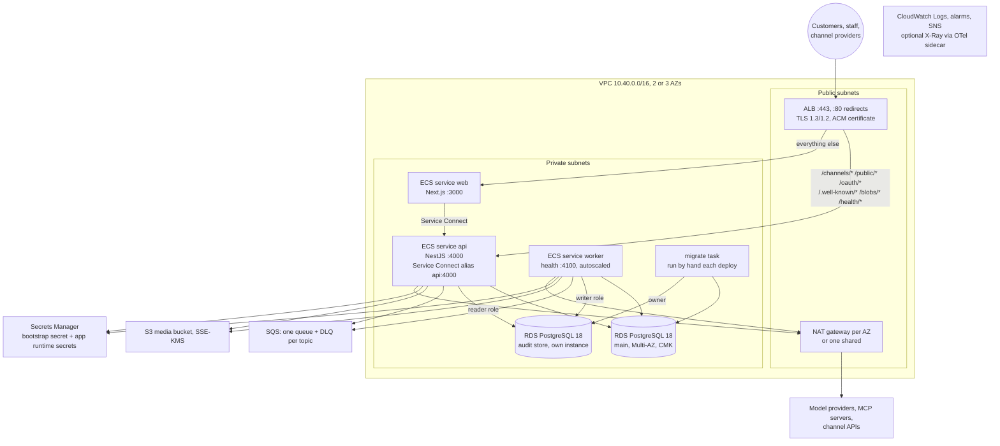

# Deploy on AWS (ECS Fargate)

This guide describes the Terraform in [infra/aws/terraform](../../../infra/aws/terraform/) (ADR-022):
what it creates, the variables you set, the apply order, and the gaps you must close before it produces
a working deployment. It is for a platform engineer who already runs Terraform on AWS. The images and
the application code are the same as in [Docker Compose](docker-compose.md); only the drivers change:
`QUEUE_DRIVER=sqs`, `BLOB_DRIVER=s3`, `SECRETS_DRIVER=aws` and `DEPLOYMENT_DRIVER=ecs`.

> [!WARNING]
> **Validated, never applied.** `terraform init -backend=false`, `terraform validate` and
> `terraform fmt -check -recursive` pass (Terraform 1.16.3; CI runs the same checks on every pull
> request). No `plan` or `apply` has been run against a real AWS account. Engine availability, quotas,
> Service Connect behaviour and the scaling metric math are unconfirmed.
>
> **As shipped it will not start a working deployment.** Three required settings are not wired
> (see [Close the known gaps first](#2-close-the-known-gaps-first)): the api refuses to start without
> `BETTER_AUTH_SECRET`, the api and worker refuse to start without an email driver in production, and the
> `conversation.route` queue is missing.

## Topology



Browsers only talk to `web`. The api's `/v1/*` control plane is not routed by the ALB (ADR-020). Better
Auth's `/api/auth/*` stays on the **web** target group (the default rule): the web app forwards it to the
api and sets the client address from its trusted proxy hop (`OCSO_TRUSTED_PROXY_HOPS=1`). Routing
`/api/auth/*` straight to the api would let clients choose that address.

## What Terraform creates

Root files: `network.tf`, `ecs.tf`, `data-stores.tf`, `audit.tf`, `iam.tf`, `scaling.tf`, `otel.tf`,
`locals.tf`, `outputs.tf`, with modules under `modules/`.

| Area | Resources |
|---|---|
| Network (`modules/network`) | VPC (`vpc_cidr`, default `10.40.0.0/16`); public and private `/20` subnets in `az_count` AZs (2 or 3); internet gateway; one NAT gateway per AZ, or one with `single_nat_gateway = true`; one private route table per AZ; an S3 gateway endpoint; the default security group locked to deny-all. |
| Security groups (`network.tf`) | One per task type: `api`, `web`, `worker`, `migrate`. ALB → web:3000 and api:4000; web → api:4000. Egress open (model providers, MCP servers and AWS APIs through NAT; destination policy is enforced by OCSO's SSRF guard). |
| Load balancer (`modules/alb`) | Internet-facing ALB, `drop_invalid_header_fields`, `desync_mitigation_mode = defensive`, idle timeout 300 s for SSE, optional access logs; HTTP:80 → 301 to HTTPS; HTTPS:443 with `ELBSecurityPolicy-TLS13-1-2-2021-06` and your ACM certificate. Path rules send `/channels/*`, `/public/*`, `/oauth/*`, `/.well-known/*`, `/blobs/*` and `/health/*` to the api target group; the default goes to web. Health checks: api `/health/ready`, web `/login`. |
| DNS (`ecs.tf`) | A Route 53 alias record for `public_hostname`, only when `route53_zone_id` is set. |
| Registry (`modules/ecr`) | Private repositories `ocso-api`, `ocso-worker`, `ocso-web`, `ocso-migrate` (prefix `ecr_name_prefix`): immutable tags, scan on push, untagged images expire after 7 days, the last `ecr_keep_images` (30) tags kept. |
| Cluster (`modules/ecs-cluster`) | ECS cluster `<name>-<environment>` (e.g. `ocso-prod`) with FARGATE and FARGATE_SPOT, Container Insights (enhanced) by default, and a Service Connect namespace. |
| Services (`modules/service`, `ecs.tf`) | Task definitions and services for **api** (2 × 1 vCPU / 2 GB, Service Connect alias `api:4000`, `TRUST_PROXY=1`), **web** (2 × 0.5 vCPU / 1 GB, `API_URL=http://api:4000`, `OCSO_TRUSTED_PROXY_HOPS=1`) and **worker** (1 vCPU / 2 GB, count owned by autoscaling, `stopTimeout` 120 s, `deployment_maximum_percent` 200, optional Fargate Spot). All: private subnets, no public IP, `awslogs` in non-blocking mode, `initProcessEnabled`, deployment circuit breaker with rollback, Node `fetch` health checks. |
| Migrations (`modules/migrate-task`) | A task definition only (0.25 vCPU / 0.5 GB). The image's default command runs `migrate.js`, then `audit-migrate.js`. You run it with `aws ecs run-task`. |
| Main database (`modules/rds`) | RDS PostgreSQL `18` (major pinned, minor auto-upgraded), `db.t4g.medium`, gp3 50 → 500 GB, Multi-AZ, own KMS key, `rds.force_ssl=1`, slow-query log over 1 s, 14-day backups with PITR, final snapshot, deletion protection, Performance Insights, no public access, major upgrades disabled. Reachable only from the api, worker and migrate security groups. |
| Audit store (`audit.tf`) | A second RDS instance from the same module (ADR-032): `db.t4g.small`, 20 → 200 GB, Multi-AZ, 35-day backups. Master user `ocso_audit` owns database `ocso_audit`; only the migrate task receives its URL. `audit_store.separate_instance = false` puts the audit database on the main instance instead, and a `check` block warns on every plan that the api and worker could then alter it. |
| Queues (`modules/sqs`) | One SQS Standard queue and one DLQ per entry in `queue_topics`: SSE, long polling, redrive after 5 receives, 4-day retention (DLQ 14 days), TLS-only policy, and a "DLQ not empty" alarm per queue. |
| Media (`modules/s3`) | Bucket `<prefix>-media-<account id>`: own KMS key as default encryption with a bucket key, Block Public Access, ACLs disabled, TLS-only and right-key-only policies, versioning, CORS for `OCSO_PUBLIC_URL` (GET/PUT/HEAD), lifecycle rules for TEMP blobs (`tmp/` prefix or tag `ocso-retention=TEMP`), noncurrent versions (30 days) and incomplete uploads. |
| Secrets (`modules/secrets`) | `ocso/<env>/bootstrap` (own KMS key, 30-day recovery window), written with a write-only attribute; IAM policy documents for the runtime prefix `ocso/<env>/app/*`. |
| IAM (`modules/iam`, `audit.tf`) | Execution roles `app` and `web`; task roles `api`, `worker`, `web`, `migrate`. The app execution role reads the bootstrap secret and the audit signing key secret; the web execution role reads neither. The api and worker task roles use the queues, the media bucket and its key, and manage runtime secrets under the prefix. Only the worker task role holds scaling permissions. Optional: ECS Exec, Bedrock invoke on `bedrock_model_arns`, the OTel collector's X-Ray and EMF permissions. |
| Autoscaling (`modules/autoscaling`) | Worker scalable target; target tracking on OCSO's `SlotDemand` ÷ `Workers` metrics; step scaling on the `conversation.turn` queue's oldest-message age (+1 task at the threshold, +3 at threshold + 60 s). OCSO owns min/max, the policy values and the alarm threshold at runtime; Terraform ignores changes to them. |
| Observability (`modules/observability`, `otel.tf`) | SNS alarm topic (KMS-encrypted) with optional email subscriptions; alarms for ALB 5xx, target 5xx and unhealthy targets per service, main RDS CPU, free storage and freeable memory, and `conversation.turn` backlog over 120 s for 5 minutes. Optional OTel collector sidecar on api and worker: traces to X-Ray over OTLP (SigV4), metrics to CloudWatch EMF (`OCSO/App`), OTLP logs dropped. |

### Environment the tasks receive

| Task | Plain environment | Secrets (from Secrets Manager) |
|---|---|---|
| api | `NODE_ENV=production`, `DATABASE_SSL=true`, `NODE_EXTRA_CA_CERTS` (RDS CA bundle baked into the image), `QUEUE_DRIVER=sqs`, `SQS_QUEUE_URLS`, `BLOB_DRIVER=s3`, `S3_BUCKET`, `S3_KMS_KEY_ID`, `SECRETS_DRIVER=aws`, `SECRETS_NAME_PREFIX`, `DEPLOYMENT_DRIVER=ecs`, `ECS_CLUSTER`, `ECS_WORKER_SERVICE`, `OCSO_PUBLIC_URL`, `OCSO_ENABLE_DEV_PROVIDERS=false`, `AUDIT_DRIVER=postgres`, `AUDIT_DATABASE_SSL=true`, `AUDIT_TRUSTED_PUBLIC_KEYS`, `PORT=4000`, `TRUST_PROXY=1` | `DATABASE_URL`, `OCSO_SETUP_TOKEN`, `AUDIT_DATABASE_URL` (the reader URL), `AUDIT_SIGNING_KEY` |
| worker | The same as api, plus `HEALTH_PORT=4100`, `OCSO_METRICS_NAMESPACE` | `DATABASE_URL`, `AUDIT_DATABASE_URL` (the writer URL), `AUDIT_SIGNING_KEY` |
| web | `NODE_ENV`, `API_URL=http://api:4000`, `HOSTNAME`, `PORT=3000`, `NEXT_TELEMETRY_DISABLED`, `OCSO_TRUSTED_PROXY_HOPS=1` | none |
| migrate | `NODE_ENV=production`, the database and audit settings above, `AUDIT_MIN_RETENTION_DAYS` | `DATABASE_URL`, `AUDIT_DATABASE_URL`, `AUDIT_READER_URL`, `AUDIT_DATABASE_OWNER_URL` |

The bootstrap secret's JSON keys are `DATABASE_URL`, `OCSO_SETUP_TOKEN`, `AUDIT_DATABASE_URL`,
`AUDIT_READER_URL` and `AUDIT_DATABASE_OWNER_URL`. Terraform generates them as `ephemeral` random
passwords and writes them through write-only attributes (`password_wo`, `secret_string_wo`), so no
secret value enters the Terraform state. They are sent only when `bootstrap_secret_version` changes, and
the same run feeds RDS and the secret, so they always agree.

## Variables

Copy [terraform.tfvars.example](../../../infra/aws/terraform/terraform.tfvars.example) to
`terraform.tfvars` (git-ignored). Required:

| Variable | Meaning |
|---|---|
| `environment` | Label such as `prod` (2–16 lower-case letters, digits, dashes). Resources are named `ocso-<environment>-…`. |
| `aws_region` | e.g. `ap-south-1`. |
| `public_hostname` | e.g. `support.meridian.example`. Becomes `OCSO_PUBLIC_URL=https://<host>`. |
| `acm_certificate_arn` | ACM certificate in the same region covering `public_hostname`. |
| `image_tag` | Immutable tag pushed to all four repositories. |
| `audit_signing_key_secret_arn` | Secrets Manager secret holding the Ed25519 audit signing key (you create it, below). |

Commonly changed (defaults in brackets): `route53_zone_id` [none], `alb_ingress_cidrs` [`0.0.0.0/0`],
`az_count` [2], `single_nat_gateway` [false], `cpu_architecture` [`X86_64`], `deploy_services` [true],
`api`, `web`, `worker`, `migrate` (sizing), `worker_scaling` (initial min 2, max 10, 10 conversations
per worker, 0.75 target), `db` (instance, storage, backups, windows), `audit_store`
(`separate_instance`, size, `min_retention_days` ≥ 365), `bootstrap_secret_version` [1], `queue_topics`,
`media`, `otel_collector`, `alarm_email_addresses`, `bedrock_model_arns`, `enable_execute_command`
[false], `log_retention_days` [30], `database_pool_size` [10]. Every variable is documented in
`variables.tf`, `variables-operations.tf` and `variables-audit.tf`.

## Prerequisites

- Terraform 1.11 or later (write-only attributes). The lock file pins AWS provider 6.66.0 and random 3.9.1.
- An AWS account and region where RDS offers PostgreSQL 18:
  ```bash
  aws rds describe-db-engine-versions --engine postgres --engine-version 18 \
    --query 'DBEngineVersions[].EngineVersion'
  ```
  If not, set `db.engine_version = "17"` and `db.parameter_group_family = "postgres17"`.
- An ACM certificate for `public_hostname` in that region.
- Docker, to build and push the images.
- Recommended: an S3 bucket for remote state (versioned, encrypted, Block Public Access). Uncomment the
  `backend "s3"` block in `versions.tf`; `use_lockfile = true` needs no DynamoDB table.

## 1. Create the audit signing key

The key lives in its own secret, created outside Terraform, so it never rotates with
`bootstrap_secret_version` and never enters state:

```bash
openssl genpkey -algorithm ed25519 -out audit_signing_key.pem
aws secretsmanager create-secret --name ocso/prod/audit-signing-key \
  --secret-string file://audit_signing_key.pem
```

Put the ARN in `audit_signing_key_secret_arn` (and `audit_signing_key_kms_key_arn` if you encrypt it
with your own KMS key). Keep a copy of the PEM with your backups.

## 2. Close the known gaps first

These are real gaps in the Terraform today, found by reading it against `packages/config/src/env.ts`
and `packages/queue/src/contract.ts`. Without them the deployment does not come up.

1. **`conversation.route` queue is missing.** `queue_topics` lists 12 topics; the code has 13. Every
   channel conversation starts in routing, the worker subscribes to `conversation.route`, and the SQS
   driver throws `no SQS queue configured for topic conversation.route` for a topic without a URL. Fix it
   in `terraform.tfvars` by listing all 13 topics:

   ```hcl
   queue_topics = [
     "conversation.turn", "channel.deliver", "media.fetch", "conversation.summarize",
     "conversation.insights", "copilot.suggest", "tool.execute_confirmed", "alert.deliver",
     "webhook.deliver", "evaluation.run", "approval.notify", "approval.activate",
     "conversation.route",
   ]
   ```

2. **`BETTER_AUTH_SECRET` is not wired.** The api refuses to start in production without it
   (`BETTER_AUTH_SECRET (≥ 32 chars) is required in production`). Create a secret with at least 32
   random characters, identical for every api task, and add it to `local.api_secrets` in `locals.tf`
   (the app execution role must be allowed to read it, as `audit.tf` does for the signing key).

3. **Email is not wired.** In production the api and worker refuse to start without `EMAIL_DRIVER`
   (`EMAIL_DRIVER is required in production`). Add `EMAIL_DRIVER=resend` (or `smtp`), `EMAIL_FROM` and
   optionally `EMAIL_REPLY_TO` to `local.app_env`, and inject `RESEND_API_KEY` (or `SMTP_PASSWORD`) as a
   secret. For a trial only, `EMAIL_ALLOW_LOG_IN_PRODUCTION=true` lets them start with no email at all.
   See [Email](../email.md).

4. **Recommended: `OCSO_PUBLIC_URL` on the web task.** Compose sets it; the web task does not. The web
   app uses it as an allowed origin for cookie-bearing requests and for absolute links in page metadata.
   Add it to the web service's `environment` in `ecs.tf`.

## 3. First deployment

```bash
cd infra/aws/terraform
terraform init

# 1. Repositories first, so there is somewhere to push.
terraform apply -target=module.ecr
```

Build and push the four images with one immutable tag, from the repository root:

```bash
TAG=2026.09.25-1
ACCOUNT=$(aws sts get-caller-identity --query Account --output text); REGION=ap-south-1
REGISTRY=$ACCOUNT.dkr.ecr.$REGION.amazonaws.com
aws ecr get-login-password --region $REGION | docker login --username AWS --password-stdin $REGISTRY
for target in api worker web migrate; do
  docker build --target $target --build-arg APP_VERSION=$TAG -t $REGISTRY/ocso-$target:$TAG .
  docker push $REGISTRY/ocso-$target:$TAG
done
```

The images must match `cpu_architecture` (default `X86_64`). The web image bakes
`API_URL=http://api:4000` into its Next.js rewrites; Service Connect publishes the api under exactly
that name, so one web image works in Compose and on ECS.

```bash
# 2. Everything except the ECS services (deploy_services = false in terraform.tfvars).
terraform apply -var image_tag=$TAG

# 3. Run the migrate task (next section) and wait for exit code 0.

# 4. Start the services.
terraform apply -var image_tag=$TAG -var deploy_services=true
```

5. **DNS.** With `route53_zone_id` set, Terraform creates the alias. Otherwise point `public_hostname`
   at the `alb_dns_name` output.
6. **First-run setup.** Every api task reads the same token from the bootstrap secret:
   ```bash
   aws secretsmanager get-secret-value --secret-id "$(terraform output -raw bootstrap_secret_arn)" \
     --query SecretString --output text | jq -r .OCSO_SETUP_TOKEN
   ```
   Open `https://<public_hostname>/setup` and continue with [First-run setup](../first-run-setup.md).

## 4. Run migrations (every deploy)

Migrations never run when the api or worker starts. Terraform only registers the task definition:

```bash
cd infra/aws/terraform
terraform apply -target=module.migrate -var image_tag=$TAG

CLUSTER=$(terraform output -raw cluster_name)
TASK_ARN=$(aws ecs run-task --cluster "$CLUSTER" --launch-type FARGATE \
  --task-definition "$(terraform output -raw migrate_task_definition_arn)" \
  --network-configuration "$(terraform output -raw migrate_network_configuration)" \
  --started-by "deploy-$TAG" --query 'tasks[0].taskArn' --output text)
aws ecs wait tasks-stopped --cluster "$CLUSTER" --tasks "$TASK_ARN"
EXIT=$(aws ecs describe-tasks --cluster "$CLUSTER" --tasks "$TASK_ARN" \
  --query 'tasks[0].containers[?name==`migrate`].exitCode | [0]' --output text)
aws logs tail "$(terraform output -raw migrate_log_group)" --since 15m
[ "$EXIT" = "0" ] || { echo "migration failed (exit $EXIT); services NOT updated"; exit 1; }

# Only now roll the services to the new image.
terraform apply -var image_tag=$TAG
```

`aws ecs wait tasks-stopped` gives up after 10 minutes; run it again for a long migration. The second
step, `audit-migrate`, creates the audit database if it is missing, applies its schema, creates the
`ocso_audit_writer` and `ocso_audit_reader` roles and sets the minimum retention. See
[Upgrades](../../operations/upgrades.md) for the expand/contract rule and rollback.

## Routine operations

| Task | How |
|---|---|
| Deploy a release | Push four images with a new tag, then section 4. |
| Roll back | `terraform apply -var image_tag=<previous>` (ECR keeps the last 30 tags). Not past a one-way release; see [Upgrades](../../operations/upgrades.md). |
| Restart a service | `aws ecs update-service --cluster <c> --service api --force-new-deployment` |
| API or web capacity | `aws ecs update-service --desired-count N`. Terraform ignores `desired_count` after creation. |
| Worker capacity | **Platform → Workers** in OCSO. The worker leader applies it to Application Auto Scaling. See [Worker scaling](../../operations/worker-scaling.md). |
| Shell into a task | Set `enable_execute_command = true`, apply, then `aws ecs execute-command --cluster <c> --task <id> --container api --interactive --command sh`. |
| Egress IPs for MCP allowlists | `terraform output nat_public_ips` |
| Rotate the database password and setup token | Bump `bootstrap_secret_version`, apply, run the migrate task (it resets the audit role passwords), then force new deployments of api and worker at once. New connections from old tasks fail until they roll. Bump it too whenever the RDS instance is replaced. |
| Redrive a DLQ | Fix the cause, then `aws sqs start-message-move-task --source-arn <dlq-arn>`. Messages are wake-ups; the work is in PostgreSQL. |

**Runtime secrets.** Provider keys, channel tokens and MCP credentials entered in the web app are written
by the app to Secrets Manager under `ocso/<env>/app/<ref>`; PostgreSQL stores only the ARN. `CreateSecret`
must carry the `ocso:kind` tag, and these secrets use the account's `aws/secretsmanager` key.

**Bedrock with the task role.** List model and inference-profile ARNs in `bedrock_model_arns`; the api
and worker roles then get `bedrock:InvokeModel` and `bedrock:InvokeModelWithResponseStream` on exactly
those. Choose auth mode `IAM_ROLE` on the provider under **Integrations → Models**. See
[AWS Bedrock](../models/aws-bedrock.md).

**Tracing.** With `otel_collector.enabled = true`, enable X-Ray Transaction Search once per account and
region, or the OTLP traces endpoint rejects spans.

## Verify it works

- `aws ecs describe-services --cluster <c> --services api web worker` shows running counts equal to
  desired, and the ALB target groups report healthy targets.
- `https://<public_hostname>/login` renders; `/setup` accepts the token.
- **Platform → Workers** shows the fleet and a scaling status of `APPLIED`.
- **Platform → System** shows the **Audit store** panel with no incident.

## Troubleshooting

| Symptom | Likely cause |
|---|---|
| api tasks stop at once with `Invalid OCSO configuration:` | One of the gaps in section 2 (`BETTER_AUTH_SECRET`, `EMAIL_DRIVER`), or a variable the log names. |
| Worker tasks stop with `no SQS queue configured for topic conversation.route` | Gap 1: add the topic to `queue_topics` and apply. |
| Tasks cannot reach RDS: certificate errors | The image must contain `/etc/ssl/certs/rds-global-bundle.pem` (the Dockerfile adds it) and `NODE_EXTRA_CA_CERTS` must point at it. |
| Migrate exits non-zero | `aws logs tail <migrate_log_group>`. See [Troubleshooting](../../operations/troubleshooting.md#migrations). |
| Scaling status `FAILED: No Application Auto Scaling target is registered` | `deploy_services` was false or the target was deleted. Apply again. |
| Setup works on one request and fails on the next | The api tasks do not share one `OCSO_SETUP_TOKEN`. It must come from the bootstrap secret. |

## Limits and known gaps

- Never applied to a real AWS account (see the warning at the top), and the gaps in section 2.
- The target-tracking metric math (`IF(workers > 0, demand / workers, demand)`) has not been checked with
  `aws cloudwatch get-metric-data` against real data.
- CloudWatch alarms cover the main RDS instance only, not the audit instance.
- No AWS WAF on the ALB. No VPC interface endpoints: ECR, Secrets Manager, SQS and Logs traffic goes
  through NAT.
- RDS enhanced monitoring needs `monitoring_interval_sec > 0` and a monitoring role that is not created.
- S3 Object Lock is not enabled, so signed audit exports in the media bucket are not write-once.
- There is no ready-made task for the offline `audit-verify` bin; run it from a host in the VPC.
- Single region, no cross-region backups.
- `bootstrap_secret_version` rotates the database password, the setup token and the audit role passwords
  together. (Its description in `variables-operations.tf` still mentions an "internal signing key"; there
  is none in the bootstrap secret.)
- `audit_store.separate_instance = false` means the api and worker hold credentials that can alter the
  audit database. Use a separate instance for a regulated deployment.

## Related

- [Docker Compose on one VM](docker-compose.md)
- [First-run setup](../first-run-setup.md)
- [Upgrades](../../operations/upgrades.md)
- [Backups and restore](../../operations/backups-and-restore.md)
- [Worker scaling](../../operations/worker-scaling.md)
- [Architecture](../../concepts/architecture.md)
