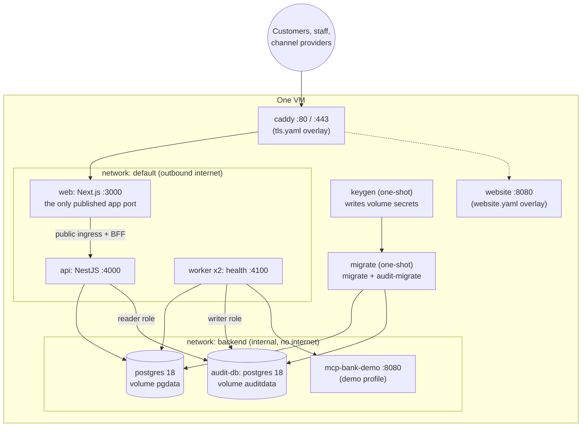

# Deploy on one VM with Docker Compose

This guide runs a complete OCSO deployment on a single machine (a cloud VM or a server you own) with
Docker Compose: the api, the workers, the web app, PostgreSQL and the separate audit store, with keys
generated on first start and optional HTTPS through Caddy. It is for the operator who installs OCSO.
The same images run on AWS ECS Fargate ([aws.md](aws.md)); only configuration differs.

Everything here is taken from [compose.yaml](../../../compose.yaml), [.env.example](../../../.env.example),
[infra/compose/](../../../infra/compose/) and the [Dockerfile](../../../Dockerfile).

## What runs



| Service | Role | Published |
|---|---|---|
| `keygen` | One-shot. Writes each missing secret to the `secrets` volume, then exits. Never overwrites a file. | – |
| `postgres` | PostgreSQL 18 (`postgres:18.6`), data on `pgdata`. | – |
| `audit-db` | A second PostgreSQL 18 for the audit store (ADR-032), data on `auditdata`. | – |
| `migrate` | One-shot. Applies `packages/db/migrations`, then runs `audit-migrate` to provision the audit store, then exits 0. | – |
| `api` | NestJS control plane on 4000. | – (internal) |
| `worker` | Agent workers, health on 4100. Two replicas by default (`OCSO_WORKER_REPLICAS`). The elected leader also runs the audit shipping, sealing and export tasks, the weekly exception report and scaling. | – |
| `web` | Next.js UI and backend-for-frontend. Proxies `/channels`, `/public`, `/oauth`, `/.well-known` and `/blobs` to the api. | **3000** |

Optional profiles and overlays:

| Name | Kind | Adds |
|---|---|---|
| `demo` | profile | `mcp-bank-demo` (example MCP server) and `seed` (the Meridian Bank demo data) |
| `observability` | profile | `otel-collector` and `jaeger` (UI on `127.0.0.1:16686`) |
| `s3` | profile | `seaweedfs` and `s3-init`: an S3-compatible blob store instead of the `blobs` volume |
| `infra/compose/tls.yaml` | overlay | `caddy` with automatic Let's Encrypt certificates |
| `infra/compose/website.yaml` | overlay | `website`: the public OCSO project site, served by the same Caddy |
| `infra/compose/debug.yaml` | overlay | Publishes the api and PostgreSQL on `127.0.0.1` for debugging. Not for production. |

The staff API (`/v1/*`) is never reachable from outside: browsers talk to the web app, and the web app
calls the api over the internal network (ADR-020). PostgreSQL and the audit database sit on the
`backend` network, which has no outbound internet.

## Prerequisites

- Docker Engine 26 or later with Compose v2.30 or later. The named-volume `subpath` mounts need these
  versions.
- For a pilot, 4 vCPU and 8 GB RAM. Building the images takes about 3 GB of disk; data grows with
  conversations and media.
- To build the images: a checkout of the repository. The build works with the classic builder;
  BuildKit is optional. To run prebuilt images you need only `compose.yaml`, `infra/compose/` and `.env`.
- For anything beyond `localhost`: a DNS name pointing at the host, with ports 80 and 443 open, for the
  Caddy overlay (or your own TLS-terminating proxy).
- For real use: an email provider (Resend or an SMTP relay). See [Email](../email.md).

## 1. Clone and create `.env`

```bash
git clone https://github.com/winsenlabs/ocso.git && cd ocso
cp .env.example .env
```

Every line in `.env` is optional and has a safe default. Secrets do not belong in it: `keygen` generates
them. Keep `.env` out of git (it is ignored) and readable only by the operator. The settings you are most
likely to change:

| Variable | Default | Meaning |
|---|---|---|
| `OCSO_PUBLIC_URL` | `http://localhost:3000` | The origin customers, channel providers and OAuth callbacks reach. Set it before creating channels. |
| `OCSO_HTTP_BIND` / `OCSO_HTTP_PORT` | `0.0.0.0` / `3000` | Where the web app is published. Use `127.0.0.1` behind the Caddy overlay. |
| `OCSO_TRUSTED_PROXY_HOPS` | `0` | Reverse proxies in front of web that append `X-Forwarded-For`. `1` behind Caddy. |
| `SESSION_COOKIE_SECURE` | `true` | Keep `true`. Browsers accept it on `http://localhost`. `false` only for a plain-http trial on another host. |
| `OCSO_WORKER_REPLICAS` | `2` | Worker replicas. See [Scale workers](#9-scale-workers). |
| `OCSO_IMAGE_PREFIX` / `OCSO_VERSION` | `ocso` / `local` | Image names. Point them at your registry to run prebuilt images. |
| `DATABASE_URL`, `DATABASE_SSL` | empty, `false` | Set only to use a managed PostgreSQL instead of the bundled one. |
| `EMAIL_DRIVER`, `EMAIL_FROM` | empty | See [Configure email](#8-configure-email). |

The [configuration reference](../../reference/configuration.md) lists every variable.

## 2. Start the stack

```bash
docker compose up -d --build
docker compose ps
```

Compose starts the services in order: `keygen` → `postgres` and `audit-db` → `migrate` → `api` and
`worker` → `web`. When it settles, `api`, `worker` and `web` are `healthy`, and `keygen` and `migrate`
show `exited (0)`.

### What `keygen` created

`infra/compose/keygen.mjs` writes each file only if it is absent, so keys survive restarts and upgrades.
Each container mounts only its own sub-directory of the `secrets` volume (the postgres container never
sees the master key).

| File on the `secrets` volume | Used for |
|---|---|
| `postgres/db_password` | Main database password (root-only) |
| `app/database_url` | `postgres://ocso:<password>@postgres:5432/ocso` |
| `app/master_key` | SecretStore key-encryption key (ADR-012). **Losing it loses every stored credential.** |
| `app/blob_signing_key` | HMAC for signed local blob URLs |
| `app/setup_token` | The one-time `/setup` token |
| `app/better_auth_secret` | Signs session cookies and encrypts authenticator secrets and backup codes. Changing it signs everyone out and users re-enrol their authenticator apps. |
| `app/audit_signing_key` | Ed25519 key that signs audit checkpoints, exports and exception reports. **Back it up.** |
| `app/audit_reader_url` | The api's SELECT-only audit store connection |
| `audit-writer/audit_database_url` | The worker's INSERT/SELECT-only audit store connection (mounted by the worker alone) |
| `audit-postgres/db_password`, `audit-migrate/*` | Audit database owner and role credentials (mounted by `migrate` alone) |
| `app/demo_mcp_token`, `demo/demo_mcp_token` | Bearer token for the demo MCP server (`demo` profile) |
| `app/aws_credentials`, `seaweedfs/s3.json` | SeaweedFS identity (`s3` profile) |

The images resolve `<VAR>_FILE` settings at start-up (`infra/compose/ocso-entrypoint.sh`). A non-empty
`<VAR>` in `.env` wins over the file. The master key and the audit signing key are read by the app as
files and never enter the process environment.

> [!IMPORTANT]
> Back up the `secrets` volume together with the databases, and store it apart from them. See
> [Backups and restore](../../operations/backups-and-restore.md).

## 3. Create the first Tech admin

Open `http://localhost:3000` (or your `OCSO_PUBLIC_URL`). You are sent to `/setup`. Read the token with:

```bash
docker compose logs api | grep "setup token"
# or
docker compose exec api cat /run/secrets/ocso/setup_token
```

Enter the **Setup token**, **Organization name**, **Your name**, **Work email**, **Password** (at least 12
characters) and **Deployment timezone**, then **Create administrator**. The page stops working once the
first user exists. Continue with [First-run setup](../first-run-setup.md).

**Or load the Meridian Bank demo** on a fresh database instead:

```bash
OCSO_DEMO_SEED=true docker compose --profile demo up -d --build
docker compose logs seed          # prints the logins
```

The seed creates the Meridian Bank organization, Tech, Head and Service users on `@meridian.example`
(password `OCSO_DEMO_PASSWORD`, default `meridian-demo-2026`), teams, queues with SLA policies, the
agents Maya, Arjun and Riya, a web chat channel behind a router, and the demo MCP server `meridian-core`.
It goes through the application services, so everything is audited and approved by a second demo user.
`OCSO_DEMO_SEED=true` also turns on the development-only scripted model. Never use it for a real deployment.

## 4. Turn on HTTPS with Caddy

`infra/compose/tls.yaml` adds a `caddy` container (`caddy:2.11-alpine`). It obtains and renews a Let's
Encrypt certificate for `OCSO_DOMAIN` (HTTP-01 on port 80, TLS-ALPN on 443), redirects http to https, adds
HSTS and other security headers, and proxies to `web:3000` without buffering server-sent events (live
updates, web chat and Ask OCSO stream). No account email is needed.

1. Create a DNS `A` (and `AAAA`, if the host has IPv6) record for your domain pointing at the host. Open
   ports 80 and 443.
2. Set in `.env`:

   ```dotenv
   OCSO_DOMAIN=ocso.example.com
   OCSO_PUBLIC_URL=https://ocso.example.com
   # Keep the web port off the public interface: Docker's published ports bypass host firewalls such as ufw.
   OCSO_HTTP_BIND=127.0.0.1
   # Caddy appends the client address to X-Forwarded-For; sign-in throttling and audit use that hop.
   OCSO_TRUSTED_PROXY_HOPS=1
   ```

3. Start with both files:

   ```bash
   docker compose -f compose.yaml -f infra/compose/tls.yaml up -d --build
   ```

Pass the same `-f` files to every later `docker compose` command, or set
`COMPOSE_FILE=compose.yaml:infra/compose/tls.yaml` in `.env`. Certificates live on the `caddy_data`
volume.

With your own reverse proxy instead of Caddy, apply the same three rules: `OCSO_PUBLIC_URL` is the
`https://` origin, `OCSO_HTTP_BIND=127.0.0.1` if the proxy runs on the host, and `OCSO_TRUSTED_PROXY_HOPS`
equals the number of proxies that append `X-Forwarded-For`. Disable response buffering for server-sent
events.

> [!NOTE]
> The api keeps `TRUST_PROXY=true` (Compose default) and takes the left-most `X-Forwarded-For` entry for
> the public web chat rate limits. Behind Caddy that entry is the real client, because Caddy overwrites
> the header. If you publish port 3000 directly, per-address web chat limits are advisory.

## 5. Optional: the public website overlay

`infra/compose/website.yaml` adds the OCSO project's public site (`apps/website`: a landing page and a
request-a-demo form) as a second Caddy site on `OCSO_WEBSITE_DOMAIN`. It exists so the project can serve
its own site next to its demo deployment. **A normal OCSO deployment does not need it.**

It stores demo requests in a Cloudflare D1 database and sends email through Cloudflare Email Service (or
Resend with `WEBSITE_EMAIL_PROVIDER=resend`), so it needs `CLOUDFLARE_ACCOUNT_ID`, a Cloudflare API token
in `website/cloudflare_api_token` on the secrets volume, `SLACK_NOTIFY_EMAIL`, and `OCSO_SITE_URL`
(baked in at build time). The defaults for `SITE_D1_DATABASE_ID` and the sender point at the project's
own Cloudflare account. `apps/website/.env.example` describes every variable. Use it on top of the TLS
overlay:

```bash
docker compose -f compose.yaml -f infra/compose/tls.yaml -f infra/compose/website.yaml up -d --build
```

## 6. Optional profiles

**Observability.**

```bash
OTEL_ENABLED=true docker compose --profile observability up -d
```

The api and worker export OTLP/HTTP to `otel-collector:4318`. `infra/compose/otel-collector.yaml` sends
traces to Jaeger (UI on `http://127.0.0.1:16686`) and prints metrics and logs with the debug exporter;
it also strips `authorization`, `cookie` and connection-string attributes. Point its exporters at your
own backend. The in-product dashboards read PostgreSQL and do not need this profile.

**S3-compatible blobs.**

```bash
BLOB_DRIVER=s3 docker compose --profile s3 up -d
```

This runs SeaweedFS (Apache-2.0) and creates the `ocso-media` bucket. Switching blob drivers does not
migrate existing blobs, so pick one before going live. For real S3, set `BLOB_DRIVER=s3`, `S3_BUCKET` and
`AWS_REGION`, and remove `S3_ENDPOINT` and `AWS_SHARED_CREDENTIALS_FILE` from the api and worker in a
`compose.override.yaml` so the SDK uses the instance role.

**Managed PostgreSQL.** Set `DATABASE_URL` and `DATABASE_SSL=true`. For a managed audit database set
`AUDIT_DATABASE_URL` (writer), `AUDIT_READER_URL` (reader), `AUDIT_DATABASE_OWNER_URL` (owner, used only
by `migrate`) and `AUDIT_DATABASE_SSL=true`; add `AUDIT_PROVISION_ROLE=false` if your DBA creates the
roles. ClickHouse is also supported as the audit store (`AUDIT_DRIVER=clickhouse`); see
[Audit](../../concepts/audit.md).

## 7. Debugging access

```bash
docker compose -f compose.yaml -f infra/compose/debug.yaml up -d
```

This publishes the api on `127.0.0.1:4000` and PostgreSQL on `127.0.0.1:15433`. The database password is
in the secrets volume:

```bash
psql "postgres://ocso:$(docker compose exec -T postgres cat /run/secrets/ocso-db/db_password)@127.0.0.1:15433/ocso"
```

## 8. Configure email

Invites, password resets, sign-in codes, security notices and alert emails go through one
deployment-wide sender, configured in the environment, not in the web app. Until `EMAIL_DRIVER` is set,
messages only reach the api and worker logs (the stack still starts, because Compose sets
`EMAIL_ALLOW_LOG_IN_PRODUCTION=true`), and **Settings → Email** shows a warning. Configure email before you
invite anyone.

The short version for Resend: store the key on the secrets volume, then set `.env`:

```bash
read -rs KEY && printf '%s' "$KEY" | docker compose run --rm -T --no-deps keygen sh -c \
  'umask 277 && cat > /secrets/app/resend_api_key && chown 1000:1000 /secrets/app/resend_api_key'; unset KEY
```

```dotenv
EMAIL_DRIVER=resend
EMAIL_FROM=Meridian Support <support@mail.meridian.example>
EMAIL_REPLY_TO=support@meridian.example
RESEND_API_KEY_FILE=/run/secrets/ocso/resend_api_key
# Make a missing email configuration a start-up error:
EMAIL_ALLOW_LOG_IN_PRODUCTION=false
```

Then `docker compose up -d` and **Settings → Email → Send test email**. [Email](../email.md) covers the
DNS records, SMTP and troubleshooting.

## 9. Scale workers

Workers lease conversations in PostgreSQL, so any replica can take over a conversation whose lease
expired, and scaling up or down never loses a conversation.

```bash
docker compose up -d --scale worker=4     # now, until the next plain `up -d`
```

To keep a count, set `OCSO_WORKER_REPLICAS=4` in `.env` and run `docker compose up -d`. The default of 2
means one worker can fail without a gap. Keep `DATABASE_POOL_SIZE` × (api + workers) below PostgreSQL's
`max_connections` (100 by default).

Under Compose the worker settings in OCSO (**Platform → Workers**) are advisory: the page shows the exact
`--scale worker=N` command for the warm floor, but nothing enforces the maximum or autoscaling. See
[Worker scaling](../../operations/worker-scaling.md).

`docker compose restart worker` is graceful: each worker gets 90 seconds (`stop_grace_period`) to finish
or checkpoint its turns and release its leases.

## Verify it works

```bash
docker compose ps                         # api, worker, web healthy; keygen and migrate exited (0)
docker compose logs migrate | tail -5     # "migrations complete", then "audit store migrations complete"
curl -sI http://localhost:3000/login      # 200 (or https://<OCSO_DOMAIN>/login behind Caddy)
```

Health endpoints, all on the internal network:

| Service | Endpoint |
|---|---|
| api | `/health/live`, `/health/ready` (database), `/health/dependencies` (needs `system.read`; reports the audit store and its shipping lag) |
| worker | `/health/live`, `/health/ready` on port 4100 |
| web | `/login` |

After signing in, **Platform → System** should show the **Audit store** panel with no incident.

## Everyday commands

```bash
docker compose logs -f api worker         # JSON logs (pino), rotated at 10 MB x 5 per container
docker compose down                       # stop; volumes are kept
```

Upgrades, backups and incident handling have their own runbooks:
[Upgrades](../../operations/upgrades.md), [Backups and restore](../../operations/backups-and-restore.md),
[Troubleshooting](../../operations/troubleshooting.md).

## Troubleshooting

| Symptom | Check |
|---|---|
| `migrate` exited non-zero | `docker compose logs migrate`. An edited, already-applied migration is refused on purpose. See [Troubleshooting](../../operations/troubleshooting.md#migrations). |
| api stays `starting` or unhealthy | `docker compose logs api`. `Invalid OCSO configuration:` lists the bad variables with secret values hidden. |
| `ocso-entrypoint: <VAR>_FILE points to a missing or unreadable file` | A file on the secrets volume is missing. Run `docker compose up keygen`. For `RESEND_API_KEY_FILE` or `SMTP_PASSWORD_FILE`, write the file first. |
| `OCSO_DOMAIN` error when starting with `tls.yaml` | `set OCSO_DOMAIN in .env`: the overlay requires it. |
| Sign-in fails on a remote host over plain http | The session cookie is `Secure`. Use TLS, or `SESSION_COOKIE_SECURE=false` for a trial only. |
| Channel webhooks return 404 | Provider webhooks must be under `/channels/...`. Only `/channels`, `/public`, `/oauth`, `/.well-known` and `/blobs` are proxied to the api. |
| `seed` says the deployment "was already set up by a person" | The demo seed only runs on a fresh database. `docker compose down -v` deletes all data and keys. |
| Port 3000 is taken | Set `OCSO_HTTP_PORT`. |

## Limits and known gaps

- One host is a single point of failure. The workers survive each other; the host, PostgreSQL and the
  audit database do not.
- Worker autoscaling is not enforced under Compose (advisory only).
- The local `blobs` volume cannot be made write-once, so signed audit exports on it are not an
  independent copy.
- Someone with root on the host can read the `secrets` volume. See the hardening notes in
  [Backups and restore](../../operations/backups-and-restore.md#protect-the-secrets).

## Related

- [First-run setup](../first-run-setup.md)
- [Deploy on AWS](aws.md)
- [Run from source](local-development.md)
- [Email](../email.md)
- [Operations runbooks](../../operations/README.md)
- [Configuration reference](../../reference/configuration.md)
