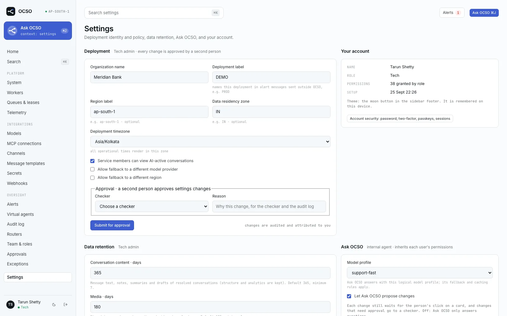
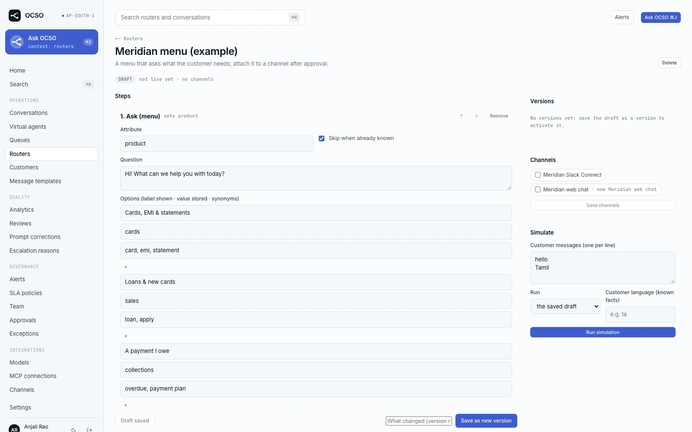

# First-run setup: from an empty deployment to a live agent

This guide takes a freshly installed OCSO deployment ([Docker Compose](deploy/docker-compose.md),
[AWS](deploy/aws.md) or [from source](deploy/local-development.md)) to a virtual agent answering
customers on a channel. It is written for the first Tech admin and the first Head and Lead, in the order
the work has to happen. Everything is done in the web app, and everything is audited.

## Before you start: roles and approvals

OCSO has four role presets (`packages/auth/src/roles.ts`). Per-user grants and revokes adjust a preset
([Permissions](../reference/permissions.md)).

| Preset | Does | Checks |
|---|---|---|
| **Tech** | Runs the platform: providers, channels, MCP servers, users, sign-in, workers. Never reads conversations. | Platform and permission changes |
| **Head** | Full authority inside their teams: agents, queues, routers, templates, teams. | Everything in their teams, plus platform and permission changes |
| **Lead** | Builds their teams' agents, queues, routers and templates. | Nothing: a Lead can make changes but not approve them |
| **Service** | Handles their teams' conversations. | Nothing |

**Maker–checker (ADR-030).** A new object starts as an inert draft that you edit freely. Taking it live,
deleting it, and changing it once it is live are *proposals*: you name a checker and a reason, and the
change applies when the checker approves it on **Approvals**. Stops never wait: pausing an agent,
disabling a channel, router or rule, removing a tool grant and revoking a permission apply at once.

| Change | Check permission | Held by |
|---|---|---|
| Agents, prompts, tool grants, escalation rules, business alert rules | `approvals.check.agents` | Head |
| Routers, queues, SLA policies | `approvals.check.routing` | Head |
| Channels, message templates | `approvals.check.channels` | Head |
| Providers, profiles, prices, shared MCP connections, alert destinations, webhooks, SSO, deployment settings, technical alert rules | `approvals.check.platform` | Tech, Head |
| New users, re-enabling users, permission increases | `approvals.check.permissions` | Tech, Head |

**Bootstrap.** When nobody else can check a change, a maker who holds the check permission may approve
their own change (**Approve as the only checker**). It is recorded as a bootstrap approval and listed on
**Exceptions**. That is how a single Tech admin gets the platform going. Bootstrap stops as soon as a
second eligible checker exists, so **invite a Head, and ideally a second Tech admin, early.** The
[governance concept page](../concepts/governance.md) explains the model in full.

## Prerequisites

- A running deployment whose `OCSO_PUBLIC_URL` is the `https://` origin customers and channel providers
  will reach (for local trials, `http://localhost:3000` works for web chat).
- **Email configured by the operator** (`EMAIL_DRIVER=resend` or `smtp`). Invites, password resets and
  sign-in codes are sent by email. Without it they only reach the server log. See [Email](email.md).
- The setup token: Compose `docker compose logs api | grep "setup token"`; AWS the `OCSO_SETUP_TOKEN` key
  of the bootstrap secret; from source your `OCSO_SETUP_TOKEN` or the api log.
- An API key for at least one model provider.

## 1. Create the first Tech admin (Tech)

Open the public URL. With no users yet you are sent to `/setup` (**Set up OCSO**). Enter the **Setup
token**, **Organization name**, **Your name**, **Work email**, **Password** (at least 12 characters) and
**Deployment timezone**, then **Create administrator**. The default alert rules and the in-app alert
destination are created at the same time. The page stops working once the first user exists; sign in
at `/login`.

## 2. Check the deployment settings (Tech)

Open **Settings**:

1. **Deployment**: **Organization name**, **Deployment label**, **Region label**, **Data residency zone**,
   **Deployment timezone**, the fallback policy (**Allow fallback to a different model provider**, **Allow
   fallback to a different region**) and **Service members can view AI-active conversations**. Also
   **Data retention** per data class and the **Ask OCSO** model profile (set that after step 4). A change
   here is a proposal; as the only Tech admin you approve it as a bootstrap.
2. **Email**: shows the driver and sender the operator configured. Press **Send test email** before
   inviting anyone.
3. **Sign-in security**: **Require MFA for roles** (recommended for Tech and Head) and **Single sign-on**
   (**Add SSO provider**, OIDC or SAML 2.0). See [Sign-in](sign-in.md).

## 3. Invite people (Tech)

**Team & roles → New user**: name, work email, preset and teams. A new user is **pending approval** and
cannot sign in until a checker approves them (Tech or Head, never the maker or the new user). As the
only Tech admin you bootstrap these approvals. After approval OCSO emails a single-use link, valid 72
hours, where the person chooses a password; **Resend invite** issues a new link. Without email, the
dialog shows the link once for you to hand over privately.

Invite at least one **Head** now, and a second Tech admin if you can. From then on, their approvals
replace your bootstrap approvals.

## 4. Add a model provider and profile (Tech)

**Integrations → Models → Add provider.** Pick the provider, enter its settings and credentials
(write-only, stored in the secret store; the model never sees them) and press **Test**, which makes a real
call. A provider is created disabled; enabling it is a proposal. The per-provider pages cover the fields:
[OpenAI](models/openai.md), [Anthropic](models/anthropic.md), [AWS Bedrock](models/aws-bedrock.md),
[Google Vertex AI](models/google-vertex.md), [Microsoft Foundry](models/microsoft-foundry.md),
[Sarvam](models/sarvam.md).

Then **New model profile**: the logical name agents use (for example `support-primary`), a primary
provider and model, ordered fallbacks, retries, timeout and cache policy. A profile must be approved
(**Approve for use**) before a live agent, Ask OCSO or a router's classifier can use it. When you save,
models without a price get one from the bundled model catalog where it knows them; set the rest under
**Model pricing**. See [Profiles and pricing](models/profiles-and-pricing.md).

## 5. Connect tools over MCP (Tech, optional)

**Integrations → MCP connections → Add MCP server** walks through URL, discovery, authentication (static
header or OAuth 2.1), classifying each tool (`READ`, `WRITE`, `SENSITIVE`) and approval. Going live is a
proposal; the worker re-probes the server on approval and blocks it if the tools changed since review.
See [MCP tools](tools/mcp.md).

## 6. Add a channel (Tech; a Head approves)

**Integrations → Channels → Add channel.** The first-party kinds are **Web chat**, **WhatsApp — Twilio**,
**WhatsApp — Meta Cloud API**, **Slack** and **Microsoft Teams**. Each dialog shows the webhook URL and
the steps at the provider. Follow the page for your channel:
[Web chat](channels/web-chat.md), [WhatsApp (Twilio)](channels/whatsapp-twilio.md),
[WhatsApp (Meta)](channels/whatsapp-meta.md), [Slack](channels/slack.md),
[Microsoft Teams](channels/microsoft-teams.md).

A new channel is a draft. Taking it **Active** is a proposal checked by a Head
(`approvals.check.channels`, which Tech does not hold). A channel does not name an agent: it is attached
to a **router** (step 9). Web chat is the quickest way to test the whole path.

## 7. Create a team (Head)

Every virtual agent is owned by one or more teams, and Heads and Leads see only their teams' agents
(ADR-026). A Head opens **Team → New team** and joins it. A Tech admin or a Head of the team adds the Lead
to it; adding someone to a team is a proposal. A Lead in no team sees "Join or create a team to create
agents" instead of **New agent**.

## 8. Build the agent (Lead)

**Virtual agents → New agent**: name, owning team, purpose, conversation type, model profile (plus optional
summarizer and copilot profiles) and default queue. Then, on the agent:

1. **Prompt**: edit the business components (identity, objective, behaviour, policies, escalation). The
   preview shows the compiled prompt and token estimate. **Create version** with a reason, then activate it.
2. **Tools**: grant approved MCP tools, optionally with always-confirm and argument rules. On a live agent,
   a grant that widens access is a proposal; removing one applies at once.
3. **Escalation**: deterministic hand-off rules (keywords, the customer asking for a person, tool
   failures, amounts over a threshold) with a target queue. Rules start off; turning one on is a proposal.
4. **Go live**: a proposal a Head approves. The checker sees the active prompt, tool grants and
   escalation rules together.

See [Agents](../concepts/virtual-agents.md).

## 9. Route customers to the agent (Lead; a Head approves)

Customers reach an agent as **channel → router → queue → agent**.

1. **SLA policies → New SLA policy**, then submit it for approval. A queue can be approved only with an
   approved policy.
2. **Queues → New queue**: name, the **AI agent** (exactly one per queue), attributes such as
   `language = ta` (routers send customers to queues by them), teams, hours, transfer targets, pickup mode
   and SLA policy. Submit it for approval.
3. **Routers → New router**: a name and a fallback queue. In the builder add steps (a menu question, a
   model classifier or a known fact such as the customer's language) and rules (**Rules from queue
   attributes** writes one per queue). **Simulate** shows the decision trace. Tick the router's
   channels, **Save as new version**, then **Activate v1**, which a Head approves. A queue or agent still
   waiting for its own approval shows as a warning: approve those first.

For a first test, a router with only a fallback queue is enough. See [Routing](../concepts/routing.md).

## 10. Approve (Head)

**Approvals** has the views **Awaiting me**, **Sent by me**, **All open** and **Decided**. Open each
proposal, read the diff and any warnings, and **Approve** or **Reject** with a reason. For the path above
a Head approves: the channel, the SLA policy, the queue, the agent's go-live and the router's activation.
Order matters only where one depends on another (the SLA policy before the queue; queue and agent before
the router), and the approval shows a warning when a dependency is still pending.

A proposal whose object changed after it was submitted cannot be approved (`content_changed`): the maker
edits and resubmits.

## Verify it works

1. For web chat, open `<public URL>/chat/<channel key>` in a private window, or embed the snippet from the
   channel dialog in a test page, and send a message.
2. The agent answers. On WhatsApp, Slack or Teams, message the connected number, bot or app.
3. In **Conversations**, a Head or Lead sees the conversation with the router's decision and the queue.
4. **Audit log** (Tech) lists every change you made, and **Exceptions** lists the bootstrap approvals from
   the first steps.

## Troubleshooting

| What you see | Meaning and fix |
|---|---|
| `invalid_setup_token` on `/setup` | The token does not match. Copy it again from the log or secret. With no fixed `OCSO_SETUP_TOKEN`, the api makes a new one on every start and logs it. |
| `/setup` redirects to `/login` | Setup is already complete (`setup_already_completed`). Sign in. |
| `approval_required` (409) | The change must be a proposal: name a checker and a reason in **Submit for approval**. |
| `checker_not_eligible` | You named yourself, or the person whose access changes. Name a colleague. |
| `bootstrap_not_allowed` | Someone else can check this, so you cannot approve it yourself. Name them. |
| New users never receive their invite | Email is not configured (log driver). Configure it, or hand over the link the dialog shows. |
| `queue_not_approved` | The target queue has not been approved yet. Approve it first. |
| `channels_route_through_routers` | Channels do not name agents. Give a queue this agent and route the channel to that queue. |
| `mcp_tools_changed` | The MCP server's tools changed after review. Rediscover, review and submit again. |
| Customer messages get no reply; the api log shows `customer message rejected (no_router)` | The channel has no active router, or the router has no queue with an agent. Activate a router for the channel. |

More in [Troubleshooting](../operations/troubleshooting.md).

## Limits and known gaps

- With a single Head, every routing change is that Head's bootstrap self-approval, and a router a Lead
  disabled stays off until that Head resumes it (Tech does not hold `approvals.check.routing`). Give
  routing at least two Heads.
- A router that has routed customers is never deleted; disable it instead.

## Related

- [Governance and maker–checker](../concepts/governance.md)
- [Routing](../concepts/routing.md)
- [Agents](../concepts/virtual-agents.md)
- [Channels](channels/README.md)
- [Model providers](models/README.md)
- [Sign-in](sign-in.md)
- [Ask OCSO](../concepts/ask-ocso.md)
- [Permissions reference](../reference/permissions.md)
