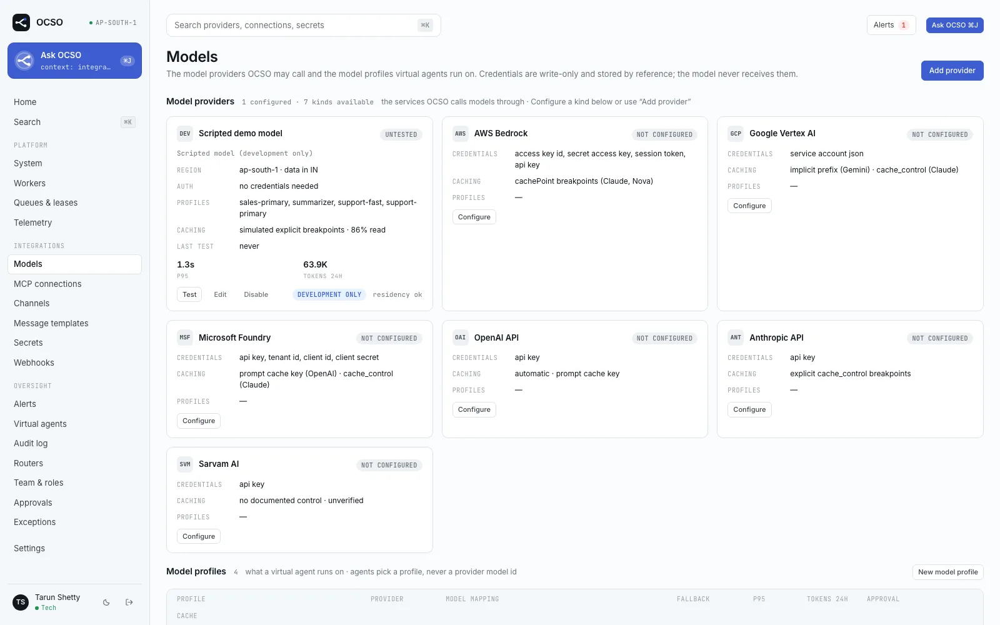
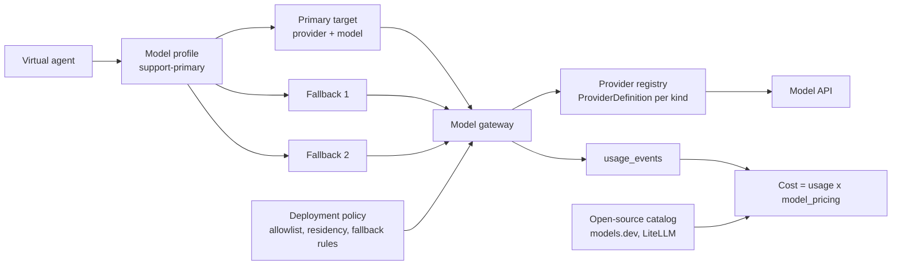

# Model providers and profiles

This section covers how OCSO calls language models: which providers ship, how a Tech admin connects one, how
agents pick a model through a **model profile**, what the deployment policy allows, and how every call is priced.
It is for the Tech admin who sets up models, and for anyone who wants to know what happens between an agent and a
model API.

Each provider is a plugin. The core never names a provider: it looks kinds up in a registry of
`ProviderDefinition`s ([packages/model-providers/src/providers/definition.ts](../../../packages/model-providers/src/providers/definition.ts)),
and the web form, caching wording and catalog mapping all come from the definition. See
[Plugins](../../concepts/plugins.md) for the wider model.

## How the pieces fit

- **Provider.** A configured connection to one model API: kind (`OPENAI`, `BEDROCK`…), name, region, data
  residency zone, non-secret settings and write-only credentials. A new provider is a disabled draft; enabling it
  is an approval by a second person.
- **Model discovery.** Each provider lists the models its credentials can call (ADR-027). The profile dialog's model
  picker uses that list and still accepts free text when the listing fails.
- **Model profile.** What an agent runs on: a stable lowercase name (`support-primary`), a primary target
  (provider + model id), up to five ordered fallbacks, generation limits, retries, a timeout, a prompt-cache policy
  and required capabilities. Agents reference profiles, never provider model ids.
- **Deployment policy.** Deployment-wide rules the gateway enforces on every call and the profile dialog checks
  before saving: provider allowlist, required data residency zone, whether fallback may cross providers or
  regions, and an optional output-price ceiling.
- **Pricing and the catalog.** Every call writes a usage row. Cost is computed from `model_pricing` rows, which are
  pre-filled from the open-source model catalogs (models.dev, then LiteLLM) and can be overridden by manual prices
  that go through approval.

Details: [Profiles, fallbacks and pricing](profiles-and-pricing.md).

## Providers

| Provider | Kind | Label in OCSO | Caching (card summary) | Discovery | Verification status |
|---|---|---|---|---|---|
| [OpenAI](openai.md) | `OPENAI` | OpenAI API | automatic · prompt cache key | `GET /v1/models`, chat models only | Request bodies checked against recorded responses; not run against a live account in CI |
| [Anthropic](anthropic.md) | `ANTHROPIC` | Anthropic API | explicit cache_control breakpoints | `GET /v1/models`, paged | Same: recorded responses only |
| [AWS Bedrock](aws-bedrock.md) | `BEDROCK` | AWS Bedrock | cachePoint breakpoints (Claude, Nova) | ListFoundationModels + ListInferenceProfiles | Recorded responses only; the model listing has **never** been checked against a live AWS account |
| [Google Vertex AI](google-vertex.md) | `VERTEX` | Google Vertex AI | implicit prefix (Gemini) · cache_control (Claude) | Model Garden, publishers `google` and `anthropic` | Recorded responses only; the model listing has **never** been checked against a live GCP project |
| [Microsoft Foundry](microsoft-foundry.md) | `FOUNDRY` | Microsoft Foundry | prompt cache key (OpenAI) · cache_control (Claude) | The deployments you declare in settings | Recorded responses only |
| [Sarvam AI](sarvam.md) | `SARVAM` | Sarvam AI | no documented control · unverified | OpenAI-compatible `GET /models`, else catalog | Recorded responses only; caching behaviour unknown |

A seventh kind, `DEV_SCRIPTED` (**Scripted model (development only)**), returns deterministic keyword-driven replies
with simulated usage. It is registered only when `OCSO_ENABLE_DEV_PROVIDERS=true`, is never priced, and start-up
refuses it when `NODE_ENV=production` unless `OCSO_ALLOW_DEV_PROVIDERS_IN_PRODUCTION=true` (demos only).

> [!IMPORTANT]
> "Recorded responses" means each provider package was driven through a fake `fetch` and its request bodies,
> streaming and usage mapping were checked (ADR-006, PM/research/01). CI has no provider credentials, so none of the
> six adapters is exercised against a live account in the test suite. Run **Test** on each provider you configure
> before an agent depends on it.

## What every provider form has

**Integrations → Models → Add provider** (or **Configure** on a provider card) opens **Add model provider**. The
settings and credential fields are rendered from the provider's own zod schemas, so their labels are the field
names humanized (`baseURL` becomes **Base URL**, `apiKey` becomes **Api key**).

| Field | Where | What it does |
|---|---|---|
| **Provider** | top | The kind. Only registered kinds are offered. |
| **Name** | top | How cards, profiles and audit entries refer to it. Unique. |
| **Region (optional)** | top | e.g. `ap-south-1`, `asia-south1`, `global`. Used by the cross-region fallback rule; Bedrock and Vertex fall back to it when their own region setting is empty. |
| **Data residency zone (optional)** | top | Where this provider keeps data, e.g. `IN` or `GLOBAL` (letters, digits, dashes, up to 20). Checked against the deployment's required zone. |
| **Max concurrency** | top | In-flight calls to this provider, 1–10000, default 50. Enforced per api or worker process, not across the fleet. |
| **Health model** | Settings | Model or deployment the **Test** button probes when no model is given. |
| **Capability overrides** | Settings | JSON keyed by model id, correcting what OCSO assumes about a model, e.g. `{"my-finetune": {"imageInput": false}}`. Keys: `imageInput`, `fileInput`, `audioInput`, `toolCalling`, `structuredOutput`, `reasoning`, `streaming`, `promptCaching` (`EXPLICIT`, `AUTOMATIC`, `UNSUPPORTED`, `UNVERIFIED`), `reportsCacheWrites`. |
| Credentials | **Credentials · write-only** | Stored in the secret store by reference. Never shown again: an edit shows only **set** / **not set**. |

The provider is saved as a disabled draft (**Add provider (draft)**). Then:

1. Click **Test** on its card. OCSO runs the adapter's health probe and one small real call, and shows
   **test passed**, **degraded**, **test failed** or **not testable** with the model and latency.
2. Click **Enable**. This opens an approval; a second person with `approvals.check.platform` (a Head, or another
   Tech admin) approves it. Until then nothing can call the provider.
3. Once approved, every edit is a proposal (**Submit change**). New credential values are stored as new secrets and
   only take effect when the change is approved. Disabling is immediate and never needs approval.

Permissions: `providers.read` (Tech, Head, Lead) sees the page; `providers.manage` (Tech) adds, edits and tests;
`model_profiles.manage` (Tech) manages profiles; `pricing.manage` (Tech) manages prices.

## Prompt caching in one paragraph

The prompt compiler always orders stable content first. A profile's **Cache policy** of **Prefix cache** then lets
the provider adapter add its own cache directives: explicit breakpoints (at most 4) for Anthropic-style APIs and
Bedrock, a prompt cache key for the OpenAI family, nothing for implicit caching (Gemini) or undocumented caching
(Sarvam). **Cache TTL** of **1 hour** asks for longer retention where the model supports it. The profile dialog's
policy check shows, per target, what each setting will actually send. Cached-token counts are recorded when the
provider reports them and shown as "n/r" (not reported) otherwise, never as zero.

## Related

- [Profiles, fallbacks and pricing](profiles-and-pricing.md)
- [OpenAI](openai.md) · [Anthropic](anthropic.md) · [AWS Bedrock](aws-bedrock.md) · [Google Vertex AI](google-vertex.md) · [Microsoft Foundry](microsoft-foundry.md) · [Sarvam AI](sarvam.md)
- [Plugins](../../concepts/plugins.md): how provider definitions are registered
- [Governance and approvals](../../concepts/governance.md)
- [Configuration reference](../../reference/configuration.md)
- [packages/model-providers/src/providers/](../../../packages/model-providers/src/providers/)
- ADR-006 and ADR-027 in [PM/ARCHITECTURE-DECISIONS.md](../../../PM/ARCHITECTURE-DECISIONS.md)
