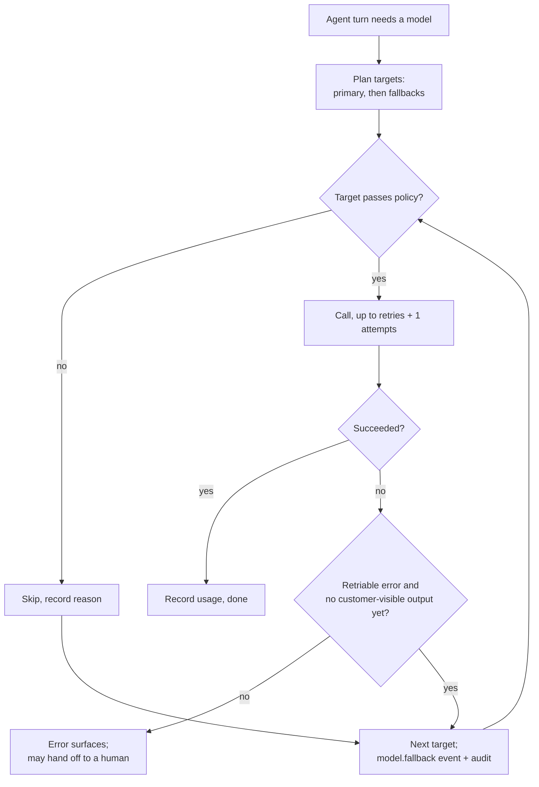

# Model profiles, fallbacks and pricing

This guide covers the two things between a configured provider and an agent's bill: **model profiles** (what an
agent runs on, including ordered fallbacks and the deployment policy that constrains them) and **pricing** (how
OCSO costs every model call, from the open-source catalog or from prices you enter). It is for the Tech admin.
Provider setup is in the [models overview](README.md).

## Model profiles

A profile is a named target that agents, routers (classify steps), the summarizer and Ask OCSO point at. Agents never
name a provider or model id, so you can move a profile to another model without touching any agent.

### Create a profile

1. Go to **Integrations → Models**. Under **Model profiles**, click **New model profile** (you need at least one
   provider first).
2. Fill in the form:

| Field | Notes |
|---|---|
| **Profile name** | Lowercase letters, digits and dashes, starting with a letter, 2–49 characters, e.g. `support-primary`. Stable: people and dashboards refer to it. |
| **Description (optional)** | Up to 500 characters. |
| **Provider** and **Model** | The primary target. The model picker lists the provider's models (refresh with the button next to it) and accepts free text. |
| **Temperature (optional)** | 0–2; blank = provider default. |
| **Max output tokens** | 1–200000, default 1024. |
| **Reasoning** | **Provider default**, **Off**, **Low**, **Medium**, **High**. |
| **Timeout (seconds)** | Per call, 1–600, default 30. |
| **Retries** | 0–5 per target before falling back, default 1. |
| **Retry backoff (ms)** | 0–60000, default 400; multiplied by the attempt number. |
| **Cache policy** | **Prefix cache · stable components first** (default) or **Off**. |
| **Cache TTL** | **Provider default (5m)**, **5 minutes**, **1 hour (longer retention where supported)**. |
| **Required capabilities** | **Image input**, **File input**, **Audio input**, **Tool calling**, **Structured output**, **Streaming**. A target lacking one is rejected (primary) or skipped (fallback). |
| **Fallback targets · in order** | Up to five, via **Add fallback**. Each is a provider and a model; reorder with the arrows. The same provider-and-model pair may not appear twice. |

3. The **Policy check** panel runs as you edit (`POST /v1/model-profiles/validate`). It shows whether the primary is
   permitted, warnings for fallbacks that will be skipped and why, the fallback rules in force, and a per-target
   table of capabilities and what the cache settings will actually send to each provider.
4. Optionally click **Test call** to send one real request through the primary target.
5. Click **Create profile**.

### Approval

A profile has no status of its own: it is live while something live uses it (a live or paused agent, an active
router's classify step, or Ask OCSO). A profile nothing live uses is a draft and is edited directly. A live or
approved profile changes only through a proposal that a second person with `approvals.check.platform` approves, so a
draft cannot be changed underneath a live agent without a checker. Deleting a profile is always a proposal, and is
refused while agents use it.

### How a call is executed



- Every attempt, successful or not, writes a usage event.
- A failed call moves to the next target only when the error category is retriable **and** no text has been
  streamed to the customer yet. Validation and policy errors never fall back.
- Every fallback emits a `model.fallback` event and an audit entry.
- If no target satisfies the policy, the call fails with `no_permitted_model_target`.

The source is [packages/agent-runtime/src/model/gateway.ts](../../../packages/agent-runtime/src/model/gateway.ts) and
the pure planner [packages/model-providers/src/policy/fallback-policy.ts](../../../packages/model-providers/src/policy/fallback-policy.ts).

## Deployment policy

The same planner runs when a profile is saved and on every call. It rejects a target, in this order, when:

| Reason | Rule |
|---|---|
| `provider_disabled` | The provider is not enabled (runtime only; the profile check warns instead). |
| `provider_not_allowlisted` | A provider allowlist is set and the provider is not on it. An empty allowlist allows every configured provider. |
| `residency_violation` | A required residency zone is set and the provider's **Data residency zone** differs (or is empty). |
| `cross_provider_forbidden` | A fallback uses a different provider than the primary and cross-provider fallback is off. |
| `cross_region_forbidden` | A fallback's provider region differs from the primary's and cross-region fallback is off. |
| `missing_capability:<name>` | The model lacks a required capability. |
| `cost_ceiling_exceeded` | An output-price ceiling is set and the target's output price per 1M tokens is above it. |

Where to set them:

- **Settings → Deployment**: **Data residency zone**, **Allow fallback to a different model provider**, **Allow
  fallback to a different region**. Both fallback toggles default to off. Changes go through approval (**Submit for
  approval**).
- API only (`PATCH /v1/settings/deployment`, also through approval): `providerAllowlist` (provider ids) and
  `maxOutputCostPerMTokMicros` (integer micro-units per 1M output tokens). There is no web control for these two
  today.

> [!NOTE]
> With both fallback toggles off (the default), only fallbacks on the same provider and region as the primary are
> used, for example a smaller model on the same provider. Turn on cross-provider fallback deliberately: it can send
> a conversation to a vendor your contracts do not cover.

## Pricing

OCSO costs every model call from the `model_pricing` table: per provider kind and model, input, output, cache-read
and cache-write prices per 1M tokens, with optional long-context tiers. Prices are never hard-coded (ADR-027).

### Where prices come from

- **Catalog prices.** Two open-source catalogs: [models.dev](https://models.dev) (primary) and LiteLLM's
  `model_prices_and_context_window.json` (fills gaps). Each provider definition maps its model ids to exact catalog
  keys; when a mapping is ambiguous the model is not priced rather than guessed.
- **Saving a profile** adds a catalog price row for each target that has no price yet, if the catalog prices it
  (audited, origin `catalog`). The save reports each target as priced, added or missing.
- **Manual prices** you enter (negotiated rates, currencies, anything the catalog misses).

Pricing lives under **Integrations → Models → Model pricing** (`pricing.manage`, Tech). The table shows **Model**,
**Provider**, **Origin** (catalog or manual), **Input**, **Output**, **Cache read**, **Cache write**, **Effective**
and **Approval**. Below it, **Models in use without a price** lists every profile target and every model that served
requests in the last 30 days without a price, with **Use catalog price** when the catalog has one and **Add price**
otherwise.

### Catalog refresh

- The worker's scheduler leader checks hourly and downloads a source when its copy is a day old (an hour after a
  failure). **Refresh catalog** on the pricing section (or `POST /v1/model-catalog/refresh`, `pricing.manage` or
  `providers.manage`) downloads now.
- Downloads go through the SSRF guard with a host allowlist (`models.dev`, `raw.githubusercontent.com`), are
  validated, and a document with too few models is rejected so the previous snapshot stays.
- A refresh moves every catalog-origin row to the current catalog price (effective now, audited as a system
  change). Manual rows are never touched.
- Offline and air-gapped deployments: set `OCSO_MODEL_CATALOG_REFRESH=false`. OCSO then uses the snapshot bundled in
  `@ocso/model-providers` and never downloads. Requests never fail because a catalog is unreachable.
- Maintainers regenerate the bundled snapshot with
  [scripts/refresh-model-catalog.mjs](../../../scripts/refresh-model-catalog.mjs):

```bash
npx turbo run build --filter=@ocso/model-providers
node scripts/refresh-model-catalog.mjs
# or from local copies:
MODELS_DEV_FILE=./api.json LITELLM_FILE=./litellm.json node scripts/refresh-model-catalog.mjs
```

It writes `packages/model-providers/catalog/vendored-snapshot.json`, keeping only the catalog providers OCSO maps.
Review the diff before committing: prices change there.

### Manual prices under approval

1. Click **Add price**. Choose the **Provider** kind, enter **Model** (an exact id, or a prefix ending in `*` such as
   `claude-sonnet-4-*`), **Currency** (three letters, default `USD`) and the **Input** and **Output** prices per 1M
   tokens (**Cache read** and **Cache write** optional).
2. The row is saved as a **draft** and prices nothing until a second person with `approvals.check.platform`
   approves it.
3. Editing a live row (an approved manual row, or any catalog row) is a proposal; approving an edit to a catalog row
   turns it manual. Deleting any row is a proposal.

Which row prices a call: rows effective at the time of the call, not drafts; an exact id beats a prefix, a longer
prefix beats a shorter one, a manual row beats a catalog row, then the most recent wins. Catalog rows match their
exact model id only, so a catalog price for `gpt-5.5` never prices `gpt-5.5-pro`.

## Cost reporting

The usage recorder, telemetry and alerts share one selection and cost function, so every screen agrees.

- **System → Telemetry**: requests, input, output, cache read, cache write, cached share and **Cost** per profile and
  per request purpose, plus per-provider rows.
- **Virtual agents → an agent → Analytics**: **Cost per conversation**, with the cached-input share.
- Provider cards: tokens and error rate over 24 hours.
- Alerts: `spend_budget_above` (**Monthly model spend above budget**; month-to-date spend in the deployment timezone
  against `monthlyBudgetUsd`, thresholds at 80% and 100% by default, projected month-end spend in the body) and
  `cost_spike` (**Model cost spike**). No budget rule is created for you. See
  [Alerts and webhooks](../alerts-and-webhooks.md).

Usage without a price is counted as unpriced and shown as "no price", never as zero.

## Limits and known gaps

- Prices are USD in the catalog. Costs recorded in other currencies are excluded from the USD budget alert and
  reported separately in its body.
- Not modelled per request: 1-hour cache writes (costed at the 5-minute rate), batch, priority/fast mode and
  data-residency surcharges. Use a manual price if these matter.
- The budget alert re-prices older unpriced usage at the model's average input size, so long-context tiers are
  approximate for that usage.
- `providerAllowlist` and the output-price ceiling have no web control.
- A profile's policy check judges the configuration; whether a provider is enabled is checked only at call time.

## Related

- [Model providers overview](README.md)
- [Governance and approvals](../../concepts/governance.md)
- [Alerts and webhooks](../alerts-and-webhooks.md)
- [Configuration reference](../../reference/configuration.md)
- ADR-027 in [PM/ARCHITECTURE-DECISIONS.md](../../../PM/ARCHITECTURE-DECISIONS.md) and PM/research/09-models-and-prices.md
