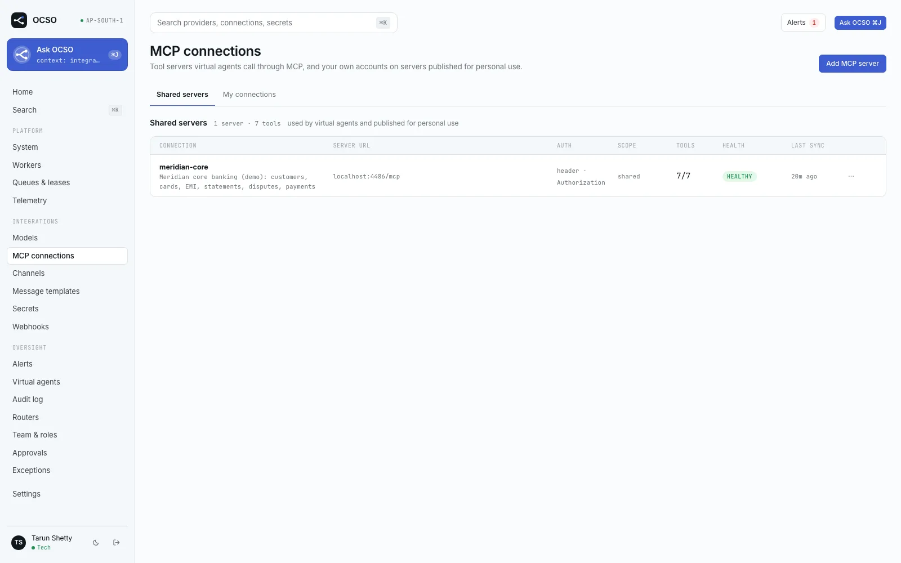

# MCP tool servers

This guide covers connecting business systems to OCSO as MCP (Model Context Protocol) servers, so virtual agents
and staff can call their tools. It is for the Tech admin who connects servers, the Head or Lead who grants tools to
agents, and the developer who builds or secures an MCP server for OCSO. Tools need no OCSO code: a business system
exposes its actions as an MCP server, and OCSO owns the connection, the credentials and the decision whether each
call may run.

The repository ships a complete example server, [examples/mcp-bank-demo](../../../examples/mcp-bank-demo/README.md)
("Meridian core"), used by the demo seed and the end-to-end tests. It is the worked example throughout this page.

## Concepts

- **Shared connection** (scope `SHARED`): configured once by a Tech admin. Virtual agents use it, subject to the
  connection's agent list and each agent's tool grants. Staff can also run its tools from the workspace.
- **Template** (scope `USER`, shown as "user-scoped"): a server published for personal use. It has no credentials of
  its own. Each user connects their own account from **My connections**, creating a **personal connection** that
  only they can use (for their own workspace actions and Ask OCSO). Virtual agents never use personal connections.
- **Transport**: Streamable HTTP only, through the official MCP TypeScript SDK v2. OCSO negotiates the protocol
  version, so 2026-07-28 servers and 2025-era servers both work. There is no stdio transport.
- **Network**: `PUBLIC` (public internet, https only) or `INTERNAL` (a private host on the deployment's egress
  allowlist, which may use plain http).
- **Model-facing tool names**: `<connection>__<tool>`, with characters outside `[a-zA-Z0-9_-]` replaced by `_`,
  capped at 64 characters. The Meridian tool `payments.reverse_transaction` on connection `meridian-core` reaches
  the model as `meridian-core__payments_reverse_transaction`. Connection names are lowercase slugs (letters, digits,
  dashes, 2–40 characters, no underscores) for that reason.

Permissions: `mcp.read` (Tech, Head, Lead) sees shared servers; `mcp.manage` (Tech) adds and configures them;
`mcp.connect_personal` (every preset) connects personal accounts; `agent_tools.manage` (Lead and Head) grants tools
to agents; `approvals.check.platform` (Head, Tech) approves connections; `approvals.check.agents` (Head) approves
widened agent grants.

## Prerequisites

- An MCP server reachable over Streamable HTTP, e.g. `https://mcp.example.com/mcp`.
- For a server on a private network: its hostname or IP on the deployment's internal egress allowlist (see
  [Egress](#egress-guard)).
- For OAuth: an authorization server that supports OAuth 2.1 with PKCE S256, and the OAuth callback URL
  `<OCSO_PUBLIC_URL>/oauth/mcp/callback` registered with it if it needs pre-registration.

## Connect a shared server

**Integrations → MCP connections → Add MCP server** opens a six-step wizard. The draft is saved at step 1, so you can
leave and resume it from the connections list (and after the OAuth redirect).

1. **Enter URL.** **MCP server URL**, **Connection name**, **Description (optional)**, **Network** (**Internal
   (private host on the egress allowlist)** or **Public internet (https only)**) and **Connection scope** (**Shared —
   available subject to policy** or **User-scoped — each user connects their own account**). OCSO saves a draft and
   checks the URL against the egress policy before any request. Click **Discover server**.
2. **Discover server.** A read-only inspection: server name and version, protocol era, capabilities and the tool
   list. If the server answers 401/403, OCSO reads its protected-resource metadata (RFC 9728) and the
   `WWW-Authenticate` challenge to learn whether OAuth is possible.
3. **Authenticate.** Either:
   - **OAuth 2.1 · authorization code + PKCE** → **Continue with OAuth**. You leave OCSO for the authorization server
     and come back with the outcome. Expand **Pre-registered client** to enter a **Client ID**, **Client secret
     (optional)** and **Scopes (optional)** only if the server offers no client registration.
   - **Header credential**: **Header name** (for example `Authorization` or `X-API-Key`) and **Credential value**, then
     **Save credential and discover**. A bare token in `Authorization` gets `Bearer ` prepended; a value with a scheme
     is sent as is. Reserved names (`Host`, `Content-Type`, `Cookie`, `Idempotency-Key`, `Mcp-*`, `X-OCSO-*` and
     other transport headers) are refused.

   Tokens and header values go to the secret store; OCSO keeps only a reference, and the model never sees them.
4. **Review capabilities.** For each tool: approve it or hold it back, choose its side-effect class (**Read only**,
   **Reversible write**, **Sensitive / irreversible**), and the roles that may run it by hand from the workspace
   (default Service, Lead and Head). OCSO pre-fills the class from the server's annotations, erring toward caution:
   anything not marked read-only is at least a write, and destructive or unannotated tools default to sensitive.
   Unapproved tools are never exposed.
5. **Approve.** Set the agent policy:
   - **Agents allowed to use this connection**: **Any agent a Lead enables it for** (per-agent grants still apply),
     or pick agents.
   - **Confirmation policy**: **Human confirmation for sensitive tools** (default), **Always confirm writes**, or
     **No confirmation (not recommended)**.
   - **Send signed customer identity claims with each call** (off by default). See [Customer claims](#customer-identity-claims).
   - **Forward the customer's verified web chat user token** (off by default). See [User-token pass-through](#user-token-pass-through).
   - **Health check every (seconds)**: 15–3600, default 60.

   **Approve and connect** submits the go-live for approval. For a user-scoped template, this step publishes the
   template instead; there is no agent policy.
6. **Active.** Once a second person approves, health checks run on the interval and the connection's status follows
   them (**healthy**, **degraded**, **down**, **auth required**).

## Approval and deferred activation

A connection that was never approved is a draft: you can discover, authenticate, classify tools and set the policy
directly, and the runtime never exposes it. Going live is an **ACTIVATE** proposal that a second person with
`approvals.check.platform` approves under **Approvals**.

Activation is **deferred**: after the checker approves, the worker contacts the server again, recomputes the hash of
its tool set, and compares it with the tool-set hash recorded in what the checker reviewed. If the server's tools
changed in between, the activation is refused (`mcp_tools_changed`, the proposal ends **BLOCKED**) and you must
rediscover, review and submit again. If the server now demands authentication, it is refused with
`mcp_auth_required`. If the server is unreachable, activation is retried. A connection disabled after the activation
was submitted stays disabled.

After go-live:

- Changing tool approvals, the agent policy or the header credential is an **UPDATE** proposal. A new header value is
  stored as a new secret at submit and takes effect only on approval.
- Deleting is always a proposal. Disabling is a stop: immediate, never gated.
- Personal connections are one user's credentials and never go through approval.

## Tool drift

On every rediscovery, OCSO fingerprints each tool's input schema, title, description, output schema and annotations.
If an approved tool changes any of them, it is un-approved until someone reviews it again: descriptions are shown to
the model, so a changed description is a prompt-injection vector. Tools that disappear are kept (marked removed) for
audit and never exposed.

## Grant tools to an agent

A Lead or Head opens **Virtual agents → an agent → Tools**. The table lists tools that are approved, on a live shared
connection that allows this agent, with columns **Tool**, **Connection**, **Side effect**, **Enabled**, **Always
confirm** and **Argument rules**.

- **Enabled** grants the tool.
- **Always confirm** requires a human confirmation for every call of this tool by this agent.
- **Argument rules** adds rules on the call's arguments (up to 20 per tool):

| Field | Values |
|---|---|
| **Argument** | Dotted path into the arguments, e.g. `amountMinor` or `payment.amount`. The first segment must be an argument the tool's schema declares. |
| **Operator** | `gt`, `gte`, `lt`, `lte`, `eq`, `neq`, `in`, `not_in`, `exists` |
| **Value** | A number for the comparisons, a scalar for `eq`/`neq`, a list of 1–100 scalars for `in`/`not_in`, nothing for `exists` |
| **Effect** | **Require confirmation** or **Deny** |
| **Message** | Shown to the confirming human, or as the denial reason |

A numeric rule on a missing or non-numeric value counts as matched (fails closed). **Deny** wins over confirmation.

Approval of grants: for a draft agent the whole grant set is part of its go-live approval. For an approved agent,
changes that only take access away (turning a tool off, turning confirmation on, adding rules) apply at once. Anything
that widens access (a new tool, turning one on, dropping confirmation, removing or loosening a rule) becomes one
proposal that a checker with `approvals.check.agents` approves.

The Meridian demo seed grants the agent Maya the read tools plus `disputes.raise_case` and
`payments.reverse_transaction`, with the rule `amountMinor gt 500000 → Require confirmation` ("Reversals above ₹5,000
need a human confirmation"; the demo takes amounts in paise).

## What happens on every call

The model only proposes a call. OCSO decides, deterministically, using nothing from the model except the arguments
([packages/tools/src/authorizer.ts](../../../packages/tools/src/authorizer.ts)):

1. The tool exists, is approved and enabled.
2. The connection is `ACTIVE` or `DEGRADED`.
3. For an agent: the AI owns the conversation, the connection is shared and allows this agent, and the agent holds an
   enabled grant. For a human: the role has `tools.execute_human`, the tool allows that role, and a personal
   connection belongs to that user.
4. The tool's required scopes were granted to the connection.
5. The arguments validate against the tool's JSON Schema.
6. Argument rules: a matching **Deny** refuses the call.
7. Confirmation: required by a matching rule, by **Always confirm**, or by the connection's confirmation policy
   (sensitive tools under the default policy; every non-read tool under **Always confirm writes**).

A `tool_calls` row with sanitized arguments is written before anything runs. Non-read calls carry an
`Idempotency-Key` header so a retried write is not applied twice.

### Confirmation of sensitive calls

A call that needs confirmation pauses the turn and shows a confirmation card in the conversation for a person with
`tools.confirm_sensitive` (the Service, Lead and Head presets; not Tech). **Confirm and run** executes exactly the arguments shown:
they are held server-side and checked by hash, and the run is attributed to the confirming person. A confirmation
expires after 30 minutes.

### Customer identity claims

With **Send signed customer identity claims with each call** on, every call to that connection carries
`X-OCSO-Customer-Claims`, a short-lived JWT signed by OCSO:

- ES256 (P-256), 120-second lifetime, `kid` = RFC 7638 thumbprint of the key.
- Claims: `iss` (`OCSO_PUBLIC_URL`), `sub`, `aud` = `ocso-mcp:<connection id>`, `iat`, `nbf`, `exp`, `jti`, `cid`
  (conversation id), `agt` (agent id), `scope`; plus `ocso_channel` when `sub` is a user id a channel verified, and
  `ctx` with values the website's backend vouched for (web chat host context; browser-sent context never becomes a
  claim).
- `sub` is the customer's external reference when staff set one; else a user id the conversation's own channel
  verified; else an opaque `ocso:customer:<id>`.
- Public keys: `GET <OCSO_PUBLIC_URL>/.well-known/jwks.json` (public, cached 5 minutes). Rotate with
  `POST /v1/security/signing-keys/rotate` (`system.configure`) or from **Integrations → Secrets**; the previous key
  stays published for 24 hours.

A receiving server must verify the signature against the JWKS, the issuer, the audience (its own connection id) and
the expiry, and then scope its data to `sub`. The Meridian server's verifier is
[examples/mcp-bank-demo/src/claims-jwks.ts](../../../examples/mcp-bank-demo/src/claims-jwks.ts); run it with
`DEMO_CLAIMS_JWKS_URL=<OCSO_PUBLIC_URL>/.well-known/jwks.json` and `DEMO_CLAIMS_ISSUER=<OCSO_PUBLIC_URL>`.

### User-token pass-through

With **Forward the customer's verified web chat user token** on (`forwardUserToken`), calls in conversations whose
channel verified the customer's own token (web chat with tool identity "passthrough") carry that token:

- as `Authorization: Bearer <token>` when the connection has no auth of its own, sent to the connection's own origin
  only;
- as `X-OCSO-User-Token` when the connection authenticates OCSO some other way.

The token is scrubbed from logs and errors. Use this when the business system should see the customer's own identity
rather than OCSO's. See [Web chat](../channels/web-chat.md) for how the site vouches for its users.

## OAuth 2.1 details

OCSO runs the whole flow server-side ([packages/mcp/src/oauth/](../../../packages/mcp/src/oauth/)):

- Client registration, in order of preference: a Client ID Metadata Document, a pre-registered client you enter,
  then dynamic client registration.
- PKCE S256 is required. `state` is stored hashed and is single use. The RFC 9207 `iss` parameter is checked.
  Grants are bound to the server's RFC 8707 resource.
- Redirect URI: `<OCSO_PUBLIC_URL>/oauth/mcp/callback`. The callback always redirects back to
  `/connections?tab=mcp` with only a connection id and an outcome code, never tokens or server text.
- Credentials are keyed by the authorization server's issuer; a token minted by a different issuer is never sent.
- Access tokens are refreshed near expiry and on a 401. Refresh-token rotation is stored compare-and-swap so
  concurrent workers do not lose a rotated token.

## Egress guard

Every MCP, metadata and token request goes through an SSRF-guarded fetch ([packages/mcp/src/egress/](../../../packages/mcp/src/egress/)):

- `PUBLIC` connections: https only, and DNS answers that resolve to private, loopback or link-local addresses are
  refused.
- `INTERNAL` connections: may reach hosts on the deployment's internal-host allowlist, and those hosts may use plain
  http (Compose service names have no TLS).
- Credential headers are only ever sent to the connection's own origin.
- Limits: 3 redirects (GET/HEAD only), 8 MiB per response, 10 s connect, 120 s idle, 30 s default request deadline.

The allowlist is a deployment setting, not an environment variable: `egressAllowedInternalHosts` in
`PATCH /v1/settings/deployment` (exact hostnames or IPs, or `*.suffix` wildcards; up to 200). Like every deployment
setting it goes through approval. There is no web control for it today; the demo seed adds `mcp-bank-demo` this way.

On AWS, give external MCP servers that allowlist callers the NAT gateway egress IPs from the Terraform outputs.

## Worked example: Meridian core

The Compose `demo` profile (`docker compose --profile demo up`) starts the `mcp-bank-demo` service on the Compose
network and a one-shot seed that creates this connection
([apps/api/src/seed/steps/mcp.ts](../../../apps/api/src/seed/steps/mcp.ts)). By hand, the same steps are:

1. Allowlist the host `mcp-bank-demo` (API, through approval).
2. **Add MCP server**: URL `http://mcp-bank-demo:8080/mcp`, name `meridian-core`, **Internal**, **Shared**.
3. Discovery answers 401 with `WWW-Authenticate: Bearer` and no protected-resource metadata, so OAuth is not offered.
   Add a **Header credential**: **Header name** `Authorization`, **Credential value** the demo token (from
   `DEMO_MCP_TOKEN`).
4. Classify: `crm.get_customer`, `cards.list_transactions`, `emi.get_schedule`, `knowledge.search_policy` as **Read
   only**; `statements.send_pdf`, `disputes.raise_case` as **Reversible write**; `payments.reverse_transaction` as
   **Sensitive / irreversible**.
5. Approve for the agent, **Human confirmation for sensitive tools**, and have a Head approve the go-live.
6. Grant tools to the agent and add the ₹5,000 argument rule.

## Verify it works

- The connection shows **healthy** and its tool count.
- In the agent's **Tools** tab, granted tools are enabled.
- A test conversation that triggers a read tool shows the call in the conversation timeline; a sensitive call shows
  a confirmation card.
- The **MCP connection unhealthy** technical alert (`mcp_unhealthy`) is seeded and fires when a connection is
  degraded, down or needs authentication.

## Troubleshooting

| Symptom | Likely cause |
|---|---|
| URL refused at step 1 | A private address on a `PUBLIC` connection, `http://` on a public host, or an internal host not on the allowlist. |
| **auth required** after going live | The token expired without a refresh token, or the server rotated the header credential. Re-authenticate (an UPDATE proposal for a header). |
| Activation **BLOCKED** with `mcp_tools_changed` | The server's tools changed after review. Rediscover, review, submit again. |
| OAuth returns `registration_unavailable` | The server has no client registration; enter a pre-registered **Client ID**. |
| OAuth returns `pkce_unsupported` | The authorization server does not support PKCE S256, which OCSO requires. |
| Agent says a tool is not allowed | The connection does not list the agent, or the agent has no enabled grant. |
| A tool vanished from the agent | It changed on the server and was un-approved; review it again. |

## Limits and known gaps

- Streamable HTTP only; no stdio or legacy SSE-only servers.
- First-party tools (`ocso_request_handoff`, `ocso_search_history`) have no per-agent grant rows, so they cannot be
  revoked per agent or given argument rules.
- The internal-host egress allowlist has no web control.
- A worker that loses a token-refresh race may fail one call before it re-reads the rotated tokens (ADR-021).
- The Meridian server's OAuth resource-server mode is exercised in tests only; its CLI supports bearer or no auth.

## Related

- [Agents](../../concepts/virtual-agents.md)
- [Governance and approvals](../../concepts/governance.md)
- [Web chat](../channels/web-chat.md)
- [examples/mcp-bank-demo/README.md](../../../examples/mcp-bank-demo/README.md)
- [packages/mcp/README.md](../../../packages/mcp/README.md)
- ADR-014 and ADR-021 in [PM/ARCHITECTURE-DECISIONS.md](../../../PM/ARCHITECTURE-DECISIONS.md)
