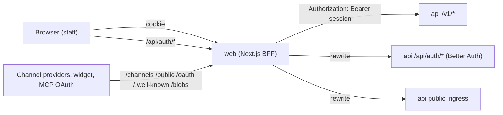

# HTTP API reference

An overview of OCSO's HTTP surface: where each group of routes is served, how requests authenticate, the error
shape, how maker–checker shows up in responses, and a map of the controllers. This page is for integrators and
contributors. It does not list every route by hand; the generated capability catalog does (see
[The capability catalog](#the-capability-catalog)).

All routes are served by the api (`apps/api`, NestJS, port 4000). Two groups are reachable from the internet:
the **public ingress** routes, and Better Auth's `/api/auth/*`. The staff API under `/v1` is internal: the web app
calls it server-side.



## Base paths

| Path | Reached from | Auth | What it is |
|---|---|---|---|
| `/v1/*` | the web app's server side (Server Components, server actions, a few `/api/*` route handlers in `apps/web/app/api`) and internal API clients | Bearer session token | The staff API: everything the web app does. Not routed from the public origin by Compose (Next rewrites) or AWS (ALB rules). |
| `/api/auth/*` | browsers, through the web app | Better Auth | Sign-in flows: email and password, passkeys, TOTP, SSO (OIDC/SAML) redirects and callbacks. Mounted ahead of Nest; which endpoints answer is an allowlist (`HTTP_AUTH_ENDPOINTS`). |
| `/channels/:segment/:publicKey/webhook` | channel providers | the channel's own verification (signature, token) | Inbound webhooks. `GET` answers verification challenges, `POST` receives messages and statuses. `:segment` is the kind's webhook segment (for example `twilio-whatsapp`). |
| `/public/webchat/:publicKey/*` | the web chat widget, `@winsendotai/ocso-chat`, your backend | visitor token, session pass or channel secret key | The public web chat API: `GET config`, `POST session`, `POST session-pass` (server to server, channel secret key as Bearer), `GET`/`POST messages`, `POST attachments`, `POST csat`, `GET stream` (SSE). See [chat SDK](chat-sdk.md). |
| `/oauth/mcp/callback` | identity providers of MCP servers | OAuth `state` | Completes the OAuth flow for MCP connections. |
| `/.well-known/jwks.json` | MCP tool servers | public | Public keys that verify the customer claims OCSO sends to tool servers. |
| `/blobs/*path` | browsers, channel providers | signed URL | Downloads for the `local` blob driver (signed, expiring links). |
| `/health/live`, `/health/ready`, `/health/dependencies` | load balancers, operators | public | Liveness (no external checks), readiness (PostgreSQL; not the audit store) and informational dependency health. Routed by the AWS ALB; not published by Compose. The worker serves `/health/live` and `/health/ready` on `HEALTH_PORT`. |

The web app forwards the public ingress prefixes (`channels`, `public`, `oauth`, `.well-known`, `blobs`) to
`API_URL` with Next rewrites ([`apps/web/next.config.ts`](../../apps/web/next.config.ts)); on AWS the ALB routes
them (and `/health/*`) straight to the api.

## Authentication

- **Staff API (`/v1`).** Authentication is a Better Auth session (ADR-025), sent as
  `Authorization: Bearer <session token>`. `/v1` never accepts cookies. The web app reads the session from its
  httpOnly cookie and forwards it. Authorization stays in OCSO: a global guard denies by default, every route
  declares `@Public`, `@Authenticated`, `@RequirePermission` or `@RequireAnyPermission`, and services add
  resource-level checks (team scope). See [permissions](permissions.md).
- **Scripts and tests.** `POST /v1/auth/login` with `{ email, password }` returns
  `{ token, expiresAt, user }`. It runs Better Auth's email sign-in with the same rate limits and audit. Accounts
  with two-factor authentication get `401 mfa_required` and must sign in through the web app.
- **Other session routes.** `GET /v1/auth/me` (the signed-in user and MFA state), `POST /v1/auth/logout`,
  `GET /v1/auth/security`. First-run: `GET /v1/setup/status`, `POST /v1/setup` (needs the setup token),
  `POST /v1/setup/recover` (only while `OCSO_RECOVERY_TOKEN` is set).
- **MFA.** When the sign-in policy requires two-factor authentication for a user's preset and they have not
  enrolled, most routes answer `403 mfa_enrollment_required`.
- **Ask OCSO.** The internal agent calls `/v1` routes as the user with a single-use
  `Authorization: Delegation …` token, accepted only on a connection from loopback to the api's private
  listener ([`apps/api/src/common/delegation.ts`](../../apps/api/src/common/delegation.ts)). It never calls
  `/v1/internal-agent/*` or `/api/auth/*`.
- **Long-lived streams.** `GET /v1/realtime/stream` (SSE) and Ask OCSO chat re-check the session every
  `SESSION_STREAM_RECHECK_SECONDS` and close when it ended.

## Errors

Every error has one shape ([`apps/api/src/common/exception.filter.ts`](../../apps/api/src/common/exception.filter.ts)):

```json
{
  "error": {
    "category": "conflict",
    "code": "approval_required",
    "message": "This change needs approval: name a checker and give a reason.",
    "details": { "objectKind": "agent", "objectId": "…", "action": "UPDATE" },
    "correlationId": "…"
  }
}
```

| Category | HTTP status |
|---|---|
| `validation` | 400 |
| `authentication` | 401 |
| `authorization`, `policy_denied` | 403 |
| `not_found` | 404 |
| `conflict` | 409 |
| `tool_rejected` | 422 |
| `provider_rate_limited` | 429 (with `Retry-After` when `details.retryAfterSeconds` is set) |
| `provider_unavailable`, `tool_unavailable` | 502 |
| `capacity` | 503 |
| `timeout` | 504 |
| `internal` | 500 (`internal_error`, generic message; raw exception text never reaches clients) |

Request validation failures are `400 invalid_request` with the zod issues joined in `message`. A missing
permission is `403 forbidden` with `details.action` naming the permission. Plugins report errors with the SDK's
`pluginError(category, …)` and map onto the same table.

Codes you will meet often:

| Status | Code | Meaning |
|---|---|---|
| 401 | `unauthenticated` | No or expired session. |
| 401 | `invalid_credentials`, `mfa_required` | `POST /v1/auth/login` failures. |
| 403 | `forbidden` | The principal lacks the permission in `details.action`. |
| 403 | `mfa_enrollment_required` | Set up two-factor authentication first. |
| 409 | `approval_required` | The write needs a checker. `details: { objectKind, objectId, action }`. |
| 409 | `approval_open` | The object already has an open proposal. `details.proposalId`. |
| 409 | `content_changed`, `dependency_changed` | Approving a proposal whose content or dependencies changed since submit. |
| 400 | `checker_not_eligible`, `no_changes`, `activation_needs_approval` | Approval request problems. |

## Maker–checker in responses

Approvable writes (ADR-030) accept, beside their own body, an `approval` field:

```json
{ "approval": { "checkerId": "<user uuid>", "reason": "Rolling out the new refund prompt" } }
```

or `{ "approval": { "bootstrap": true, "reason": "…" } }` when nobody else could check it and the maker holds the
check permission. The answers:

| Situation | Response |
|---|---|
| The object is a draft (not yet approved), or the change is a stop (pause, disable, revoke) | The normal result, applied at once (`200`, `201` or `204`). |
| The change needs approval and `approval` was sent | **`202 { "proposal": { … } }`**. Nothing changed yet; a checker decides it in **Approvals**. |
| The change needs approval and no `approval` was sent | **`409 approval_required`**. |
| Another proposal is open on the object | **`409 approval_open`**. |
| Create-and-go-live (`live: true` with `approval`) | `202 { …draft, proposal }`; if the proposal is refused, `201 { …draft, activationError }` so the client retries activation on that id. |
| Permission changes | Reductions apply at once (`200`, `applied`); the widening part is `202 proposal` or `409 approval_required` (the reductions still applied). |

The approvals queue itself is `/v1/approvals`: list (`box=AWAITING_ME|SENT_BY_ME|OPEN|DECIDED`), counts, kinds,
checkers, state, `PATCH /:id` (maker edits), `POST /:id/withdraw`, `POST /:id/decision`, `POST /bulk-decision`
(approve only, up to 50), `POST /:id/checker` (reassign) and `POST /:id/void`. See
[governance](../concepts/governance.md).

## Realtime

Server-sent events only; there is no WebSocket endpoint.

- `GET /v1/realtime/stream?conversationId=&types=` for staff. Conversation events reach only users who may access
  that conversation; alert and config events follow alert audiences. `types` is a comma list filter.
- `GET /public/webchat/:publicKey/stream` for web chat visitors.

Outbound **webhooks** (signed `X-OCSO-Signature`, `X-OCSO-Event`, `X-OCSO-Delivery`) are a separate feature;
`GET /v1/webhooks/event-types` lists what can be subscribed to. See
[alerts and webhooks](../guides/alerts-and-webhooks.md).

## Controllers by area

Derived from the `@Controller` classes in [`apps/api/src/modules`](../../apps/api/src/modules). About 290
routes in total when this page was written.

| Area | Controller(s) | Base path | Main routes |
|---|---|---|---|
| Session and setup | `AuthController`, `AuthSettingsController` | `/v1/auth`, `/v1/setup`, `/v1/settings` | `POST auth/login`, `GET auth/me`, `POST setup`, `POST setup/recover`; `GET`/`PUT settings/auth-policy`, `settings/sso-providers` CRUD |
| People and access | `UsersController`, `PermissionsController` | `/v1/users`, `/v1/teams`, `/v1/permissions` | users CRUD, `POST users/:id/invite`, `POST users/:id/password-reset`, teams and members, `PUT me/availability`, `GET permissions/catalogue`, `GET`/`POST users/:id/permission(s|-changes)` |
| Approvals | `ApprovalsController` | `/v1/approvals` | list, counts, kinds, state, checkers, decision, bulk-decision, withdraw, void |
| Conversations | `ConversationsController`, `ConversationToolsController`, `ConversationAttachmentsController`, `CopilotController`, `CsatController` | `/v1/conversations` | list, get, timeline, `claim`, `accept`, `decline`, `take-over`, `return-to-ai`, `transfer`, `resolve`, `reopen`, `messages`, `notes`, `tags`, `template-message`, `attachments`, `tools/run`, `copilot/draft`, `csat`; `POST /v1/tool-calls/:id/confirm|deny` |
| Customers | `CustomersController` | `/v1/customers` | list, get, patch |
| Virtual agents | `AgentsController`, `PromptsController`, `EscalationRulesController`, `AgentToolsController` | `/v1/agents` | CRUD, `status`, `owners`, prompt draft, preview, diff, versions, activate, escalation rules, `tools` |
| Routing | `RoutersController`, `RoutingController` | `/v1/routers`, `/v1/queues`, `/v1/sla-policies` | routers CRUD, `draft`, `versions`, `simulate`, `activate`, `disable`, `channels`, `reach`; queues and SLA policies with `submit` and `approval` |
| Channels | `ChannelsAdminController`, `ChannelTemplatesController`, `ChannelWebhookController` | `/v1/channels`, `/channels` | `GET kinds`, CRUD, `test`, `setup-files/:key`, message templates and drafts; `GET /v1/message-templates/channels`; public webhooks |
| Web chat (public) | `WebChatController` | `/public/webchat/:publicKey` | `config`, `session`, `session-pass`, `messages`, `attachments`, `csat`, `stream` |
| Models | `ModelProvidersController`, `ModelProfilesController`, `ModelPricingController`, `ModelCatalogController` | `/v1/model-providers`, `/v1/model-profiles`, `/v1/model-pricing`, `/v1/model-catalog` | `GET kinds`, CRUD, `test`, `models`, `activate`, `validate`, pricing `from-catalog` and `missing`, catalog `refresh` |
| MCP tools | `McpConnectionsController`, `McpPersonalController`, `McpOauthCallbackController` | `/v1/mcp/connections`, `/v1/mcp/personal`, `/oauth/mcp` | CRUD, `discover`, `rediscover`, `tools`, `health`, `approve`, `enable`, `disable`, `auth/header`, `oauth/begin`; personal connections and templates |
| Alerts and webhooks | `AlertsController`, `AlertRulesController`, `NotificationDestinationsController`, `WebhooksController` | `/v1/alerts`, `/v1/alert-rules`, `/v1/notification-destinations`, `/v1/webhooks` | alerts `acknowledge`/`resolve`/`counts`, rules and `conditions`, destinations `kinds`/`test`, webhooks CRUD, `test`, `rotate-secret`, `deliveries`, `event-types`, `webhook-deliveries/:id/retry` |
| Quality | `ReviewsController`, `CorrectionsController`, `EvaluationsController` | `/v1/reviews`, `/v1/corrections`, `/v1/evaluations` | reviews and `rubric`, corrections `stage`/`reject`, evaluation runs and `results` |
| Analytics and home | `AnalyticsController`, `HomeController`, `TelemetryController` | `/v1/analytics`, `/v1/home`, `/v1/telemetry` | overview, agents, queues, escalation reasons; home; telemetry overview, usage, latency, providers, mcp, workers, changes |
| Audit and exceptions | `AuditController`, `ExceptionsController` | `/v1/audit`, `/v1/exceptions` | audit list, `keys`, `store`, `verify`, incident acknowledge; exceptions `live`, weekly `reports`, `sign`, `export`, `regenerate` |
| Ask OCSO | `InternalAgentController`, `ChatLinksController` | `/v1/internal-agent` | `chat`, `threads`, `actions/:id/confirm|reject`, `capabilities/suggestions`, chat links and link tokens |
| Settings and system | `SettingsController`, `EmailSettingsController`, `PluginsController`, `StorageController`, `SigningKeysController`, `SecretsController` | `/v1/settings`, `/v1/system`, `/v1/security`, `/v1/secrets` | `deployment`, `workers`, `retention`, `approval`; email status and `test`; `system/plugins`, `system/storage`; customer-claims signing keys and `rotate`; secrets inventory (metadata only) |
| Realtime | `RealtimeController` | `/v1/realtime` | `stream` (SSE) |
| Public keys, blobs, health | `JwksController`, `BlobsController`, `HealthController` | `/.well-known`, `/blobs`, `/health` | `jwks.json`, blob download, `live`, `ready`, `dependencies` |
| Test hooks | `TestHooksController` | `/v1/test-hooks` | `emails` (only with `OCSO_ENABLE_TEST_HOOKS`, never in production) |

## The capability catalog

Every `/v1` route is described in one generated file,
[`packages/internal-agent/src/catalog/capabilities.generated.json`](../../packages/internal-agent/src/catalog/capabilities.generated.json)
(ADR-035). Ask OCSO builds its tools from it, and it is the most complete route list there is. Each entry has
`name`, `method`, `path`, `permissions`, `summary`, `details`, `risk` (`READ`, `LOW_WRITE`, `HIGH_WRITE`),
`approvalKind`, `input` (JSON Schema of params, query and body; secret fields are marked), `tags` and `uiHref`. An
`excluded` list names the routes left out and why (channel webhooks, public routes, streams, blobs).

When this page was written it held 252 capabilities (123 `READ`, 35 `LOW_WRITE`, 94 `HIGH_WRITE`) and 48 excluded
routes.

It is extracted from the code in two passes: the Nest route metadata and zod schemas at runtime, and doc comments
and approval kinds with the TypeScript compiler ([`scripts/capabilities/extract.mjs`](../../scripts/capabilities/extract.mjs)).
A handler adds its name, summary and tags with `@Capability({ … })`, or opts out with `@Capability({ exclude })`.

```bash
pnpm capabilities:generate   # rewrite the file from the api's controllers
pnpm capabilities:check      # exit 1 if the committed file is stale
```

`pnpm test` also fails when the committed catalog is stale
(`packages/internal-agent/test/capabilities.test.ts`). Run `capabilities:generate` and commit the result whenever
you add or change a route. See [CLI](cli.md#capabilitiesgenerate-and-capabilitiescheck).

## Compatibility

OCSO is pre-1.0. The `/v1` staff API is shaped for the web app and Ask OCSO and may change between releases;
there is no public API stability promise for it yet. The public web chat API is what
[`@winsendotai/ocso-chat`](chat-sdk.md) speaks; use the SDK rather than calling it directly. Channel webhook
routes follow each provider's contract.

## Related

- [Permissions](permissions.md)
- [Chat SDK](chat-sdk.md)
- [Plugin SDK](plugin-sdk.md)
- [Governance](../concepts/governance.md)
- [Ask OCSO](../concepts/ask-ocso.md)
- [Architecture](../concepts/architecture.md)
